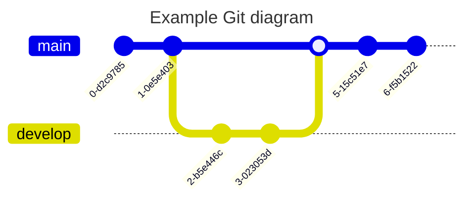

## Mermaid

### Diagram Syntax

#### Flowchart

所有流程图（Flowchart）均由节点、几何形状和边、箭头或线组成。mermaid定义了这些节点和边的创建和交互方式。它还可以容纳不同的箭头类型、多向箭头以及与子图的链接。

##### Example

#### Sequence Diagram

#### Class Diagram

#### State Diagram

#### Entity Relationship Diagram

#### User Journey

#### Gantt

#### Pie Chart

#### Requirement Diagram

#### Gitgraph Diagram

#### C4C Diagram

#### Mindmaps

### References

- [Mermaid Document](https://mermaid.js.org/intro/)
- [FontAwesome Version 4](https://fontawesome.com/v4/icons/)