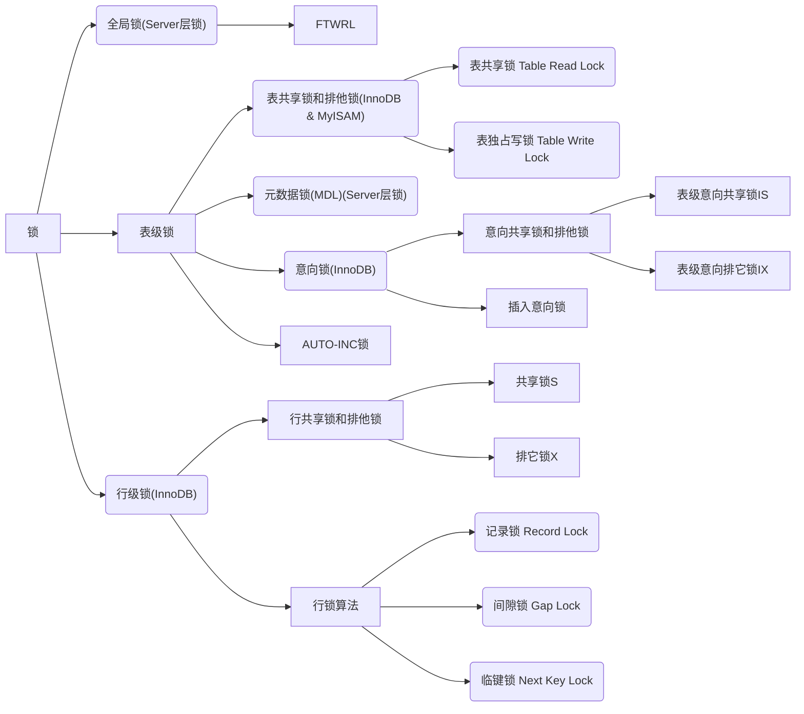

# MySQL 锁

**当一个事务请求的锁模式与当前的锁兼容，InnoDB就将请求的锁授予该事务；反之如果请求不兼容，则该事物就等待锁释放。**



## 锁种类

### 操作读写来分

#### 读锁（共享锁）

也叫共享锁，当一个事务添加了读锁后，其他的事务也可以添加读锁或是读取数据，但是不能进行写操作，只能等到所有的读锁全部释放。

共享锁（S锁）允许一个事务去读一行，阻止其他事务获得相同数据集的排他锁。也叫做**读锁**：读锁是**共享**的，多个客户可以**同时读取同一个**资源，但**不允许其他客户修改**。

共享锁（Share Locks，简记为S）又被称为读锁，其他用户可以并发读取数据，但任何事务都不能获取数据上的排他锁，直到已释放所有共享锁。

共享锁(S锁)又称为读锁，若事务T对数据对象A加上S锁，则事务T只能读A；其他事务只能再对A加S锁，而不能加X锁，直到T释放A上的S锁。这就保证了其他事务可以读A，但在T释放A上的S锁之前不能对A做任何修改。


为了确保自己查到的数据没有被其他的事务正在修改，也就是说确保查到的数据是`最新的数据`，并且不允许其他人来修改数据。但是自己不一定能够修改数据，因为有可能其他的事务也对这些数据使用了 `in share mode` 的方式上了`S` 锁。如果不及时的commit 或者rollback 也可能会**造成大量的事务等待**。

**「共享锁」**：事务查询数据行时默认不会加锁，但是可以使用 select * from table lock in share mode 添加共享锁。


#### 写锁（排他锁）

也叫排他锁，当一个事务添加了写锁后，其他事务不能读不能写也不能添加任何锁，只能等待当前事务释放锁。

使用InnoDB的情况下，在执行更新、删除、插入操作时，数据库也会自动为所涉及的行添加写锁（排他锁），直到事务提交时，才会释放锁。

执行普通的查询操作时，不会添加任何锁。

使用MyISAM的情况下，在执行更新、删除、插入操作时，数据库会对涉及的表添加写锁，在执行查询操作时，数据库会对涉及的表添加读锁。

排他锁（X锁)：允许获得排他锁的事务更新数据，阻止其他事务取得相同数据集的共享读锁和排他写锁。也叫做**写锁**：写锁是排他的，**写锁会阻塞其他的写锁和读锁**。

排它锁（(Exclusive lock,简记为X锁)）又称为写锁，若事务T对数据对象A加上X锁，则只允许T读取和修改A，其它任何事务都不能再对A加任何类型的锁，直到T释放A上的锁。它防止任何其它事务获取资源上的锁，直到在事务的末尾将资源上的原始锁释放为止。在更新操作(INSERT、UPDATE 或 DELETE)过程中始终应用排它锁。


为了让自己查到的数据确保是最新数据，并且查到后的数据只允许自己来修改的时候，需要用到`for update`。相当于一个 update 语句。在业务繁忙的情况下，如果事务没有及时的commit或者rollback 可能会造成其他事务长时间的等待，从而影响数据库的并发使用效率。


**「独占锁」**：事务更新数据时会加独占锁，加独占锁的数据行其它事务不可修改，但是可以通过 mvcc 机制读取数据行快照，其它事务必须等待当前事务提交才能修改。也可以使用 select * from table for update | insert | delete 在查询时对数据行添加独占锁，那么其它事务此时就不能更新这行数据，也不能对这行数据加共享锁。


##### FOR UPDATE

```sql
# 先表上加上意向独占锁，然后对读取的记录加独占锁
SELECT * FROM `table_name` WHERE `condition` FOR UPDATE;
```


查询条件用了索引或主键，那么`FOR UPDATE`就会进行行锁；如果是普通字段(没有索引或主键)，那么`FOR UPDATE`就会进行锁表。


#### 总结

独占锁和独占锁之间是互斥的，意思就是在修改数据行时不允许其它事务修改，这也是避免脏写的方法。

独占锁和共享锁之间是互斥的，意思就是在读取数据行时不允许其它事务修改。

共享锁和共享锁之间是兼容的，意思就是事务之间读取数据行都不会影响彼此，毕竟只是读数据而已。


|      | X      | S      |
| ---- | ------ | ------ |
| X    | 不兼容 | 不兼容 |
| S    | 不兼容 | 兼容   |


##### **共享锁和排他锁的区别**

共享锁（S锁）：如果事务T对数据A加上共享锁后，则其他事务只能对A再加共享锁，不 能加排他锁。获取共享锁的事务只能读数据，不能修改数据。

排他锁（X锁）：如果事务T对数据A加上排他锁后，则其他事务不能再对A加任任何类型的封锁。获取排他锁的事务既能读数据，又能修改数据。


##### SELECT申请锁

SELECT 的读取锁定主要分为两种方式：共享锁和排他锁。

普通的 select 语句是不会对记录加锁的，如果要在查询时对记录加行锁，可以使用下面这两个方式：

```sql
# 先在表上加上意向共享锁，然后对读取的记录加共享锁
SELECT * FROM `table_name` WHERE `condition` LOCK IN SHARE MODE;
# 先表上加上意向独占锁，然后对读取的记录加独占锁
SELECT * FROM `table_name` WHERE `condition` FOR UPDATE;
```

上面这两条语句必须在一个事务中，**因为当事务提交了，锁就会被释放**，所以在使用这两条语句的时候，要加上 begin、start transaction 或者 set autocommit = 0。


这两种方式主要的不同在于LOCK IN SHARE MODE多个事务同时更新同一个表单时很容易造成死锁。

申请排他锁的前提是，没有线程对该结果集的任何行数据使用排它锁或者共享锁，否则申请会受到阻塞。在进行事务操作时，MySQL会对查询结果集的每行数据添加排它锁，其他线程对这些数据的更改或删除操作会被阻塞（只能读操作），直到该语句的事务被commit语句或rollback语句结束为止。

SELECT... FOR UPDATE 使用注意事项：

for update 仅适用于innodb，且必须在事务范围内才能生效。根据主键进行查询，查询条件为like或者不等于，主键字段产生表锁。根据非索引字段进行查询，会产生表锁。


### 操作意向来分

#### 意向共享锁

详情见[全局锁](mysql-locks-global-level-lock.md)。


#### 意向排它锁

详情见[全局锁](mysql-locks-global-level-lock.md)。


### 作用范围来分

#### 全局锁
详情见[全局锁](mysql-locks-global-level-lock.md)。


#### 表级锁
详情见[表级锁](mysql-locks-table-level-lock.md)。


#### 页级锁

MySQL中锁定粒度介于行级锁和表级锁中间的一种锁。表级锁速度快，但冲突多，行级冲突少，但速度慢。页级进行了折衷，一次锁定相邻的一组记录。BDB存储引擎支持页级锁。开销和加锁时间界于表锁和行锁之间，会出现死锁。锁定粒度界于表锁和行锁之间，并发度一般。


#### 行级锁
详情见[行级锁](mysql-locks-record-level-lock.md)。


### 乐观锁和悲观锁

数据库中的并发控制是确保在多个事务同时存取数据库中同一数据时不破坏事务的隔离性和统一性以及数据库的统一性。乐观锁和悲观锁是并发控制主要采用的技术手段。


#### 悲观锁

悲观锁：假定会发生并发冲突，在查询完数据的时候就把事务锁起来，直到提交事务。实现方式：使用数据库中的锁机制。

```sql
select * from `table_name` for update
```


在select 语句后边加了 `for update`相当于加了排它锁(写锁)，加了写锁以后，其他的事务就不能对它修改了！需要等待当前事务修改完之后才可以修改。

该方式如果条件没有名中索引，就会生成表锁，阻塞所有操作。名中索引时才会生成行锁。


`优点`：适合在写多读少的并发环境中使用，虽然无法维持非常高的性能，但是在乐观锁无法提更好的性能前提下，可以做到数据的安全性

`缺点`：加锁会增加系统开销，虽然能保证数据的安全，但数据处理吞吐量低，不适合在读书写少的场合下使用


#### 乐观锁

乐观锁：假设不会发生并发冲突，只在提交操作时检查是否数据是否被修改过。给表增加`version`字段，在修改提交之前检查`version`与原来取到的`version`值是否相等，若相等，表示数据没有被修改，可以更新，否则，数据为脏数据，不能更新。实现方式：乐观锁一般使用版本号机制或`CAS`算法实现。


`优点`：在读多写少的并发场景下，可以避免数据库加锁的开销，提高DAO层的响应性能，很多情况下ORM工具都有带有乐观锁的实现，所以这些方法不一定需要我们人为的去实现。

`缺点`：在写多读少的并发场景下，即在写操作竞争激烈的情况下，会导致CAS多次重试，冲突频率过高，导致开销比悲观锁更高。

`实现`：数据库层面的乐观锁其实跟`CAS`思想类似， 通`数据版本号`或者`时间戳`也可以实现。


## 查看加锁

在事务中通过 `select * from performance_schema.data_locks\G;` 语句，查看事务执行 SQL 过程中加了什么锁。

```sql
mysql> begin;
mysql> select * from student where id = 1 for update;
mysql> select * from performance_schema.data_locks\G;
*************************** 1. row ***************************
               ENGINE: INNODB
       ENGINE_LOCK_ID: 281473441361112:1073:281473366174160
ENGINE_TRANSACTION_ID: 2877
            THREAD_ID: 5839
             EVENT_ID: 70
        OBJECT_SCHEMA: test
          OBJECT_NAME: student
       PARTITION_NAME: NULL
    SUBPARTITION_NAME: NULL
           INDEX_NAME: NULL
OBJECT_INSTANCE_BEGIN: 281473366174160
            LOCK_TYPE: TABLE
            LOCK_MODE: IX
          LOCK_STATUS: GRANTED
            LOCK_DATA: NULL
*************************** 2. row ***************************
               ENGINE: INNODB
       ENGINE_LOCK_ID: 281473441361112:8:4:2:281473366171168
ENGINE_TRANSACTION_ID: 2877
            THREAD_ID: 5839
             EVENT_ID: 70
        OBJECT_SCHEMA: test
          OBJECT_NAME: student
       PARTITION_NAME: NULL
    SUBPARTITION_NAME: NULL
           INDEX_NAME: PRIMARY
OBJECT_INSTANCE_BEGIN: 281473366171168
            LOCK_TYPE: RECORD
            LOCK_MODE: X,REC_NOT_GAP
          LOCK_STATUS: GRANTED
            LOCK_DATA: 1
2 rows in set (0.00 sec)
```


| 参数      | 描述                    | 可选值                                                       |
| --------- | ----------------------- | ------------------------------------------------------------ |
| ENGINE    | 存储引擎                | INNODB：InnoDB存储引擎<br />MYISAM：MyISAM存储引擎           |
| LOCL_TYPE | 锁类型                  | TABLE：表锁<br />RECORD：行锁                                |
| LOCK_MODE | 加锁类型                | TABLE级别：<br />- IX：X类型的意向锁<br />RECORD级别：<br />- X：X类型的临键锁<br />- X, REC_NOT_GAP：记录锁<br />- X, GAP：间隙锁 |
| LOCK_DATA | 表示next-key 锁的范围。 | 如果 LOCK_MODE 是 next-key 锁或者间隙锁，那么 **LOCK_DATA 就表示锁的范围最右值**，而锁范围的最左值为 LOCK_DATA 的上一条记录的值。 |


## 总结

| 锁名称        | 操作类型 | 作用范围 | 支持的存储引擎 |
| ------------- | -------- | -------- | -------------- |
| 全局锁        | 所有操作 | 全局     | InnoDB、MyISAM |
| 表读锁        | 读       | 表级     | InnoDB、MyISAM |
| 表写锁        | 写       | 表级     | InnoDB         |
| 元数据读锁MDL | 读       | 表级     | InnoDB、MyISAM |
| 元数据写锁MDL | 写       | 表级     | InnoDB、MyISAM |
| 意向共享锁    | 读       | 表级     | InnoDB         |
| 意向排它锁    | 写       | 表级     | InnoDB         |
| AUTO-INC锁    | 写       | 表级     | InnoDB、MyISAM |
| 记录锁        | 写       | 行级     | InnoDB         |
| 间隙锁        | 写       | 行级     | InnoDB         |
| 临键锁        | 写       | 行级     | InnoDB         |