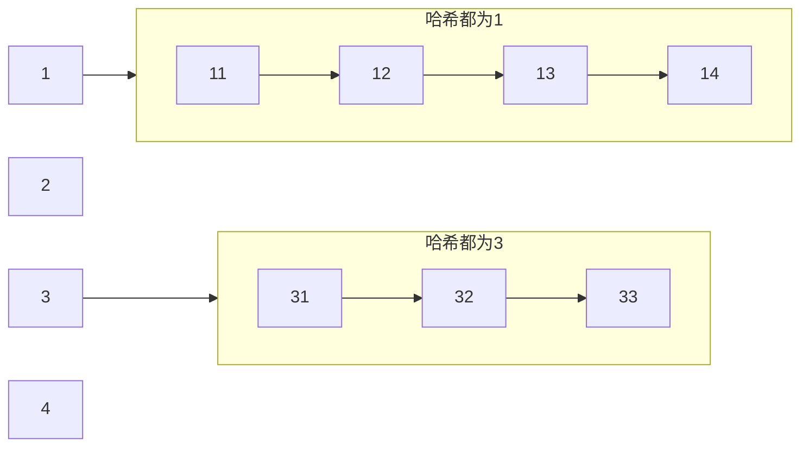

# 哈希表

根据关键码值（Key value）直接进行访问的数据结构。通过把关键码值映射到表中一个位置来访问记录，以加快查找的速度。这个映射函数叫做哈希函数，存放记录的数组就叫做哈希表。

从根本上来说，一个哈希表包含一个数组，通过特殊的关键码(也就是key)来访问数组中的元素。

哈希表的主要思想是:

- 存放Value的时候，通过一个**哈希函数**，通过 关键码（key）进行哈希运算得到哈希值，然后得到 映射的位置， 去寻找存放值的地方 ，
- 读取Value的时候，也是通过同一个**哈希函数**，通过 关键码（key）进行哈希运算得到哈希值，然后得到 映射的位置，从那个位置去读取。

## 哈希算法

哈希算法要符合一下几点要求：
- 高效：效率得高，要做到长文本也能高效计算出hash值；
- 不可逆：不能逆推出原文；

### 直接定址法

- 取关键字或关键字的某个线性函数值为散列地址。
- 即 f(key) = key 或 f(key) = a*key + b，其中a和b为常数。

### 除留余数法

- 取关键字被某个不大于散列表长度 m 的数 p 求余，得到的作为散列地址。
- 即 f(key) = key % p, p < m。这是最为常见的一种哈希算法。

###  数字分析法

- 当关键字的位数大于地址的位数，对关键字的各位分布进行分析，选出分布均匀的任意几位作为散列地址。
- 仅适用于所有关键字都已知的情况下，根据实际应用确定要选取的部分，尽量避免发生冲突。

### 平方取中法

- 先计算出关键字值的平方，然后取平方值中间几位作为散列地址。
- 随机分布的关键字，得到的散列地址也是随机分布的。

### 随机数法

- 选择一个随机函数，把关键字的随机函数值作为它的哈希值。
- 通常当关键字的长度不等时用这种方法。

## 哈希冲突

哈希冲突指的是不同的key通过同样的哈希算法生成的哈希值相同，也叫哈希碰撞。

哈希冲突是无法避免的，如果要完全避免的话，那么就只能一个key对应一个值的地址，也就是一个key就有一个索引。这样一来，空间就会增大，甚至内存溢出。

> 要想办法减少哈希冲突，**因为Hash碰撞的概率就越小，存取效率就会越高**

### 解决方案

#### 开放地址法

开发地址法的做法是，当冲突发生时，使用某种探测算法在散列表中寻找下一个空的散列地址，只要散列表足够大，空的散列地址总能找到。

按照探测序列的方法，一般将开放地址法区分为线性探查法、二次探查法、双重散列法等。

这里为了更好的展示三种方法的效果，我们用以一个模为8的哈希表为例，采用**除留余数法**，

往表中插入三个关键字分别为26，35，36的记录，分别除8取模后，在表中的位置如下：

| 0    | 1    | 2    | 3    | 4    | 5    | 6    | 7    |
| ---- | ---- | ---- | ---- | ---- | ---- | ---- | ---- |
|      |      | 26   | 35   | 36   |      |      |      |

这个时候插入42，那么正常应该在地址为2的位置里，但因为关键字30已经占据了位置。

##### 线性探查法

fi=(f(key)+i) ％ m ，0 ≤ i ≤ m-1

探查时从地址 d 开始，首先探查 T[d]，然后依次探查 T[d+1]，…，直到 T[m-1]，此后又循环到 T[0]，T[1]，…，直到探查到有空余的地址或者到 T[d-1]为止。

插入42时，探查到地址2的位置已经被占据，接着下一个地址3，地址4，直到空位置的地址5，所以39应放入地址为5的位置。

缺点：需要不断处理冲突，无论是存入还是査找效率都会大大降低。

| 0    | 1    | 2    | 3    | 4    | 5    | 6    | 7    |
| ---- | ---- | ---- | ---- | ---- | ---- | ---- | ---- |
|      |      | 26   | 35   | 36   | 42   |      |      |

##### 二次探查法

fi=(f(key)+di) ％ m，0 ≤ i ≤ m-1

探查时从地址 d 开始，首先探查 T[d]，然后依次探查 T[d+di]，di 为增量序列12，-12，22，-22，……，q2，-q2 且q≤1/2 (m-1) ,直到探查到 有空余地址或者到 T[d-1]为止。

缺点：无法探查到整个散列空间。

所以插入42时，探查到地址2被占据，就会探查T[2+1^2]也就是地址3的位置，被占据后接着探查到地址7，然后插入。

| 0    | 1    | 2    | 3    | 4    | 5    | 6    | 7    |
| ---- | ---- | ---- | ---- | ---- | ---- | ---- | ---- |
|      |      | 26   | 35   | 36   | 42   |      |      |

##### 双重散列法

fi=(f(key)+i*g(key)) % m (i=1，2，……，m-1)

其中，f(key) 和 g(key) 是两个不同的哈希函数，m为哈希表的长度

步骤：

双哈希函数探测法，先用第一个函数 **f(key)** 对关键码计算哈希地址，一旦产生地址冲突，再用第二个函数 **g(key)** 确定移动的步长因子，最后通过步长因子序列由探测函数寻找空的哈希地址。

比如，f(key)=a 时产生地址冲突，就计算g(key)=b，则探测的地址序列为 f1=(a+b) mod m，f2=(a+2b) mod m，……，fm-1=(a+(m-1)b) % m，假设 b 为 3，那么关键字42应放在 “5” 的位置。

| 0    | 1    | 2    | 3    | 4    | 5    | 6    | 7    |
| ---- | ---- | ---- | ---- | ---- | ---- | ---- | ---- |
|      |      | 26   | 35   | 36   | 42   |      |      |

##### 总结

开发地址法，通过持续的探测，最终找到空的位置。

上面的例子中，开发地址方虽然解决了问题，但是26和42,占据了一个数组同一个元素，42只能向下，此时再来一个取余为2 的值呢，只能向下继续寻找，同理，每一个来的值都只能向下寻找。

为了解决这个问题，引入了链地址法。

#### 链地址法

在哈希表每一个单元中设置链表，某个数据项对的关键字还是像通常一样映射到哈希表的单元中，而数据项本身插入到单元的链表中。来一个相同的数据，就将它插入到单元对应的链表中，在来一个相同的，继续给链表中插入。

链地址法解决哈希冲突的例子如下：

（1）采用**除留余数法**构造哈希函数，而 冲突解决的方法为 **链地址法**。

（2）具体的关键字列表为（11，12，13，14，31，32，33），则哈希函数为H（key）=key MOD 13。则采用除留余数法和链地址法后得到的预想结果应该为：

哈希造表完成后，进行查找时，首先是根据哈希函数找到关键字的位置链，然后在该链中进行搜索，如果存在和关键字值相同的值，则查找成功，否则若到链表尾部仍未找到，则该关键字不存在。

哈希表的特性决定了其高效的性能，大多数情况下**查找元素**的时间复杂度可以达到O(1)， 时间主要花在计算hash值上，

然而也有一些极端的情况，最坏的就是hash值全都映射在同一个地址上，这样**哈希表就会退化成链表**。**查找元素**的时间复杂度会变为O(n)，效率瞬间低下。

## 最佳实践

## 总结

哈希表这种结构适用于只有等值查询的场景，不适用于范围查询和模糊查询。