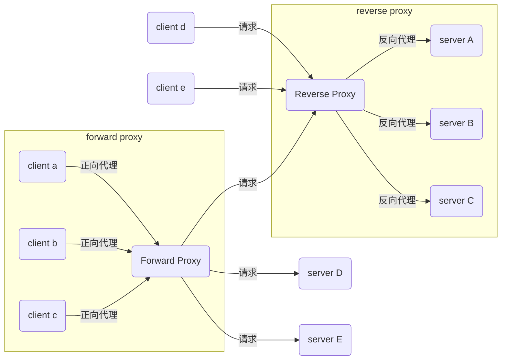

# Nginx

## 概念

Nginx是一个高性能的HTTP和反向代理服务器，及电子邮件（IMAP/POP3）代理服务器，同时也是一个非常高效的反向代理、负载平衡。

Nginx性能这么高得益于它的**异步非阻塞**事件处理机制：运用了epoll模型，提供了一个队列，排队解决。

高度模块化设计，除了少量核心代码，其他一切接模块。官方Nginx共有五大类型模块：核心模块、配置模块、事件模块、HTTP模块、mail模块。

要注意的是：nginx的模块是静态的，添加和删除模块都要对nginx进行重新编译，这一点与Apache的动态模块完全不同。


### 优点

- 跨平台、配置简单

- 非阻塞、高并发连接：处理2-3万并发连接数，官方监测能支持5万并发
- 内存消耗小：开启10个nginx才占150M内存，Nginx采取了分阶段[资源分配](https://baike.so.com/doc/1092243-1155769.html)技术
- nginx处理静态文件好,耗费内存少
- 内置的健康检查功能：如果有一个服务器宕机，会做一个健康检查，再发送的请求就不会发送到宕机的服务器了。重新将请求提交到其他的节点上。
- 节省宽带：支持GZIP压缩，可以添加浏览器本地缓存
- 稳定性高：宕机的概率非常小
- master/worker结构：一个master进程，生成一个或者多个worker进程
- 接收用户请求是异步的：浏览器将请求发送到nginx服务器，它先将用户请求全部接收下来，再一次性发送给后端web服务器，极大减轻了web服务器的压力
- 一边接收web服务器的返回数据，一边发送给浏览器客户端
- 网络依赖性比较低，只要ping通就可以负载均衡
- 可以有多台nginx服务器
- 事件驱动：通信机制采用epoll模型


## 工作流程

### 接收请求

- 首先，nginx在启动时，会解析配置文件，得到需要监听的端口与ip地址，
- 然后在nginx的master进程里面先初始化好这个监控的socket，再进行listen
- 然后再fork出多个子进程出来,  子进程会竞争accept新的连接。
- 此时，客户端就可以向nginx发起连接了。当客户端与nginx进行三次握手，与nginx建立好一个连接后
- 此时，某一个子进程会accept成功，然后创建nginx对连接的封装，即ngx_connection_t结构体
	   接着，根据事件调用相应的事件处理模块，如http模块与客户端进行数据的交换。
- 最后，nginx或客户端来主动关掉连接，到此，一个连接就寿终正寝了


Nginx启动后，首先进行配置文件的解析，解析成功会得到虚拟服务器的ip和端口号，在主进程master进程中创建socket，对addrreuse选项进行设置，并将socket绑定到对应的ip地址和端口并进行监听。然后创建子进程worker进程，当客户端和Nginx进行三次握手，则可以创建成功与Nginx的连接。当有新的请求进入时，空闲的worker进程会竞争，当某一个worker进程竞争成功，则会得到这个已经成功建立连接的socket，然后创建ngx_connection_t结构体，接下来设置读写事件处理函数并添加读写事件用来与客户端进行数据交换。当请求结束Nginx或者客户端主动关闭连接，此时一个请求处理完毕。


#### Master

`Master`进程：读取及评估配置和维持


#### Worker

`Worker`进程：处理请求


### 异步非阻塞原理

Nginx使用了epoll模型并对底层代码进行大幅度优化。之前其实有讲过Nginx是采用1个master进程，多个worker进程的模式，每次接收到一个请求，master会将请求按照一定策略分发给一个worker进程去进行处理请求。worker进程数一般设置为和CPU核心数一致，异步非阻塞模式就会使得worker线程在等待请求callback的空闲时间可以接收处理新的请求，当接收到旧请求的callback时再回去继续处理该请求，这样就完成了少数几个worker进程却实现了高并发的问题。


每创建一个新的线程，都需要为其分配cpu和内存。当然，创建进程也是一样，但是由于线程过多会导致内存消耗过多。所以Nginx采用单线程异步处理用户请求，这样不需要不断地为新的线程分配cpu和内存，减轻服务器内存消耗，所以使得Nginx性能方面更为高效。


### C10K问题

`C10K`问题是指无法同时处理大量客户端(10,000)的网络套接字。


## 请求代理




### 正向代理

正向代理也是大家最常接触的到的代理模式，那究竟什么是正向代理呢？我们都知道Google在国内是无法正常访问的，但是某些时候我们由于技术问题需要去访问Google时，我们会先找到一个可以访问Google的代理服务器，我们将请求发送到代理服务器，代理服务器去访问Google，然后将访问到的数据返回给我们，这样的过程就是正向代理。正向代理最大的特点是客户端需要明确知道要访问的服务器地址，Google服务器只清楚请求来自哪个代理服务器，而不清楚来自哪个具体的客户端，正向代理可以隐藏真实客户端的具体信息。

客户端必须设置正向代理服务器，而且需要知道正向代理服务器的IP地址以及代理程序的端口。一句话来概括就是正向代理代理的是客户端，是一个位于客户端和Google服务器之间的服务器，为了从Google服务器取得数据，客户端向代理服务器发送一个请求并指定目标(Google服务器)，然后代理向原始服务器转交请求并将获得的数据返回给客户端。


一个位于客户端和原始服务器(origin server)之间的服务器，为了从原始服务器取得内容，客户端向代理发送一个请求并指定目标(原始服务器)，然后代理向原始服务器转交请求并将获得的内容返回给客户端。客户端才能使用正向代理。

正向代理总结就一句话：代理端代理的是客户端。


总结正向代理的几个作用：

- 访问国外无法访问的网站做缓存，加速访问资源
- 对客户端访问授权，上网进行认证代理
- 可以记录用户访问记录（上网行为管理），对外隐藏用户信息


### 反向代理

反向代理（Reverse Proxy）方式是指以代理服务器来接受internet上的连接请求，然后将请求，发给内部网络上的服务器，并将从服务器上得到的结果返回给internet上请求连接的客户端，此时代理服务器对外就表现为一个反向代理服务器。

反向代理总结就一句话：代理端代理的是服务端。


多个客户端给服务器发送的请求，Nginx服务器接收到请求以后，按照一定的规则转发到不同的服务器进行业务逻辑处理，也就是我们刚才讲到的负载均衡的策略。此时请求来源于哪个客户端是确定的，但是请求由哪台服务器处理的并不明确，Nginx扮演的就是一个反向代理角色。可以这样来理解，反向代理对外都是透明的，访问者并不知道自己访问的是一个代理。反向代理代理的是服务端，主要用于服务器集群分布式部署的情况下，反向代理隐藏了服务器的信息。


总结下反向代理的两个作用：

- 保证内网的安全，通常将反向代理作为公网访问地址，Web服务器是内网
- 负载均衡，通过反向代理服务器来优化网站的负载


### 总结

1. 在正向代理中，隐藏了请求来源的客户端信息；
2. 在反向代理中，隐藏了请求具体处理的服务端信息；


## 动静分离

动态资源、静态资源分离是让动态网站里的动态网页根据一定规则把不变的资源和经常变的资源区分开来，动静资源做好了拆分以后，我们就可以根据静态资源的特点将其做缓存操作，这就是网站静态化处理的核心思路。
   动态资源、静态资源分离简单的概括是：动态文件与静态文件的分离。


在我们的软件开发中，有些请求是需要后台处理的（如：.jsp,.do等等），有些请求是不需要经过后台处理的（如：css、html、jpg、js等等文件）。

 这些不需要经过后台处理的文件称为静态文件，否则动态文件。因此我们后台处理忽略静态文件。这会有人又说那我后台忽略静态文件不就完了吗。

当然这是可以的，但是这样后台的请求次数就明显增多了。在我们对资源的响应速度有要求的时候，我们应该使用这种动静分离的策略去解决。

动、静分离将网站静态资源（HTML，JavaScript，CSS，img等文件）与后台应用分开部署，提高用户访问静态代码的速度，降低对后台应用访问。

这里我们将静态资源放到nginx中，动态资源转发到tomcat服务器中。


## 负载均衡

负载均衡即是代理服务器将接收的请求均衡的分发到各服务器中

 负载均衡主要解决网络拥塞问题，提高服务器响应速度，服务就近提供，达到更好的访问质量，减少后台服务器大并发压力。


### 负载均衡类型

#### 静态负载均衡


##### 配置方式

Nginx的四层静态负载均衡需要启用ngx_stream_core_module模块，默认情况下，ngx_stream_core_module是没有启用的，需要在安装Nginx时，添加--with-stream配置参数启用，如下所示。

```
./configure --prefix=/usr/local/nginx-1.17.2 --with-openssl=/usr/local/src/openssl-1.0.2s --with-pcre=/usr/local/src/pcre-8.43 --with-zlib=/usr/local/src/zlib-1.2.11 --with-http_realip_module --with-http_stub_status_module --with-http_ssl_module --with-http_flv_module --with-http_gzip_static_module --with-cc-opt=-O3 --with-stream  --with-http_ssl_module
```


配置HTTP负载均衡时，都是配置在http指令下，配置四层负载均衡，则是在stream指令下，结构如下所示：

```bash
stream {
	upstream mysql_backend {
		......
	}
	server {
		......
	}
}
```


###### 配置upstream

```bash
upstream mysql_backend {
	server 192.168.175.201:3306 max_fails=2 fail_timeout=10s weight=1;
	server 192.168.175.202:3306 max_fails=2 fail_timeout=10s weight=1;
	least_conn;
}
```


###### 配置server

```bash
server {
	#监听端口，默认使用的是tcp协议，如果需要UDP协议，则配置成listen 3307 udp;
	listen 3307;
	#失败重试
	proxy_next_upstream on;
	proxy_next_upstream_timeout 0;
	proxy_next_upstream_tries 0;
	#超时配置
	#配置与上游服务器连接超时时间，默认60s
	proxy_connect_timeout 1s;
	#配置与客户端上游服务器连接的两次成功读/写操作的超时时间，如果超时，将自动断开连接
	#即连接存活时间，通过它可以释放不活跃的连接，默认10分钟
	proxy_timeout 1m;
	#限速配置
	#从客户端读数据的速率，单位为每秒字节数，默认为0，不限速
	proxy_upload_rate 0;
	#从上游服务器读数据的速率，单位为每秒字节数，默认为0，不限速
	proxy_download_rate 0;
	#上游服务器
	proxy_pass mysql_backend;
}
```


配置完之后，就可以连接Nginx的3307端口，访问数据库了。


###### 完整配置

```bash
user  hadoop hadoop;
worker_processes  auto;
 
error_log  logs/error.log;
#error_log  logs/error.log  notice;
#error_log  logs/error.log  info;
 
#pid        logs/nginx.pid;
 
 
events {
	use epoll;
    worker_connections  1024;
}
 
stream {
	upstream mysql_backend {
		server 192.168.175.100:3306 max_fails=2 fail_timeout=10s weight=1;
		least_conn;
	}
	server {
		#监听端口，默认使用的是tcp协议，如果需要UDP协议，则配置成listen 3307 udp;
		listen 3307;
		#失败重试
		proxy_next_upstream on;
		proxy_next_upstream_timeout 0;
		proxy_next_upstream_tries 0;
		#超时配置
		#配置与上游服务器连接超时时间，默认60s
		proxy_connect_timeout 1s;
		#配置与客户端上游服务器连接的两次成功读/写操作的超时时间，如果超时，将自动断开连接
		#即连接存活时间，通过它可以释放不活跃的连接，默认10分钟
		proxy_timeout 1m;
		#限速配置
		#从客户端读数据的速率，单位为每秒字节数，默认为0，不限速
		proxy_upload_rate 0;
		#从上游服务器读数据的速率，单位为每秒字节数，默认为0，不限速
		proxy_download_rate 0;
		#上游服务器
		proxy_pass mysql_backend;
	}
}

```


#### 动态负载均衡

配置Nginx四层静态负载均衡后，重启Nginx时，Worker进程一直不退出，会报错，如下所示：

```
nginx: worker process is shutting down;
```

这是因为Worker进程维持的长连接一直在使用，所以无法退出，只能杀掉进程。可以使用Nginx的四层动态负载均衡解决这个问题。


##### 配置方式

使用Nginx的四层动态负载均衡有两种方案：使用商业版的Nginx和使用开源的nginx-stream-upsync-module模块。

注意：四层动态负载均衡可以使用nginx-stream-upsync-module模块，七层动态负载均衡可以使用nginx-upsync-module模块。

使用如下命令为Nginx添加nginx-stream-upsync-module模块和nginx-upsync-module模块，此时，Nginx会同时支持四层动态负载均衡和HTTP七层动态负载均衡。

```bash
git clone https://github.com/xiaokai-wang/nginx-stream-upsync-module.git
git clone https://github.com/weibocom/nginx-upsync-module.git
git clone https://github.com/CallMeFoxie/nginx-upsync.git
cp -r nginx-stream-upsync-module/* nginx-upsync/nginx-stream-upsync-module/
cp -r nginx-upsync-module/* nginx-upsync/nginx-upsync-module/
 
./configure --prefix=/usr/local/nginx-1.17.2 --with-openssl=/usr/local/src/openssl-1.0.2s --with-pcre=/usr/local/src/pcre-8.43 --with-zlib=/usr/local/src/zlib-1.2.11 --with-http_realip_module --with-http_stub_status_module --with-http_ssl_module --with-http_flv_module --with-http_gzip_static_module --with-cc-opt=-O3 --with-stream --add-module=/usr/local/src/nginx-upsync --with-http_ssl_module
```


配置HTTP负载均衡时，都是配置在http指令下，配置四层负载均衡，则是在stream指令下，结构如下所示：

```bash
stream {
	upstream mysql_backend {
		......
	}
	server {
		......
	}
}
```


###### 配置upstream

```bash
upstream mysql_backend {
	server 127.0.0.1:1111;	#占位server
	upsync 192.168.175.100:8500/v1/kv/upstreams/mysql_backend upsync_timeout=6m upsync_interval=500ms upsync_type=consul strong_dependency=off;
	upsync_dump_path /usr/local/nginx-1.17.2/conf/mysql_backend.conf;
}
```

- upsync指令指定从consul哪个路径拉取上游服务器配置；
- upsync_timeout配置从consul拉取上游服务器配置的超时时间；
- upsync_interval配置从consul拉取上游服务器配置的间隔时间；
- upsync_type指定使用consul配置服务器；
- strong_dependency配置nginx在启动时是否强制依赖配置服务器，如果配置为on，则拉取配置失败时Nginx启动同样失败。
- upsync_dump_path指定从consul拉取的上游服务器后持久化到的位置，这样即使consul服务器出现问题，本地还有一个备份。


###### 配置server

```bash
server {
	#监听端口，默认使用的是tcp协议，如果需要UDP协议，则配置成listen 3307 udp;
	listen 3307;
	#失败重试
	proxy_next_upstream on;
	proxy_next_upstream_timeout 0;
	proxy_next_upstream_tries 0;
	#超时配置
	#配置与上游服务器连接超时时间，默认60s
	proxy_connect_timeout 1s;
	#配置与客户端上游服务器连接的两次成功读/写操作的超时时间，如果超时，将自动断开连接
	#即连接存活时间，通过它可以释放不活跃的连接，默认10分钟
	proxy_timeout 1m;
	#限速配置
	#从客户端读数据的速率，单位为每秒字节数，默认为0，不限速
	proxy_upload_rate 0;
	#从上游服务器读数据的速率，单位为每秒字节数，默认为0，不限速
	proxy_download_rate 0;
	#上游服务器
	proxy_pass mysql_backend;
}
```


###### 从Consul添加上游服务器

```bash
curl -X PUT -d "{\"weight\":1, \"max_fails\":2, \"fail_timeout\":10}" http://192.168.175.100:8500/v1/kv/upstreams/mysql_backend/192.168.175.201:3306
curl -X PUT -d "{\"weight\":1, \"max_fails\":2, \"fail_timeout\":10}" http://192.168.175.100:8500/v1/kv/upstreams/mysql_backend/192.168.175.202:3306
```


###### 从Consul删除上游服务器

```bash
curl -X DELETE http://192.168.175.100:8500/v1/kv/upstreams/mysql_backend/192.168.175.202:3306
```


###### 配置upstream_show

```bash
server {
	listen 13307;
	upstream_show;
}
```

配置upstream_show指令后，可以通过curl http://192.168.175.100:13307/upstream_show查看当前动态负载均衡上游服务器列表。


###### 完整配置

```bash
user  hadoop hadoop;
worker_processes  auto;
 
error_log  logs/error.log;
#error_log  logs/error.log  notice;
#error_log  logs/error.log  info;
 
#pid        logs/nginx.pid;
 
 
events {
	use epoll;
    worker_connections  1024;
}
 
stream {
	upstream mysql_backend {
		server 127.0.0.1:1111;	#占位server
		upsync 192.168.175.100:8500/v1/kv/upstreams/mysql_backend upsync_timeout=6m upsync_interval=500ms upsync_type=consul strong_dependency=off;
		upsync_dump_path /usr/local/nginx-1.17.2/conf/mysql_backend.conf;
	}
	server {
		#监听端口，默认使用的是tcp协议，如果需要UDP协议，则配置成listen 3307 udp;
		listen 3307;
		#失败重试
		proxy_next_upstream on;
		proxy_next_upstream_timeout 0;
		proxy_next_upstream_tries 0;
		#超时配置
		#配置与上游服务器连接超时时间，默认60s
		proxy_connect_timeout 1s;
		#配置与客户端上游服务器连接的两次成功读/写操作的超时时间，如果超时，将自动断开连接
		#即连接存活时间，通过它可以释放不活跃的连接，默认10分钟
		proxy_timeout 1m;
		#限速配置
		#从客户端读数据的速率，单位为每秒字节数，默认为0，不限速
		proxy_upload_rate 0;
		#从上游服务器读数据的速率，单位为每秒字节数，默认为0，不限速
		proxy_download_rate 0;
		#上游服务器
		proxy_pass mysql_backend;
	}
	server {
		listen 13307;
		upstream_show;
	}
}
```


### 负载均衡方式

#### 轮询

默认情况下Nginx使用轮询的方式实现负载均衡，每个新的请求按照时间顺序逐一分配到不同的后端服务器去进行处理，如果后端服务器宕机，则Nginx的健康检查功能会将这个后端服务器剔除。但是轮询方式是显而易见的：可靠性低而且负载分配不平衡，所以轮询方式更适用于图片服务器或者静态资源服务器。


#### weight

可以对不同的后端服务器设置不同的权重比例，这样可以改变不同后端服务器处理请求的比例。可以给性能更优的后端服务器配置更高的权重。


#### ip_hash

这种方式会根据请求的ip地址的hash结果分配后端服务器来处理请求，这样每个用户发起的请求固定只会由同一个后端服务器处理，这样可以解决session问题。


##### session同步

上面其实提过了解决方案，负载均衡方式使用ip_hash方式，如果用户已经访问过某个后端器，则再次访问时会将这个请求的ip地址进行哈希算法转换，自动定位到该服务器。当然也可以通过redis缓存用户session，一样可以处理session不同步的问题。


#### fail

这种方式有点类似于轮询方式，主要是根据后端服务器的响应时间来分配请求，响应时间短的后端服务器优先分配请求。


#### url_hash

这种方式是按照请求url的hash结果来将不同请求分配到不同服务器，使用这种方式每个url的请求都会由同一个后端服务器进行处理，后端服务器为缓存时效率会更高。


## 常用优化配置

1. 调整worker_processes指定Nginx需要创建的worker进程数量，刚才有提到worker进程数一般设置为和CPU核心数一致。
2. 调整worker_connections设置Nginx最多可以同时服务的客户端数。结合worker_processes配置可以获得每秒可以服务的最大客户端数。
3. 启动gzip压缩，可以对文件大小进行压缩，减少了客户端http的传输带宽，可以大幅度提高页面的加载速度。
4. 启用缓存，如果请求静态资源，启用缓存是可以大幅度提升性能的。


## 常用命令

通过Nginx安装目录中的/sbin/nginx执行如下命令：

- 启动nginx：./sbin/nginx
- 停止nginx：./sbin/nginx -s stop  ./sbin/nginx -s quit
- 安全退出：nginx -s quit 
- 重载配置：./sbin/nginx -s reload(平滑重启) service nginx reload 
- 重载指定配置文件：./sbin/nginx -c /usr/local/nginx/conf/nginx.conf
- 查看nginx版本：./sbin/nginx -v

```sh
[root@VM-12-3-opencloudos ~]# nginx -v
nginx version: nginx/1.24.0
```


- 查看Nginx安装信息：nginx -V

```sh
[root@VM-12-3-opencloudos ~]# nginx -V
nginx version: nginx/1.24.0
built by gcc 8.5.0 20210514 (OpenCloudOS 8.5.0-18) (GCC) 
configure arguments: --prefix=/usr/local/nginx --with-http_gzip_static_module
```


- 检查配置文件是否正确：./sbin/nginx -t

```sh
[root@VM-12-3-opencloudos ~]# nginx -t
nginx: the configuration file /usr/local/nginx/conf/nginx.conf syntax is ok
nginx: configuration file /usr/local/nginx/conf/nginx.conf test is successful
```


- 显示帮助信息：./sbin/nginx -h

```sh
[root@VM-12-3-opencloudos ~]# nginx -h
nginx version: nginx/1.24.0
Usage: nginx [-?hvVtTq] [-s signal] [-p prefix]
             [-e filename] [-c filename] [-g directives]

Options:
  -?,-h         : this help
  -v            : show version and exit
  -V            : show version and configure options then exit
  -t            : test configuration and exit
  -T            : test configuration, dump it and exit
  -q            : suppress non-error messages during configuration testing
  -s signal     : send signal to a master process: stop, quit, reopen, reload
  -p prefix     : set prefix path (default: /usr/local/nginx/)
  -e filename   : set error log file (default: logs/error.log)
  -c filename   : set configuration file (default: conf/nginx.conf)
  -g directives : set global directives out of configuration file
```


# Nginx 应用

## 访问Vue应用

```nginx
server {
  	# 配置访问的端口号
    listen       28080;
    # 设置为服务器的外网地址或域名
    server_name  43.139.3.252;
    location / {
    		# 配置build后的dist文件夹的绝对路径
        root  /var/lib/docker/volumes/jenkins-data/_data/workspace/learning-web/dist;
        index  index.html index.htm;
        try_files $uri $uri/ /index.html;
    }
    location /api{
         rewrite  ^/api/(.*)$ /$1 break;
         proxy_pass http://localhost:28083;
    }
}
```

# TODO 

```nginx
user  nginx;
worker_processes  auto;

error_log  /var/log/nginx/error.log notice;
pid        /var/run/nginx.pid;


events {
    worker_connections  1024;
}


http {
    include       /etc/nginx/mime.types;
    default_type  application/octet-stream;

    log_format  main  '$remote_addr - $remote_user [$time_local] "$request" '
                      '$status $body_bytes_sent "$http_referer" '
                      '"$http_user_agent" "$http_x_forwarded_for"';

    access_log  /var/log/nginx/access.log  main;

    sendfile        on;
    #tcp_nopush     on;

    keepalive_timeout  65;

    #gzip  on;

    include /etc/nginx/conf.d/*.conf;
}
```


```nginx
upstream polling {
    # 轮训不同的服务
    server 192.168.2.146:1994;
    server 192.168.2.146:1995;
    server 192.168.2.146:1996;
}

upstream pollingByWeight {
    # 根据权重轮训不同的服务
    server 192.168.2.146:1994 weight=9;
    server 192.168.2.146:1995;
    server 192.168.2.146:1996;
}

server {
    listen       80;
    listen  [::]:80;
    server_name  localhost;

    #access_log  /var/log/nginx/host.access.log  main;

    location / {
        root   /usr/share/nginx/html;
        index  index.html index.htm;
    }

    location /v1/ {
        # 转发到指定服务器
        # proxy_pass http://192.168.2.146:1994;

        # 轮训转到到指定服务器
        # proxy_pass        http://polling;

        # 轮训转到到指定服务器
        proxy_pass        http://pollingByWeight;
        proxy_set_header  Host $proxy_host; # 修改转发请求头，让8080端口的应用可以受到真实的请求
        proxy_set_header  X-Real-IP $remote_addr;
        proxy_set_header  X-Forwarded-For $proxy_add_x_forwarded_for;   
    }

    location /baidu/ {
        proxy_pass https://www.baidu.com/;
        proxy_set_header  Host $proxy_host; # 修改转发请求头，让8080端口的应用可以受到真实的请求
        proxy_set_header  X-Real-IP $remote_addr;
        proxy_set_header  X-Forwarded-For $proxy_add_x_forwarded_for;   
    }

    #error_page  404              /404.html;

    # redirect server error pages to the static page /50x.html
    #
    error_page   500 502 503 504  /50x.html;
    location = /50x.html {
        root   /usr/share/nginx/html;
    }

    # proxy the PHP scripts to Apache listening on 127.0.0.1:80
    #
    #location ~ \.php$ {
    #    proxy_pass   http://127.0.0.1;
    #}

    # pass the PHP scripts to FastCGI server listening on 127.0.0.1:9000
    #
    #location ~ \.php$ {
    #    root           html;
    #    fastcgi_pass   127.0.0.1:9000;
    #    fastcgi_index  index.php;
    #    fastcgi_param  SCRIPT_FILENAME  /scripts$fastcgi_script_name;
    #    include        fastcgi_params;
    #}

    # deny access to .htaccess files, if Apache's document root
    # concurs with nginx's one
    #
    #location ~ /\.ht {
    #    deny  all;
    #}
}


```
