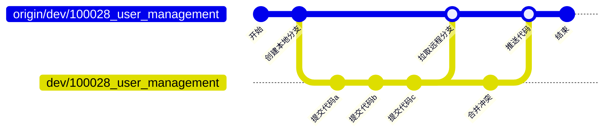
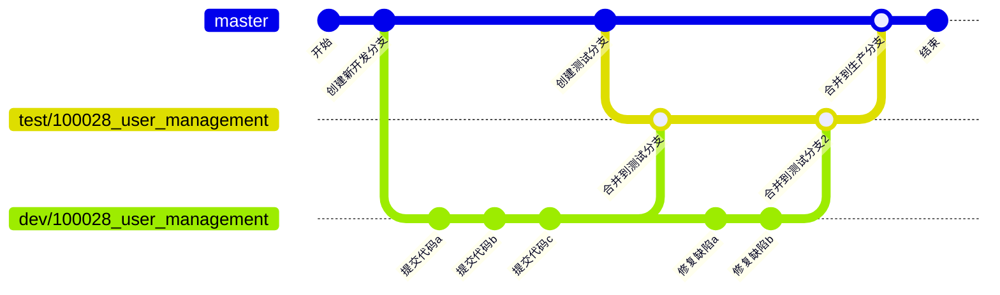
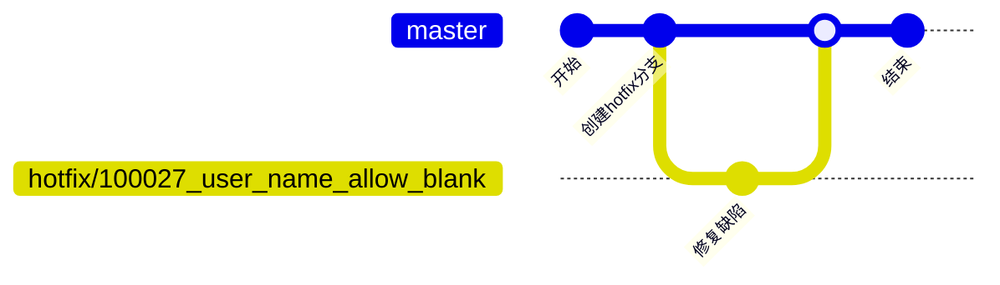

# Git 开发规范

## 分支创建

### master 分支

主分支，在创建项目时创建，也可命名为`main`分支。用于部署生产环境的分支，所有提供给用户使用的正式版本，都在这个主分支上发布。为确保 `master `分支稳定性，要求代码无严重缺陷， `master` 分支一般由 `test` 以及 `hotfix` 分支合并，任何时间都不能直接修改或推送代码。


### release分支

预发布分支，暂无。


### hotfix分支

用于修复生产环境发现的缺陷，是从`master`分支切换出的新分支，缺陷修复完成后及时合并到`master`分支并发布生产环境。

- 分支名称根据缺陷ID和描述确认，如：`hotfix/100027_user_name_allow_blank`；
- 该分支合并到master分支发布生产确认没有问题后删除；


### test分支

测试分支，用于发布到测试环境，是先从`master`分支切换出的新分支，再将需要提测的开发分支代码合并到该测试分支。

- 分支名称根据需求ID和描述确认，如 `test/100028_user_management`；
- 如果因为服务器资源冲突时，可以将多个测试分支合并为一个测试分支发布到测试环境，此时新测试分支命名根据需求ID确认，如`test/100028_100029`；该分支只能用来作为发布到测试环境，不能基于该分支开发代码；
- 该分支合并到master分支发布生产确认没有问题后删除；


### dev分支

开发分支，用于开发新需求，是从`master`分支切换出的新分支。

- 分支名称根据需求ID和描述确认，如 `dev/100028_user_management`；
- 如果因为服务器资源冲突时，可以将多个开发分支合并为一个测试分支发布到测试环境，此时新开发分支命名根据需求ID确认，如 `dev/100028_100029` ；该分支只能用来作为发布到开发环境，不能基于该分支开发代码
- 该分支合并到测试分支后删除；


## 代码提交

编写完代码后需要commit代码，需要遵循如下几点规范：


### 提交描述

```xml
<type>: <subject>
// 换行
<body>
```


- type: 本次 commit 的类型，诸如 bugfix docs style 等
- subject: 简明扼要的阐述下本次 commit 的主旨，不能用更新代码、提交、update等无法看出含义的描述；
- body: 在主体内容中把本次 commit 详细的描述一下，比如此次变更的动机，修复的缺陷产生原因及修复方式；


#### Type说明

- **feat**: 添加新特性，新接口等
- **fix**: 修复bug
- **build**: 改变构建流程、或者增加依赖库、工具等
- docs: 仅仅修改了文档
- style: 仅仅修改了空格、格式缩进、逗号等等，不改变代码逻辑
- refactor: 代码重构，没有加新功能或者修复bug
- perf: 增加代码进行性能测试
- test: 增加测试用例


### 提交原则

- 每次尽量编写实现一个功能点后就commit，避免编写完所有功能点后才commit所有代码；后端比方说写完一个接口就提交一次，前端比方说写完一个页面的某个组件就提交一次；

  

### 参考文档

- [如何熟练使用git做好代码提交_云效(Apsara Devops)-阿里云帮助中心](https://help.aliyun.com/document_detail/324213.html?spm=a2c4g.153866.0.0.7f0363a1sPs7lI)


## 推送代码

在多人同时开发时，每次推送代码前都需要先操作拉取远程分支代码，然后解决冲突后推送代码到远程。




## 分支合并

代码合并必须通过pullrequest方式进行合并，且合并前必须先解决冲突。


## 标签创建

标签是某一时间点上的版本，通常使用标签标识代码库的重要版本，如在项目的里程碑创建标签。

使用标签标识代码库某一时间的重要版本，也可以使用 git 命令直接创建标签：git tag -a v1.0 -m '版本 1.0'。建议在名称前加字母 v 前缀，如：v1.0 或 v1.0.0；如非生产版本，可以在名称后加待发行版标识，如：v0.1-alpha 或 v0.1-beta。


**每次合并代码到`master`分支发布到生产环境后，在下班前将根据当前`master`分支创建tag作留存。**


### 参考文档

- [如何在代码托管中管理标签_云效(Apsara Devops)-阿里云帮助中心](https://help.aliyun.com/document_detail/153867.html?spm=a2c4g.460319.0.0.6a67657bhozuTK)


## 场景描述

### 一般需求开发




#### 开发到测试流程

- 由生产分支`master`（时刻1）切换出开发分支 `dev/100028_user_management`；
- 由生产分支`master`（时刻2）切换出测试分支 `test/100028_user_management`，然后将开发分支 `dev/100028_user_management` 代码合并到测试分支 `test/100028_user_management` 。此时因为生产分支`master`（时刻1）和生产分支`master`（时刻2）代码可能不一致，所以合并分支 `dev/100028_user_management` 时需要解决代码冲突；


#### 测试到生产流程

- 缺陷的修复在开发分支`dev/100028_user_management`上进行，修复完成后合并到测试分支`test/100028_user_management`并发布测试环境；

- 上线前将测试分支`test/100028_user_management`合并到生产分支`master`（时刻3），此时依然可能会有冲突，需要解决冲突。然后发布`master`（时刻4）分支代码到测试环境验证功能是否正常；
- 发布生产分支`master`（时刻4）


### 线上缺陷修复

- 由生产分支`master`（时刻1）切换出开发分支`hotfix/100027_user_name_allow_blank`；





### 多开发测试分支并行开发

在服务器资源冲突时，可以将多个开发分支合并为一个测试分支发布到测试环境，此时新开发分支命名根据需求ID确认，如 `dev/100028_100029` ；该分支只能用来作为发布到开发环境，不能基于该分支开发代码。

测试分支同开发分支一样处理。


## 总结

- 分支代码流向永远是单向的，从`master`创建，再一层一层合并到`master`；
- 所有`hotfix`，`test`，`dev`分支都是从`master`分支切换出的新分支；
- 所有分支推送的代码要保证能编译通过并运行；


## 参考文档

- [别乱提交代码了，你最好知道的 Git 分支开发规范！别错过好文哦](https://cloud.tencent.com/developer/article/1809754)
- [项目中的 Git 使用规范](https://learnku.com/articles/42994)