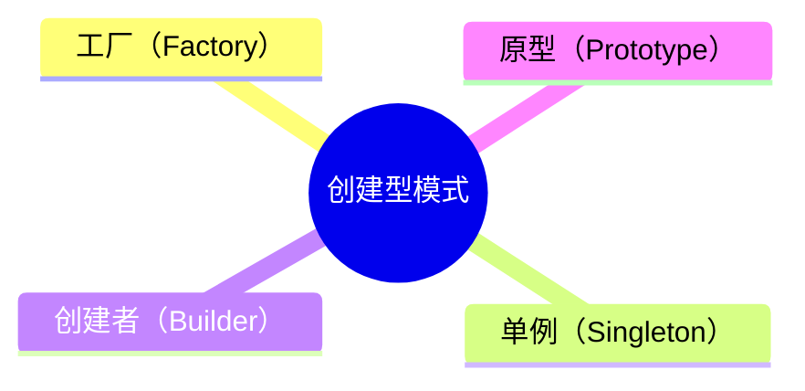

**创建型设计模式**

用于描述“怎样创建对象”，主要特点是“将对象的创建与使用分离”。GoF中提供了单例、原型、工厂方法、抽象工厂、建造者5种创建型模式。


| 模式名称     | **业务场景**                                         | **实现要点**                                                 |
| ------------ | ---------------------------------------------------- | :----------------------------------------------------------- |
| 工厂方法模式 | 多种类型商品不同接口，统一发奖服务搭建场景           | 定义一个创建对象的接口，让其子类自己决定实例化哪一个工厂类，工厂模式使其创建过程延迟到子类进行。 |
| 抽象工厂模式 | 替换Redis双集群升级，代理类抽象场景                  | 提供一个创建一系列相关或相互依赖对象的接口，而无需指定它们具体的类。 |
| 单例模式     | 7种单例模式案例，Effective Java 作者推荐枚举单例模式 | 一个类只有一个实例，并提供一个访问它的全局访问点，以便外部获取该实例。 |
| 原型模式     | 上机考试多套试，每人题目和答案乱序排列场景           | 通过对原型对象复制而获取多个和原型对象类似的实例。           |
| 建造者模式   | 各项装修物料组合套餐选配场景                         | 将一个复杂对象分解成多个相对简单的部分，然后根据不同的需要分别创建它们，最后构建成该复杂对象。 |


# Factory

## 概述

工厂方法模式（Factory）具体的实现大概可以细分为三种：

- 简单工厂模式
- 工厂方法模式
- 抽象工厂模式


### 优点

该模式的扩展性较高，增加新的子类实现较简单，且隐蔽了具体的子类实现过程。缺点在于增加了系统的复杂度，增加了子类的个数。


### 使用场景


## 简单实现

### 基于JDK的实现

#### 简单工厂模式

```java
public ISender produce(String type) {
if (MAIL.equals(type)) {
return new MailSender();
} else if (SMS.equals(type)) {
return new SmsSender();
} else {
System.err.println("please input correct type!");
return null;
}
}
```


需要注意的是，一般来说如果每个对象的创建只需要简单地new一下就行了，那么其实就无需使用工厂模式，工厂模式适合对象创建过程复杂的场景。


#### 工厂方法模式

简单工厂模式违反了七大设计原则的OCP原则，也就是开闭原则。所谓的开闭原则就是对修改关闭，对扩展开放。如果现在新增了一种对象，那么工厂方法就得修改，增加一种类型的判断，那么就此时就出现了修改代码的行为，也就违反了对修改关闭的原则。

```java
public interface Provider {
ISender produce();
}

public class SendMailFactory implements Provider{
public static SendMailFactory build() {
return new SendMailFactory();
}
@Override
public ISender produce() {
return new MailSender();
}
}

public class SendSmsFactory implements Provider{
public static SendSmsFactory build() {
return new SendSmsFactory();
}
@Override
public ISender produce() {
return new SmsSender();
}
}
```


工厂方法模式。将工厂提取成一个接口，具体每个对象都各自实现这个接口，每种对象都有各自的创建工厂，如果调用者需要创建对象，就可以通过各自的工厂来实现。

此时假设需要新增一个对象，那么只需要实现接口就行，对于原来的实现代码是不需要修改的，遵守了对修改关闭的原则，同时由于是对扩展开放，实现接口就是扩展的意思，那么也就符合扩展开放的原则。


#### 抽象工厂模式

抽象工厂模式特点就是创建一系列产品。


### 基于IOC容器的实现


## 源码解析

### Mybatis

> org.apache.ibatis.session.defaults.DefaultSqlSessionFactory

```java
public class DefaultSqlSessionFactory implements SqlSessionFactory {
private SqlSession openSessionFromDataSource(ExecutorType execType, TransactionIsolationLevel level, boolean autoCommit) {
Transaction tx = null;
try {
final Environment environment = configuration.getEnvironment();
final TransactionFactory transactionFactory = getTransactionFactoryFromEnvironment(environment);
tx = transactionFactory.newTransaction(environment.getDataSource(), level, autoCommit);
final Executor executor = configuration.newExecutor(tx, execType);
return new DefaultSqlSession(configuration, executor, autoCommit);
} catch (Exception e) {
closeTransaction(tx); // may have fetched a connection so lets call close()
throw ExceptionFactory.wrapException("Error opening session.  Cause: " + e, e);
} finally {
ErrorContext.instance().reset();
}
}
}
```


在Mybatis中，当需要调用Mapper接口执行sql的时候，需要先获取到 `SqlSession`，通过`SqlSession`再获取到`Mapper`接口的动态代理对象，而`SqlSession`的构造过程比较复杂，所以就提供了`SqlSessionFactory`工厂类来封装`SqlSession`的创建过程。

对于使用者来说，只需要通过`SqlSessionFactory`来获取到`SqlSession`，而无需关心`SqlSession`是如何创建的。


### Spring

> org.springframework.beans.factory.BeanFactory

```java
public interface BeanFactory {
Object getBean(String name) throws BeansException;
}
```


BeanFactory就是Bean生成的工厂。一个Spring Bean在生成过程中会经历复杂的一个生命周期，而这些生命周期对于使用者来说是无需关心的，所以就可以将Bean创建过程的逻辑给封装起来，提取出一个Bean的工厂。

# Singleton

## 概述

单例模式（Singleton）要私有化构造器，在类中创建私有实例并提供公有方法给外部类获取该实例对象，确保只会存在唯一的一个实例。


特点：

- 私有化构造器；
- 对外提供获取实例方法。


单例模式分为：

- **懒汉式**（线程不安全，调用效率高，但是不能延时加载）；
- **饿汉式**（线程安全，调用效率不高，可以延时加载）；
- **双重检测锁式**（由于JVM底层内部模型原因，偶尔会出问题，不建议使用）；
- **静态内部类式**（线程安全，调用效率高，可以延时加载）；
- **枚举单例**（线程安全，调用效率高，不能延时加载）；


## 简单实现

### 基于JDK的实现

#### 懒汉式

线程不安全的懒汉式：

```java
public class Singleton {
private static Singleton instance = null;
private Singleton() {}
public static Singleton getInstance() {
if(instance == null) {
instance = new Singleton();
}
return instance;
}
}
```

这种方式是最基本的实现方式，这种实现最大的问题就是不支持多线程。因为没有加锁 synchronized，所以严格意义上它并不算单例模式。


线程安全的懒汉式：

```java
public class Singleton {
private static Singleton instance = null;
private Singleton() {}
public static synchronized Singleton getInstance() {
if(instance == null) {
instance = new Singleton();
}
return instance;
}
}
```


这种方式具备很好的 lazy loading，能够在多线程中很好的工作，但是，效率很低，99% 情况下不需要同步。

优点：第一次调用才初始化，避免内存浪费。

缺点：必须加锁 synchronized 才能保证单例，但加锁会影响效率。


#### 饿汉式

```java
public class Singleton {
private static final Singleton instance = new Singleton();
private Singleton() { }
public static Singleton getInstance() { return instance; }
}
```


优点：没有加锁，执行效率会提高。

缺点：类加载时就初始化，浪费内存，容易产生垃圾对象。


饿汉式基于 classloader 机制避免了多线程的同步问题，在类装载时就实例化。

虽然导致类装载的原因有很多种，在单例模式中大多数都是调用 getInstance 方法， 但是也不能确定有其他的方式（或者其他的静态方法）导致类装载，这时候初始化 instance 显然没有达到 lazy loading 的效果。


#### 静态常量

静态常量方式属于饿汉式，以静态变量的方式声明对象。这种单例模式在Spring中使用的比较多，举个例子，在Spring中对于Bean的名称生成有个类AnnotationBeanNameGenerator就是单例的。


#### 双检锁式

```java
public class Singleton {
private volatile static Singleton instance = null;
private Singleton() {}
/**
* 静态工程方法，创建实例，此时毫无线程安全保护，因此要添加synchronized
* @return      单例对象
*/
public static Singleton getInstance() {
if(instance == null) {
synchronized(Singleton.class) {
if(instance == null) {
instance = new Singleton();
}
}
}
return instance;
}
}
```


##### synchronized的作用

主要用来解决的是多线程同步问题，其可以保证在被其修饰的代码任意时刻只有一个线程执行。


##### 两次校验null

- 第一次校验null是为了减少进入同步代码块的次数，提高效率。
- 第二次校验null是为了防止多次创建对象。假设AB同时走到同步代码块，A先抢到锁，进入代码，创建了对象，释放锁，此时B进入代码块，如果没有判断null，那么就会直接再次创建对象，那么就不是单例的了，所以需要进行判断null，防止重复创建单例对象。


##### **volatile的作用**

假设没有使用volatile关键字发生了重排序，第二步和第三步执行过程被调换了，也就是先将INSTANCE变量指向Singleton这个对象内存地址，再初始化对象。这样在发生并发的情况下，另一个线程经过第一个if非空判断时，发现已经为不为空，就直接返回了这个对象，但是此时这个对象还未初始化，内部的属性可能都是空值，一旦被使用的话，就很有可能出现空指针这些问题。

volatile的主要作用：

1. 保持内存可见性；使所有线程都能看到共享内存的最新状态。
2. 防止指令重排的问题；


这种方式采用双检锁机制（DCL，即 double-checked locking），安全且在多线程情况下能保持高性能。

uniqueInstance = new Singleton(); 这段代码其实是分为三步执行：

1. 为实例分配内存空间
2. 初始化实例
3. 将实例指向分配的内存地址


由于 JVM 指令重排，执行顺序有可能变成 1->3->2。指令重排在单线程环境下不会出现问题，但是在多线程环境下会导致一个线程获得还没有初始化的实例。例如，线程 T1 执行了 1 和 3，此时 T2 调用 getUniqueInstance 后发现实例不为空，因此返回实例，但此时实例还未被初始化。

使用 `volatile` 可以禁止 JVM 的指令重排，保证在多线程环境下也能正常运行。


#### 静态内部类式

单例模式使用内部类来实现，JVM 内部的机制能够保证当一个类被加载的时候，这个类的加载过程是线程互斥的。当第一次调用getInstance的时候，JVM 能够保证instance只被创建一次，并且会把赋值给instance的内存初始化完毕。 同时该方法也只会在第一次调用的时候使用互斥机制，这样就解决了低性能问题。

```java
// 通过静态内部类的方式来实现单例模式，线程安全，调用效率高，可以延时加载。
public class Singleton {
private Singleton () {
// 避免通过反射方式实例化对象
if(SingletonFactory.INSTANCE != null) {
throw new RuntimeException("不支持重复实例化");
}
}

// 使用一个内部类来维护单例
private static class SingletonFactory{
private static final Singleton INSTANCE = new Singleton();
}

public static Singleton getInstance() {
return SingletonFactory.INSTANCE;
}

// 防止反序列化实例化重复对象
private Object readResolve() throws ObjectStreamException {
return Inner.INSTANCE;
}
}
```


这种方式能达到双检锁方式一样的功效，但实现更简单。对静态域使用延迟初始化，应使用这种方式而不是双检锁方式。这种方式只适用于静态域的情况，双检锁方式可在实例域需要延迟初始化时使用。

这种方式同样利用了 classloader 机制来保证初始化 instance 时只有一个线程，跟饿汉式不同的是饿汉式只要 Singleton 类被装载了，那么 instance 就会被实例化，没有懒加载的效果，而这种方式是 Singleton 类被装载了，instance 不一定被初始化。因为 SingletonHolder 类没有被主动使用，只有通过显式调用 getInstance 方法时，才会显式装载 SingletonHolder 类，从而实例化 instance。

如果实例化 instance 很消耗资源，想让它延迟加载，另外一方面，又不希望在 Singleton 类加载时就实例化，因为不能确保 Singleton 类还可能在其他的地方被主动使用从而被加载，那么这个时候实例化 instance 显然是不合适的。这个时候，这种方式相比饿汉式就显得很合理。


**防止反射创建对象**

为了防止通过Class类型对象调用newInstance方法来创建实例，可以在私有空构造器中添加内部类静态属性是否为空校验。


**防止反序列化创建对象**

为了防止放序列化创建对象，可以添加readResolve方法，程序在反序列化获取对象时，会去寻找readResolve()方法。

- 如果该方法不存在，则直接返回新对象。
- 如果该方法存在，则按该方法的内容返回对象。
- 如果之前没有实例化单例对象，则会返回null。


#### 创建获取分离方式

因为只需要在创建类的时候进行同步，所以只要将创建和getInstance()分开，单独为创建加synchronized关键字也可以。整个程序只需创建一次实例，所以性能也不会有什么影响。


```java
public class Singleton {
private static Singleton instance = null;
private Singleton() {
}
public static synchronized void syncInit() {
if(instance == null) {
instance = new Singleton();
}
}
public static Singleton getInstance() {
if(instance == null) {
syncInit();
}
return instance;
}
}
```


类的静态方法也能实现单例模式，两者的不同处：

- 静态类不能实现接口，因为接口中不允许有static修饰的方法

- 单例可以被延迟（比较庞大的类延迟加载有助于提升性能）初始化，静态类一般在第一次加载时初始化。

- 单例类比较灵活，可以实现一些其它功能，静态类不行。


#### 枚举式

```java
public enum Singleton {
INSTANCE;
}
```

这种方式是实现单例模式的最佳方法。它更简洁，不仅能避免多线程同步问题，而且还自动支持序列化机制，防止反序列化重新创建新的对象。


### 基于IOC容器的实现

## 源码解析

### JDK

> java.lang.Runtime

```java
public class Runtime {
private static Runtime currentRuntime = new Runtime();
public static Runtime getRuntime() {
return currentRuntime;
}
private Runtime() {}
}
```


### Mybatis

> org.apache.ibatis.logging.LogFactory

```java
public final class LogFactory {
private static Constructor<? extends Log> logConstructor;
static {
tryImplementation(LogFactory::useSlf4jLogging);
// ...
}

private LogFactory() {}

public static Log getLog(Class<?> clazz) {
return getLog(clazz.getName());
}

public static Log getLog(String logger) {
try {
return logConstructor.newInstance(logger);
} catch (Throwable t) {
// ...
}
}

public static synchronized void useSlf4jLogging() {
setImplementation(org.apache.ibatis.logging.slf4j.Slf4jImpl.class);
}
// ...
private static void tryImplementation(Runnable runnable) {
if (logConstructor == null) {
try {
runnable.run();
} catch (Throwable t) {
// ignore
}
}
}

private static void setImplementation(Class<? extends Log> implClass) {
try {
Constructor<? extends Log> candidate = implClass.getConstructor(String.class);
logConstructor = candidate;
} catch (Throwable t) {
// ...
}
}
}
```


### Spring

> org.springframework.context.annotation.AnnotationBeanNameGenerator

```java
public class AnnotationBeanNameGenerator implements BeanNameGenerator {
public static final AnnotationBeanNameGenerator INSTANCE = new AnnotationBeanNameGenerator();
}
```


>org.springframework.beans.factory.xml.DefaultNamespaceHandlerResolver

```java
public class DefaultNamespaceHandlerResolver implements NamespaceHandlerResolver {
@Nullable
private volatile Map<String, Object> handlerMappings;
private Map<String, Object> getHandlerMappings() {
Map<String, Object> handlerMappings = this.handlerMappings;
if (handlerMappings == null) {
synchronized (this) {
handlerMappings = this.handlerMappings;
if (handlerMappings == null) {
// ...
}
}
}
return handlerMappings;
}
}
```


### Dubbo

> org.apache.dubbo.common.extension.ExtensionLoader

```java
public class ExtensionLoader<T> {
    public T getExtension(String name, boolean wrap) {
    // ...
    Object instance = holder.get();
    if (instance == null) {
    synchronized (holder) {
    instance = holder.get();
    if (instance == null) {
    instance = createExtension(name, wrap);
    holder.set(instance);
    }
    }
    }
    return (T) instance;
    }
    }
```


## 优点

单例模式优点在于在内存里只有一个实例，减少了内存的开销，尤其是在频繁的创建和销毁实例场景下，避免对资源的多重占用；

缺点在于没有接口，不能继承，与单一职责原则冲突，一个类应该只关心内部逻辑，而不关心外面怎么样来实例化。


## 使用场景

​    

# Prototype

原型模式（Prototype）

## 概述

## 简单实现

## 基于JDK的实现

## 基于IOC容器的实现

## 源码解析

## 优点

## 使用场景


# Builder

## 概述

建造者模式（Builder）将一个复杂对象的构造与它的表示分离，使同样的构建过程可以创建不同的表示，这样的设计模式被称为建造者模式。它是将一个复杂的对象分解为多个简单的对象，然后一步一步构建而成。


### 优点

- 建造者独立，易扩展。
- 便于控制细节风险。


### 缺点

- 产品必须有共同点，范围有限制；
- 如内部变化复杂，会有很多的建造类。


### 使用场景

- 需要生成的对象具有复杂的内部结构
- 需要生成的对象内部属性本身相互依赖


## 简单实现

### 基于JDK的实现


### 基于IOC容器的实现

## 源码解析

### Spring

> org.springframework.beans.factory.support.BeanDefinitionBuilder

```java
public final class BeanDefinitionBuilder {
	public static BeanDefinitionBuilder genericBeanDefinition(String beanClassName) {
		BeanDefinitionBuilder builder = new BeanDefinitionBuilder(new GenericBeanDefinition());
		builder.beanDefinition.setBeanClassName(beanClassName);
		return builder;
	}
}
```


Spring在创建Bean之前，会将每个Bean的声明封装成对应的一个BeanDefinition，而BeanDefinition会封装很多属性，所以Spring为了更加优雅地创建BeanDefinition，就提供了BeanDefinitionBuilder这个建造者类。


### Guava

> com.google.common.cache.CacheBuilder

```java
public final class CacheBuilder<K, V> {
    public static CacheBuilder<Object, Object> newBuilder() {
        return new CacheBuilder();
    }
    // ...
    public <K1 extends K, V1 extends V> Cache<K1, V1> build() {
        this.checkWeightWithWeigher();
        this.checkNonLoadingCache();
        return new LocalManualCache(this);
    }
}
```


在项目中，如果需要使用本地缓存，会使用本地缓存的实现的框架来创建一个，比如在使用Guava来创建本地缓存Cache时，就是通过建造者模式实现。