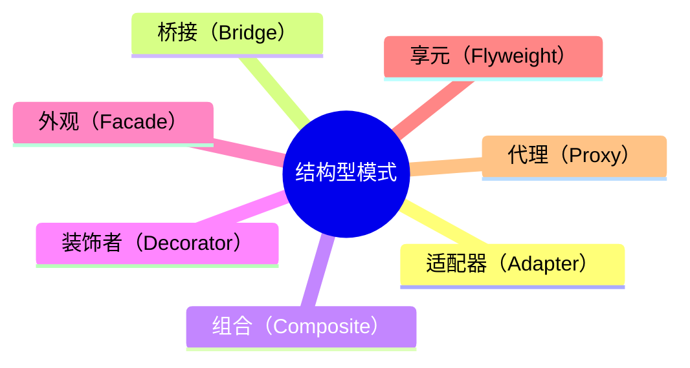

**结构型设计模式**

用于描述如何将类或对象按某种布局组成更大的结构，GoF中提供了代理、适配器、桥接、装饰、外观、享元、组合7种结构型模式。


| 模式名称   | **业务场景**                                                 | **实现要点**                                                 |
| :--------- | :----------------------------------------------------------- | :----------------------------------------------------------- |
| 适配器模式 | 从多个MQ消息体中，抽取指定字段值场景                         | 将一个类的接口转换成另外一个接口，使得原本由于接口不兼容而不能一起工作的那些类可以一起工作。 |
| 桥接模式   | 多支付渠道(微信、支付宝)与多支付模式(刷脸、指纹)场景         | 将抽象与实现分离，使它们可以独立变化，用组合关系代替继承关系，降低了抽象和实现的耦合度。 |
| 组合模式   | 营销差异化人群发券，决策树引擎搭建场景                       | 将对象组合成树形结构以表示”部分-整体”的层次结构。组合模式使得用户对单个对象和组合对象的使用具有一致性。 |
| 装饰模式   | SSO单点登录功能扩展，增加拦截用户访问方法范围场景            | 动态地给对象添加额外功能。                                   |
| 外观模式   | 基于SpringBoot开发门面模式中间件，统一控制接口白名单场景     | 为多个复杂的子系统提供一个一致的接口，使这些子系统更加容易被访问。 |
| 享元模式   | 基于Redis秒杀，提供活动与库存信息查询场景                    | 运用共享技术有效地支持大量细粒度的对象的复用。               |
| 代理模式   | 模拟mybatis-spring中定义DAO接口，使用代理类方式操作数据库原理实现场景 | 提供一种代理来控制对这个对象的访问，从而限制、增强或修改该对象的一些特性。 |


# Adapter

## 概述 

对适配器模式（Adapter）的功能很好理解，就是把一个类的接口变换成客户端所能接受的另一种接口，从而使两个接口不匹配而无法在一起工作的两个类能够在一起工作。

适配器的重点在于将一个接口的功能转换为另一个接口的功能。


### 优点

- 更好的复用性

系统需要使用现有的类，而此类的接口不符合系统的需要。那么通过适配器模式就可以让这些功能得到更好的复用。

- 更好的扩展性

在实现适配器功能的时候，可以调用自己开发的功能，从而自然地扩展系统的功能。


### 缺点

过多的使用适配器，会让系统非常零乱，不易整体进行把握。比如，明明看到调用的是A接口，其实内部被适配成了B接口的实现，一个系统如果太多出现这种情况，无异于一场灾难。因此如果不是很有必要，可以不使用适配器，而是直接对系统进行重构。

## 简单实现

### 基于JDK的实现

1、已有 `AdapterSource` 接口及其实现类 `AdapterSourceImpl`

> com.demo.design.pattern.structural.adapter.AdapterSource

```java
public interface AdapterSource {
    /**
     * adapter method  
     */
    void execute();
}
```


> com.demo.design.pattern.structural.adapter.AdapterSourceImpl

```java
@Slf4j
public class AdapterSourceImpl implements AdapterSource {
    @Override
    public void execute() {
        log.info("default adapter function");
    }
}
```


2、现在要在使用 `AdapterTarget` 接口处调用 `AdapterSource` 接口方法而不修改 `AdapterSource` 相关类。

> com.demo.design.pattern.structural.adapter.AdapterTarget

```java
public interface AdapterTarget {
    /**
     * call adapter method in this method
     */
    void executeTarget();
}
```


3、可以通过两种适配方式来在 `AdapterTarget` 接口的实现类中调用 `AdapterSource` 实现类的功能。
第一种是通过持有 `AdapterSource` 实现类对象的方式来调用 `AdapterSource` 方法，相比于下述的继承方式，更推荐通过组装的方式完成 `AdapterSource` 接口的适配。

> com.demo.design.pattern.structural.adapter.HoldObjectAdapter

```java
public class HoldObjectAdapter implements AdapterTarget {
    private final AdapterSource source;

    HoldObjectAdapter(AdapterSource source) {
        super();
        this.source = source;
    }

    @Override
    public void executeTarget() {
        source.execute();
    }
}
```


第二种是通过继承 `AdapterSource` 实现类的方式来调用 `AdapterSource` 方法。

> com.demo.design.pattern.structural.adapter.ExtendClassAdapter

```java
public class ExtendClassAdapter extends AdapterSourceImpl implements AdapterTarget {
    @Override
    public void executeTarget() {
        execute();
    }
}
```


示例

```java
@Test
public void adapterPattern(){
    AdapterSource adapterSource = new AdapterSourceImpl();
    AdapterTarget holdObjAdapter = new HoldObjectAdapter(adapterSource);
    holdObjAdapter.executeTarget();

    AdapterTarget extendAdapter = new ExtendClassAdapter();
    extendAdapter.executeTarget();           
}
```


## 源码解析

### JDK

#### 输入流

> java.io.InputStreamReader

```java
public class InputStreamReader extends Reader {
    private final StreamDecoder sd;
    public InputStreamReader(InputStream in) {
        // ...
    }
}
```

`InputStreamReader` 通过持有不同接口或父类 `InputStream` 类型的实现来将 `InputStream` 适配适配到 `Reader`。


### Mybatis

#### Log日志

> org.apache.ibatis.logging.Log

```java
public interface Log {
    // ...
}
```


`Mybatis` 为了适配多种日志实现类，就使用了适配器模式，将多种日志的实现适配为同一个接口 `Log` 的实现。

> org.apache.ibatis.logging.log4j2.Log4j2LoggerImpl

```java
// ...
import org.apache.logging.log4j.Logger;

public class Log4j2LoggerImpl implements Log {
    private static final Marker MARKER = MarkerManager.getMarker(LogFactory.MARKER);
    // 这里就适配了 apache 的 log4j2 日志实现类
    private final Logger log;
    public Log4j2LoggerImpl(Logger logger) {
        log = logger;
    }
}
```


> org.apache.ibatis.logging.slf4j.Slf4jLoggerImpl

```java
class Slf4jLoggerImpl implements Log {
    private final Logger log;
    // 这里就适配了 slf4j 的日志实现类
    public Slf4jLoggerImpl(Logger logger) {
        log = logger;
    }
```


# Bridge

桥接模式（Bridge）将抽象部分与它的实现部分相分离，使他们可以独立的变化。

桥接模式就是把事物和其具体实现分开，使他们可以各自独立的变化。桥接的用意是： 将抽象化与实现化解耦，使得二者可以独立变化，像我们常用的JDBC桥DriverManager一样，JDBC进行连接数据库的时候，在各个数据库之间进行切换，基本不需要动太多的代码，甚至丝毫不用动，原因就是JDBC提供统一接口，每个数据库提供各自的实现，用一个叫做数据库驱动的程序来桥接就行了。


## 概述

## 简单实现

## 基于JDK的实现

## 基于IOC容器的实现

## 源码解析

## 优点

## 使用场景


# Composite

组合模式（Composite）


## 概述

## 简单实现

## 基于JDK的实现

## 基于IOC容器的实现

## 源码解析

## 优点

## 使用场景


# Decorator

## 概述

装饰模式（Decorator）通过实现与被装饰类实现的相同接口或父类，并将被装饰类作为属性注入到装饰器对象中来完成对装饰器模式的应用。

装饰器模式重点在于调用方对整个过程无感知，仍然调用原先实现的接口或父类方法即可。

### 和适配器模式的比较

装饰器与适配器都有一个别名叫做 包装模式(Wrapper)，它们看似都是起到包装一个类或对象的作用，但是使用它们的目的很不一一样。

适配器模式的意义是要将一个接口转变成另一个接口，它的目的是通过改变接口来达到重复使用的目的。

而装饰器模式不是要改变被装饰对象的接口，而是恰恰要保持原有的接口，但是增强原有对象的功能，或者改变原有对象的处理方式而提升性能。

所以这两个模式设计的目的是不同的。

## 简单实践

### JDK实现

1、现在有接口 `DecoratorSource` 及其实现类 `DecoratorSourceImpl`，如果想在不修改已有类且继续通过 `Source` 类型的声明来调用的情况下对execute功能做修改，即可使用装饰器模式。

> com.demo.design.pattern.structural.decorator.DecoratorSource

```java
public interface DecoratorSource {
    /**
     * enhanced target method
     */
    void execute();
}
```

> com.demo.design.pattern.structural.decorator.DecoratorSourceImpl

```java
@Data
@Slf4j
public class DecoratorSourceImpl implements DecoratorSource {
    @Override
    public void execute() {
        log.info("default decorator source");
    }
}
```

2、创建 `SourceDecorator` 的装饰器类，该类要实现 `DecoratorSource` 接口并将要被装饰的 `DecoratorSource` 类型的实现类作为属性。

> com.demo.design.pattern.structural.decorator.SourceDecorator

```java
@Slf4j
public class SourceDecorator implements DecoratorSource {
    private final DecoratorSource source;

    public SourceDecorator(DecoratorSource source) {
        super();
        this.source = source;
    }

    @Override
    public void execute() {
        log.info("before decorator!");
        source.execute();
        log.info("after decorator!");
    }
}
```

3、调用装饰器类 `SourceDecorator` 方式示例如下：

> com.demo.design.pattern.StructuralPatternTest

```java
public class StructuralPatternTest {
    @Test
    public void decoratorPattern(){
        DecoratorSourceImpl decoratorSource = new DecoratorSourceImpl();
        SourceDecorator sourceDecorator = new SourceDecorator(decoratorSource);
        sourceDecorator.execute();
    }
}
```

## 源码解析

### JDK InputStream流

> java.io.FilterInputStream

```java
public class FilterInputStream extends InputStream {
    protected volatile InputStream in;

    protected FilterInputStream(InputStream in) {
        this.in = in;
    }
```

`FilterInputStream` 通过持有实现相同父类的对象，来对该对象功能作增强。


# Facade

外观模式（Facade）


## 概述

## 简单实现

## 基于JDK的实现

## 基于IOC容器的实现

## 源码解析

## 优点

## 使用场景


# Flyweight

## 概述

> Use sharing to support large numbers of fine-grained objects efficiently.

享元模式（Flyweight Pattern）：使用共享对象可有效地支持大量的细粒度的对象，从而节省内存。

## 简单实现

### JDK实现

> com.demo.design.pattern.structural.flyweight.Circle

```java
@Data
public class Circle {
    private int radius;
    private Font font;

    public void draw() {
        System.out.println("Circle: [Font : " + font + ", radius : " + radius + "]");
    }
}
```

调用示例

```java
@Test
public void flyWeightPattern(){
    // 事先定义好需要的Circle对象的共享属性
    Map<Integer, Font> fontMap = new HashMap<>(10);
    fontMap.put(1, new Font("Arial Bold", Font.PLAIN, 1));
    fontMap.put(2, new Font("Arial Bold", Font.BOLD, 2));
    
    List<Circle> circles = new ArrayList<>(100000);
    Circle circle;
    for (int i = 0; i < 100000; ++i) {
        circle = new Circle();
        // 需要大量Circle对象时，共享属性属性可以引用同一个对象
        circle.setFont(fontMap.get(i & 1));
        
        // 非共享属性则每个Circle独有
        circle.setRadius(new Random().nextInt(100));
        circles.add(circle);
    }
    circles.forEach(Circle::draw);
}
```

## 源码解析

### JDK

> java.lang.Integer

```java
public final class Integer extends Number implements Comparable<Integer> {
    /**
     * Returns an {@code Integer} instance representing the specified
     * {@code int} value.  If a new {@code Integer} instance is not
     * required, this method should generally be used in preference to
     * the constructor {@link #Integer(int)}, as this method is likely
     * to yield significantly better space and time performance by
     * caching frequently requested values.
     *
     * This method will always cache values in the range -128 to 127,
     * inclusive, and may cache other values outside of this range.
     *
     * @param  i an {@code int} value.
     * @return an {@code Integer} instance representing {@code i}.
     * @since  1.5
     */
    public static Integer valueOf(int i) {
        if (i >= IntegerCache.low && i <= IntegerCache.high)
            return IntegerCache.cache[i + (-IntegerCache.low)];
        return new Integer(i);
    }
}
```

Integer缓存对象缓存了 -128 到 127 之间的整型值，这是最常用的一部分整型值，JDK也提供了方法来自定义缓存的最大值。
           

> java.lang.Integer.IntegerCache

```java
private static class IntegerCache {
    static final int low = -128;
    static final int high;
    static final Integer cache[];

    static {
        // high value may be configured by property
        int h = 127;
        String integerCacheHighPropValue =
            sun.misc.VM.getSavedProperty("java.lang.Integer.IntegerCache.high");
        if (integerCacheHighPropValue != null) {
            try {
                int i = parseInt(integerCacheHighPropValue);
                i = Math.max(i, 127);
                // Maximum array size is Integer.MAX_VALUE
                h = Math.min(i, Integer.MAX_VALUE - (-low) -1);
            } catch( NumberFormatException nfe) {
                // If the property cannot be parsed into an int, ignore it.
            }
        }
        high = h;

        cache = new Integer[(high - low) + 1];
        int j = low;
        for(int k = 0; k < cache.length; k++)
            cache[k] = new Integer(j++);

        // range [-128, 127] must be interned (JLS7 5.1.7)
        assert IntegerCache.high >= 127;
    }

    private IntegerCache() {}
}
```

## 优点

减少应用程序创建的对象， 降低程序内存的占用， 增强程序的性能。

## 缺点

提高了系统复杂性， 需要分离出外部状态和内部状态， 而且外部状态具有固化特性， 不应该随内部状态改变而改变， 否则导致系统的逻辑混乱。

## 使用场景

- 系统中存在大量的相似对象。

- 细粒度的对象都具备较接近的外部状态， 而且内部状态与环境无关， 也就是说对象没有特定身份。

- 需要缓冲池的场景。


# Proxy

## 概述

代理模式（Proxy）也是开源项目中很常见的使用的一种设计模式，这种模式可以在不改变原有代码的情况下增加功能。

讲到了代理模式，就不得不提一下Spring AOP，Spring AOP其实跟静态代理很像，最终其实也是调用目标对象的方法，只不过是动态生成的。


### 优点

### 使用场景

## 简单实现

### 基于JDK的实现

### 基于IOC容器的实现

## 源码解析

### MyBatis

#### CachingExecutor二级缓存执行器

CachingExecutor中内部有一个Executor类型的属性delegate，所以CachingExecutor显然就是一个代理类，这里就使用到了代理模式。

CachingExecutor的实现原理其实很简单，先从二级缓存查，查不到就通过被代理的对象查找数据，而被代理的Executor在Mybatis中默认使用的是SimpleExecutor实现，SimpleExecutor继承自BaseExecutor。

Mybatis的一级缓存默认是开启的，一级缓存写在BaseExecutor中的话，那么只要是继承了BaseExecutor，就拥有了一级缓存的能力。

但二级缓存默认是不开启的，如果写在BaseExecutor中，讲道理也是可以的，但不符和单一职责的原则，类的功能过多，同时会耦合很多判断代码，比如开启二级缓存走什么逻辑，不开启二级缓存走什么逻辑。而使用代理模式很好的解决了这一问题，只需要在创建的Executor的时候判断是否开启二级缓存，开启的话就用CachingExecutor代理一下，不开启的话老老实实返回未被代理的对象就行，默认是SimpleExecutor。


> org.apache.ibatis.executor.CachingExecutor

```java
public class CachingExecutor implements Executor {
  private final Executor delegate;
}
```


构建Executor对象的源码，一旦开启了二级缓存，就会将前面创建的Executor进行代理，构建一个CachingExecutor返回。


> org.apache.ibatis.session.Configuration

```java
public class Configuration {
    public Executor newExecutor(Transaction transaction, ExecutorType executorType) {
        // ...
        if (cacheEnabled) {
            // 开启二级缓存，就创建executor的代理类的实例
            executor = new CachingExecutor(executor);
        }
        // ...
        return executor;
    }
}
```


## 