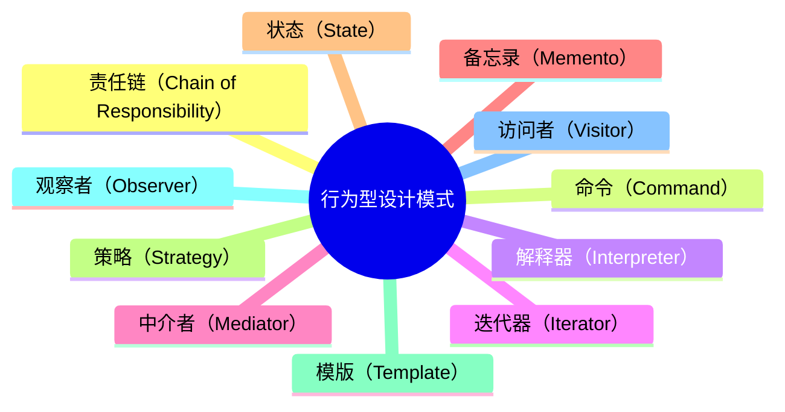
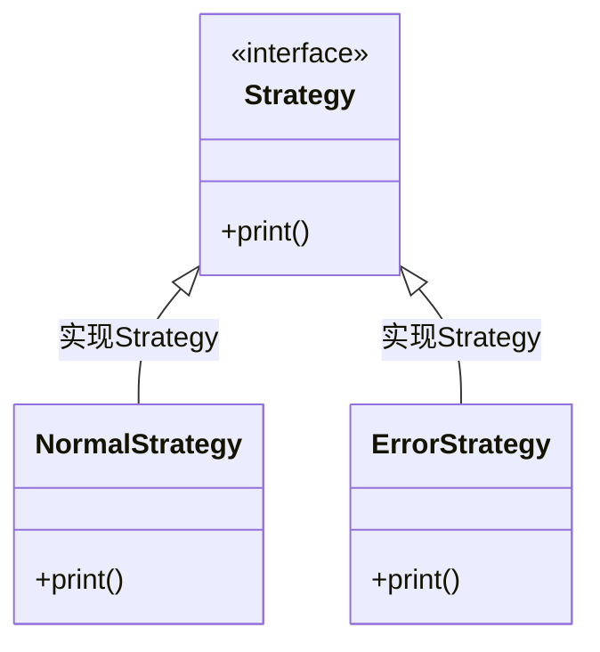

**行为型设计模式**

用于描述类或对象之间怎样相互协作共同完成单个对象无法单独完成的任务，以及怎样分配职责。GoF中提供了模板方法、策略、命令、职责链、状态、观察者、中介者、迭代器、访问者、备忘录、解释器11种行为型模式。


| 模式名称     | **业务场景**                                                 | **实现要点**                                                 |
| :----------- | ------------------------------------------------------------ | ------------------------------------------------------------ |
| 责任链模式   | 模拟618电商大促期间，项目上线流程多级负责人审批场景          | 把请求从链中的一个对象传到下一个对象，直到请求被响应为止。通过这种方式可以去除对象之间的耦合。 |
| 命令模式     | 模拟高档餐厅八大菜系，小二点单厨师烹饪场景                   | 将一个请求封装成一个对象，使发出请求的责任和执行请求的责任分割开。 |
| 迭代器模式   | 模拟公司组织架构树结构关系，深度迭代遍历人员信息输出场景     | 提供一种方法顺序访问一个聚合对象中各个元素,  而又无须暴露该对象的内部表示。 |
| 中介者模式   | 按照Mybatis原理手写ORM框架，给JDBC方式操作数据库增加中介者场景 | 定义一个中介对象来简化原有对象之间的交互关系，降低系统中对象间的耦合度，使原有对象之间不必相互了解。 |
| 备忘录模式   | 模拟互联网系统上线过程中，配置文件回滚场景                   | 在不破坏封装性的前提下，捕获一个对象的内部状态，并在该对象之外保存这个状态。 |
| 观察者模式   | 模拟类似小客车指标摇号过程，监听消息通知用户中签场景         | 定义对象间的一种一对多的依赖关系，当一个对象的状态发生改变时，所有依赖于它的对象都得到通知并被自动更新。 |
| 状态模式     | 模拟系统营销活动，状态流程审核发布上线场景                   | 允许一个对象在其内部状态发生改变时改变其行为能力。           |
| 策略模式     | 模拟多种营销类型优惠券，折扣金额计算策略场景                 | 定义并封装一系列的算法， 使它们可相互替换。算法的改变不会影响使用算法的客户。 |
| 模板方法模式 | 模拟爬虫各类电商商品，生成营销推广海报场景                   | 定义一个操作中的算法的骨架，而将一些步骤延迟到子类中。模板方法使得子类可以不改变一个算法的结构即可重定义该算法的某些特定步骤。 |
| 访问者模式   | 模拟家长与校长，对学生和老师的不同视角信息的访问场景         | 在不改变集合元素的前提下，为一个集合中的每个元素提供多种访问方式，即每个元素有多个访问者对象访问。 |
| 解释器       |                                                              | 提供如何定义语言的文法，以及对语言句子的解释方法，即解释器。 |


# Chain_of_Responsibility

## 概述

责任链模式（Chain of Responsibility）里，很多对象由每一个对象对其下家的引用而连接起来形成一条链。请求在这个链上传递，由该链上的某一个对象或者某几个对象决定处理此请求，每个对象在整个处理过程中值扮演一个小小的角色。


### 优点

### 使用场景


## 简单实现

### 基于JDK的实现

```java
public interface Handler {
    /**
     * 执行方法
     */
    void operator();

    /**
     * 设置责任链上的处理器
     * @param handler 处理器
     */
    void setHandler(Handler handler);
}

public abstract class AbstractHandler implements Handler {
    private Handler handler;

    Handler getHandler() {
        return handler;
    }

    @Override
    public void setHandler(Handler handler) {
        this.handler = handler;
    }
}

public class ShoppingHandler extends AbstractHandler {
    private String name;

    public ShoppingHandler(String name) {
        this.name = name;
    }

    @Override
    public void operator() {
        System.out.println(name + " started!");
        if (getHandler() != null) {
            getHandler().operator();
        }
    }
}

public class OrderHandler extends AbstractHandler {
    private String name;

    public OrderHandler(String name) {
        this.name = name;
    }

    @Override
    public void operator() {
        System.out.println(name + " started!");
        if (getHandler() != null) {
            getHandler().operator();
        }
    }
}

public class PayHandler extends AbstractHandler {
    private String name;
    private Integer money;

    public PayHandler(String name, Integer money) {
        this.name = name;
        this.money = money;
    }

    @Override
    public void operator() {
        this.money = this.money - 1;
        if(this.money > 0) {
            System.out.println(this.name + " started!");
            if (getHandler() != null) {
                getHandler().operator();
            }
        } else {
            System.out.println("you don't have enough money");
        }
    }
}
```


```java
@Test
public void chainOfResponsibility(){
    // 创建责任链上的所有的执行对象，每个责任链的构造参数可以不同，也可以是同一个参数
    Handler shoppingHandler = new ShoppingHandler("shopping");
    Handler orderHandler = new OrderHandler("order");

    // 设置闭环责任链的循环次数，如果超过指定次数，则断开责任链
    Handler payHandler = new PayHandler("pay", 3);

    // 设置下一步需要执行的处理器对象
    shoppingHandler.setHandler(orderHandler);
    orderHandler.setHandler(payHandler);

    // 如果责任链的尾部处理器设置的下一步处理器为头部处理器，则形成了一个闭环
    payHandler.setHandler(shoppingHandler);

    // 首先执行的处理器调用执行方法
    shoppingHandler.operator();
}
```


### 基于IOC容器的实现

## 源码解析

### Spring

#### MVC拦截器

在SpringMVC中，可以通过使用HandlerInterceptor对每个请求进行拦截。而HandlerInterceptor其实就使用到了责任链模式，但是这种责任链模式的写法跟上面举的例子写法不太一样。


> org.springframework.web.servlet.HandlerInterceptor

```java
public interface HandlerInterceptor {
	default boolean preHandle(HttpServletRequest request, HttpServletResponse response, Object handler)
			throws Exception {

		return true;
	}

	default void postHandle(HttpServletRequest request, HttpServletResponse response, Object handler,
			@Nullable ModelAndView modelAndView) throws Exception {
	}

	default void afterCompletion(HttpServletRequest request, HttpServletResponse response, Object handler,
			@Nullable Exception ex) throws Exception {
	}

}
```


对于请求处理前的拦截，就在HandlerExecutionChain中完成调用的。其实就是循环遍历每个HandlerInterceptor，调用preHandle方法。


> org.springframework.web.servlet.HandlerExecutionChain

```java
public class HandlerExecutionChain {
	boolean applyPreHandle(HttpServletRequest request, HttpServletResponse response) throws Exception {
		HandlerInterceptor[] interceptors = getInterceptors();
		if (!ObjectUtils.isEmpty(interceptors)) {
			for (int i = 0; i < interceptors.length; i++) {
				HandlerInterceptor interceptor = interceptors[i];
				if (!interceptor.preHandle(request, response, this.handler)) {
					triggerAfterCompletion(request, response, null);
					return false;
				}
				this.interceptorIndex = i;
			}
		}
		return true;
	}
}
```


### Sentinel

#### 核心实现

Sentinel是阿里开源的一个流量治理组件，而Sentinel核心逻辑的执行其实就是一条责任链。

在Sentinel中，有个核心抽象类AbstractLinkedProcessorSlot，这个组件内部也维护了下一个节点对象。

这个组件有很多实现，比如有比较核心的几个实现

- DegradeSlot：熔断降级的实现
- FlowSlot：流量控制的实现
- StatisticSlot：统计的实现，比如统计请求成功的次数、异常次数，为限流提供数据来源
- SystemSlot：根据系统规则来进行流量控制


> com.alibaba.csp.sentinel.slotchain.AbstractLinkedProcessorSlot

```java
public abstract class AbstractLinkedProcessorSlot<T> implements ProcessorSlot<T> {
    private AbstractLinkedProcessorSlot<?> next = null;
}
```


整个链条的组装的实现是由DefaultSlotChainBuilder实现的，并且内部是使用了SPI机制来加载每个处理节点。如果要自定一些处理逻辑，就可以基于SPI机制来扩展。


> com.alibaba.csp.sentinel.slots.DefaultSlotChainBuilder

```java
@Spi(isDefault = true)
public class DefaultSlotChainBuilder implements SlotChainBuilder {
    @Override
    public ProcessorSlotChain build() {
        ProcessorSlotChain chain = new DefaultProcessorSlotChain();
        List<ProcessorSlot> sortedSlotList = SpiLoader.of(ProcessorSlot.class).loadInstanceListSorted();
        for (ProcessorSlot slot : sortedSlotList) {
            if (!(slot instanceof AbstractLinkedProcessorSlot)) {
                RecordLog.warn("The ProcessorSlot(" + slot.getClass().getCanonicalName() + ") is not an instance of AbstractLinkedProcessorSlot, can't be added into ProcessorSlotChain");
                continue;
            }
            chain.addLast((AbstractLinkedProcessorSlot<?>) slot);
        }
        return chain;
    }
}
```


# Command

## 概述

命令模式（Command Pattern）是一种数据驱动的设计模式，它属于行为型模式。请求以命令的形式包裹在对象中，并传给调用对象。调用对象寻找可以处理该命令的合适的对象，并把该命令传给相应的对象，该对象执行命令。

命令模式很好理解，举个例子，司令员下令让士兵去干件事情，从整个事情的角度来考虑，司令员的作用是，发出口令，口令经过传递，传到了士兵耳朵里，士兵去执行。这个过程好在，三者相互解耦，任何一方都不用去依赖其他人，只需要做好自己的事儿就行，司令员要的是结果，不会去关注到底士兵是怎么实现的。


命令模式会将一个请求封装为一个接口对象，由各种功能去实现其方法，在详细命令类中，通过聚合的方式将具体方法进行抽取调用。

在软件系统中，行为请求者与行为实现者通常是一种紧耦合的关系，但某些场合，比如需要对行为进行记录、撤销或重做、事务等处理时，这种无法抵御变化的紧耦合的设计就不太合适。


**命令模式的目的就是达到命令的发出者和执行者之间解耦，实现请求和执行分开。**


### 优点

1、降低了系统耦合度。 

2、新的命令可以很容易添加到系统中去。


### 缺点

使用命令模式可能会导致某些系统有过多的具体命令类。


### 使用场景

认为是命令的地方都可以使用命令模式，比如： 1、GUI 中每一个按钮都是一条命令。 2、模拟 CMD。

系统需要支持命令的撤销(Undo)操作和恢复(Redo)操作，也可以考虑使用命令模式，见命令模式的扩展。


## 简单实现

### 基于JDK

```java
public interface Command {
    void print();
    void setReceiver(Receiver receiver);
}

public class PrintCommand implements Command {
    private Receiver receiver;
    PrintCommand(Receiver receiver) {
        this.receiver = receiver;
    }

    @Override
    public void setReceiver(Receiver receiver) {
        this.receiver = receiver;
    }

    @Override
    public void print() {
        receiver.action();
    }
}
```


```java
public interface Receiver {
    void action();
}

public class ErrorPrintReceiver implements Receiver {
    @Override
    public void action() {
        System.err.println("errorPrintReceiver: command received!");
    }
}

public class NormalPrintReceiver implements Receiver {
    @Override
    public void action() {
        System.out.println("normalPrintReceiver: command received!");
    }
}
```


```java
public class Invoker{
    private Command command;
    Invoker(Command command) {
        this.command = command;
    }
    void action() {
        command.print();
    }
}
```


```java
public class CommandPattern {
    public static void main(String[] args) {
        // 执行正常打印命令
        Receiver normalPrintReceiver = new NormalPrintReceiver();
        Command cmd = new PrintCommand(normalPrintReceiver);
        Invoker invoker = new Invoker(cmd);
        invoker.action();
        
        // 执行错误打印命令
        Receiver errorPrintReceiver = new ErrorPrintReceiver();
        cmd.setReceiver(errorPrintReceiver);
        invoker.action();
    }
}
```


### 基于IOC


## 源码解析

# Iterator

迭代器模式（Iterator）

## 概述

## 简单实现

## 基于JDK的实现

## 基于IOC容器的实现

## 源码解析

## 优点

## 使用场景

# Mediator

中介者模式（Mediator）

## 概述

## 简单实现

## 基于JDK的实现

## 基于IOC容器的实现

## 源码解析

## 优点

## 使用场景

# Memento

备忘录模式（Memento）

## 概述

## 简单实现

## 基于JDK的实现

## 基于IOC容器的实现

## 源码解析

## 优点

## 使用场景

# Observer

## 概述

> Define a one-to-many dependency between objects so that when one object changes state, all its dependents are notified and updated automatically.

观察者模式（Observer）在对象之间定义一个一对多的依赖，当一个对象状态改变的时候，所有依赖的对象都会得到通知并自动更新。也叫发布订阅模式，能够很好的解耦一个对象改变，自动改变另一个对象这种情况。

当对象间存在一对多关系时，则使用观察者模式（Observer Pattern）。比如，当一个对象被修改时，则会自动通知依赖它的对象。


### 优点

- 观察者和被观察者之间抽象耦合

不管是增加观察者还是被观察者都非常容易扩展，在系统扩展方面会得心应手。

- 建立一套触发机制

被观察者变化引起观察者自动变化。但是需要注意的是，一个被观察者，多个观察者，Java的消息通知默认是顺序执行的，如果一个观察者卡住，会导致整个流程卡住，这就是同步阻塞。

所以实际开发中没有先后顺序的考虑使用异步，异步非阻塞除了能够实现代码解耦，还能充分利用硬件资源，提高代码的执行效率。

另外还有不同进程间的观察者模式，通常基于消息队列来实现，用于实现不同进程间的观察者和被观察者之间的交互。


### 使用场景

- 关联行为场景。如用户注册或登陆成功后发送短信提醒，就可以通过观察注册或登陆是否成功来发送短信。

- 事件多级触发场景。

- 跨系统的消息交换场景， 如消息队列的处理机制。


## 简单实现

### 基于JDK的实现

- 定义被观察者

> com.demo.design.pattern.behavioral.observer.Subject

```java
public interface Subject {
    /**
     * 添加观察者（如果有必要，可以添加remove方法移除观察者接口并在抽象类中实现）
     *
     * @param observer 观察者
     */
    void add(Observer observer);

    /**
     * 被观察者执行操作发生变化
     */
    void operation();
}
```


> com.demo.design.pattern.behavioral.observer.AbstractSubject

```java
public abstract class AbstractSubject implements Subject {
    /**
     * 观察者对象，可以有多个不同的观察者执行不同的行为
     */
    private final List<Observer> observers = new ArrayList<>();

    @Override
    public void add(Observer observer) {
        observers.add(observer);
    }

    void notifyObservers() {
        // 唤醒所有的观察者并同步更新
        for (Observer observer : observers) {
            observer.update();
        }
    }
}
```


> com.demo.design.pattern.behavioral.observer.SubjectImpl

```java
public class SubjectImpl extends AbstractSubject {
    @Override
    public void operation() {
        System.out.println("update self!");
        this.notifyObservers();
    }
}
```


- 定义被观察者

> com.demo.design.pattern.behavioral.observer.Observer

```java
interface Observer {
    /**
     * 更新操作
     */
    void update();
}
```


> com.demo.design.pattern.behavioral.observer.ObserverImpl

```java
public class ObserverImpl implements Observer {
    @Override
    public void update() {
        System.out.println("observer has received and update");
    }
}
```


- 使用示例

```java
@Test
public void observerPattern(){
    Subject sub = new SubjectImpl();
    sub.add(new ObserverImpl());
    sub.operation();
}
```


## 源码解析

### JDK

#### Observer类

> java.util.Observer

```java
/**
 * 通过实现 Observer 接口来接受被观察对象发生改变而发出的通知
 */
public interface Observer {
    /**
     * 当被观察对象发生改变时会调用此方法。当改变发生时，调用被观察对象的唤醒方法来通知所有观察者。
     *
     * @param   o     被观察对象.
     * @param   arg   被观察对象唤醒方法参数
     */
    void update(Observable o, Object arg);
}
```

> java.util.Observable

```java
/**
 * This class represents an observable object, or "data"
 * in the model-view paradigm. It can be subclassed to represent an
 * object that the application wants to have observed.
 * <p>
 * An observable object can have one or more observers. An observer
 * may be any object that implements interface <tt>Observer</tt>. After an
 * observable instance changes, an application calling the
 * <code>Observable</code>'s <code>notifyObservers</code> method
 * causes all of its observers to be notified of the change by a call
 * to their <code>update</code> method.
 * <p>
 * The order in which notifications will be delivered is unspecified.
 * The default implementation provided in the Observable class will
 * notify Observers in the order in which they registered interest, but
 * subclasses may change this order, use no guaranteed order, deliver
 * notifications on separate threads, or may guarantee that their
 * subclass follows this order, as they choose.
 * <p>
 * Note that this notification mechanism has nothing to do with threads
 * and is completely separate from the <tt>wait</tt> and <tt>notify</tt>
 * mechanism of class <tt>Object</tt>.
 * <p>
 * When an observable object is newly created, its set of observers is
 * empty. Two observers are considered the same if and only if the
 * <tt>equals</tt> method returns true for them.
 *
 * @author  Chris Warth
 * @see     java.util.Observable#notifyObservers()
 * @see     java.util.Observable#notifyObservers(java.lang.Object)
 * @see     java.util.Observer
 * @see     java.util.Observer#update(java.util.Observable, java.lang.Object)
 * @since   JDK1.0
 */
public class Observable {
    private boolean changed = false;
    private Vector<Observer> obs;

    /** Construct an Observable with zero Observers. */

    public Observable() {
        obs = new Vector<>();
    }

    /**
     * Adds an observer to the set of observers for this object, provided
     * that it is not the same as some observer already in the set.
     * The order in which notifications will be delivered to multiple
     * observers is not specified. See the class comment.
     *
     * @param   o   an observer to be added.
     * @throws NullPointerException   if the parameter o is null.
     */
    public synchronized void addObserver(Observer o) {
        if (o == null)
            throw new NullPointerException();
        if (!obs.contains(o)) {
            obs.addElement(o);
        }
    }

    /**
     * Deletes an observer from the set of observers of this object.
     * Passing <CODE>null</CODE> to this method will have no effect.
     * @param   o   the observer to be deleted.
     */
    public synchronized void deleteObserver(Observer o) {
        obs.removeElement(o);
    }

    /**
     * If this object has changed, as indicated by the
     * <code>hasChanged</code> method, then notify all of its observers
     * and then call the <code>clearChanged</code> method to
     * indicate that this object has no longer changed.
     * <p>
     * Each observer has its <code>update</code> method called with two
     * arguments: this observable object and <code>null</code>. In other
     * words, this method is equivalent to:
     * <blockquote><tt>
     * notifyObservers(null)</tt></blockquote>
     *
     * @see     java.util.Observable#clearChanged()
     * @see     java.util.Observable#hasChanged()
     * @see     java.util.Observer#update(java.util.Observable, java.lang.Object)
     */
    public void notifyObservers() {
        notifyObservers(null);
    }

    /**
     * If this object has changed, as indicated by the
     * <code>hasChanged</code> method, then notify all of its observers
     * and then call the <code>clearChanged</code> method to indicate
     * that this object has no longer changed.
     * <p>
     * Each observer has its <code>update</code> method called with two
     * arguments: this observable object and the <code>arg</code> argument.
     *
     * @param   arg   any object.
     * @see     java.util.Observable#clearChanged()
     * @see     java.util.Observable#hasChanged()
     * @see     java.util.Observer#update(java.util.Observable, java.lang.Object)
     */
    public void notifyObservers(Object arg) {
        /*
         * a temporary array buffer, used as a snapshot of the state of
         * current Observers.
         */
        Object[] arrLocal;

        synchronized (this) {
            /* We don't want the Observer doing callbacks into
             * arbitrary code while holding its own Monitor.
             * The code where we extract each Observable from
             * the Vector and store the state of the Observer
             * needs synchronization, but notifying observers
             * does not (should not).  The worst result of any
             * potential race-condition here is that:
             * 1) a newly-added Observer will miss a
             *   notification in progress
             * 2) a recently unregistered Observer will be
             *   wrongly notified when it doesn't care
             */
            if (!changed)
                return;
            arrLocal = obs.toArray();
            clearChanged();
        }

        for (int i = arrLocal.length-1; i>=0; i--)
            ((Observer)arrLocal[i]).update(this, arg);
    }

    /**
     * Clears the observer list so that this object no longer has any observers.
     */
    public synchronized void deleteObservers() {
        obs.removeAllElements();
    }

    /**
     * Marks this <tt>Observable</tt> object as having been changed; the
     * <tt>hasChanged</tt> method will now return <tt>true</tt>.
     */
    protected synchronized void setChanged() {
        changed = true;
    }

    /**
     * Indicates that this object has no longer changed, or that it has
     * already notified all of its observers of its most recent change,
     * so that the <tt>hasChanged</tt> method will now return <tt>false</tt>.
     * This method is called automatically by the
     * <code>notifyObservers</code> methods.
     *
     * @see     java.util.Observable#notifyObservers()
     * @see     java.util.Observable#notifyObservers(java.lang.Object)
     */
    protected synchronized void clearChanged() {
        changed = false;
    }

    /**
     * Tests if this object has changed.
     *
     * @return  <code>true</code> if and only if the <code>setChanged</code>
     *          method has been called more recently than the
     *          <code>clearChanged</code> method on this object;
     *          <code>false</code> otherwise.
     * @see     java.util.Observable#clearChanged()
     * @see     java.util.Observable#setChanged()
     */
    public synchronized boolean hasChanged() {
        return changed;
    }

    /**
     * Returns the number of observers of this <tt>Observable</tt> object.
     *
     * @return  the number of observers of this object.
     */
    public synchronized int countObservers() {
        return obs.size();
    }
}
```


### Guava

#### EventBus

事件总线，提供了实现观察者模式的骨架代码。Google Guava EventBus 就是一个比较著名的 EventBus 框架，它不仅仅支持异步非阻塞模式，同时也支持同步阻塞模式。

> com.google.common.eventbus.EventBus

```java
@Beta
public class EventBus {
    private static final Logger logger = Logger.getLogger(EventBus.class.getName());
    private final String identifier;
    private final Executor executor;
    private final SubscriberExceptionHandler exceptionHandler; 
    private final SubscriberRegistry subscribers = new SubscriberRegistry(this);
    private final Dispatcher dispatcher;
    // ...
}
```


利用 `EventBus` 框架实现的观察者模式，不需要定义 `Observer` 接口，任意类型的对象都可以注册到 `EventBus` 中，通过 `@Subscribe` 注解来标明类中哪个函数可以接收被观察者发送的消息。


### Spring

#### Spring事件

Spring事件，就是Spring基于观察者模式实现的一套API。Spring事件的实现比较简单，其实就是当Bean在生成完成之后，会将所有的ApplicationListener接口实现（监听器）添加到ApplicationEventMulticaster中。ApplicationEventMulticaster可以理解为一个调度中心的作用，可以将事件通知给监听器，触发监听器的执行。

retrieverCache中存储了事件类型和对应监听器的缓存。当发布事件的时候，会通过事件的类型找到对应的监听器，然后循环调用监听器。


> org.springframework.context.event.AbstractApplicationEventMulticaster

```java
public abstract class AbstractApplicationEventMulticaster
		implements ApplicationEventMulticaster, BeanClassLoaderAware, BeanFactoryAware {
	final Map<ListenerCacheKey, ListenerRetriever> retrieverCache = new ConcurrentHashMap<>(64);
}
```


> org.springframework.context.event.SimpleApplicationEventMulticaster

```java
public class SimpleApplicationEventMulticaster extends AbstractApplicationEventMulticaster {
	@Override
	public void multicastEvent(final ApplicationEvent event, @Nullable ResolvableType eventType) {
		ResolvableType type = (eventType != null ? eventType : resolveDefaultEventType(event));
		Executor executor = getTaskExecutor();
		for (ApplicationListener<?> listener : getApplicationListeners(event, type)) {
			if (executor != null) {
				executor.execute(() -> invokeListener(listener, event));
			}
			else {
				invokeListener(listener, event);
			}
		}
	}
}
```


# State

## 概述

状态模式（State）：如果一个实体具备状态，且在不同状态下会在同一业务场景执行不同的业务逻辑时，就可以考虑使用状态模式。

### 优点

- 容易新加状态，封装了状态转移规则，每个状态可以被复用和共享。
- 避免大量的if else结构。

### 缺点

- 状态类膨胀。
- 新加入状态时，可能需要修改现有的状态实现。

## 简单实现

### 基于JDK的实现

```java
public interface State {
    /**
     * open mobile
     */
    void open();
    
    /**
     * close mobile
     */
    void close();
}
```

```java
@Slf4j
public class WaitingState implements State{
    private final MobileModel model;

    public WaitingState(MobileModel model) {
        this.model = model;
    }

    @Override
    public void open() {
        log.info("开启手机中。。。");
        this.model.setState(new OpenState(this.model));
    }

    @Override
    public void close() {
        log.info("关闭手机中。。。");
        this.model.setState(new CloseState(this.model));
    }
}
```

```java
@Slf4j
public class OpenState implements State {
    private final MobileModel model;

    public OpenState(MobileModel model) {
        this.model = model;
    }

    @Override
    public void open() {
        log.info("手机已开启");
    }

    @Override
    public void close() {
       log.info("关闭手机中。。。");
        model.setState(new CloseState(this.model));
    }
}
```

```java
@Slf4j
public class CloseState implements State {
    private final MobileModel model;

    public CloseState(MobileModel model) {
        this.model = model;
    }

    @Override
    public void open() {
        log.info("开启手机中。。。");
        this.model.setState(new OpenState(this.model));
    }

    @Override
    public void close() {
        log.info("手机已关闭");
    }
}
```

状态模式中具体实现功能的代码被封装到了 `State` 的实现类中，上下文通过设置不同的 `State` 实现类。

```java
public class MobileModel {
    private State state;

    public MobileModel() { }

    public MobileModel(State state) {
        this.state = state;
    }

    public void setState(State state) {
        this.state = state;
    }

    public void open() {
        state.open();
    }

    public void close() {
        state.close();
    }
}
```

在同一场景中根据不同的状态来调用不同的业务逻辑。

```java
public class DesignPattenTest {
    @Test
    public void stateDesignPattern(){
        MobileModel model = new MobileModel();
        model.setState(new WaitingState(model));
        model.open();
        model.open();
        model.close();
        model.close();
        model.open();
    }
}
```


# Strategy

## 概述

策略模式（Strategy）的重点在于其实现可以去感知随意替换，根据不同的场景调用不同的实现。


### 优点

 - 算法可以自由切换。 
 - 免使用多重条件判断。 
 - 扩展性良好。


### 缺点

- 策略类膨胀。 
- 所有策略类都需要对外暴露。


### 和状态模式的比较

- 策略模式的各个策略之间没有关系，状态模式中要实现状态的流转；
- 策略模式的策略调用由客户端决定，状态模式客户端定义状态的流转；
- 策略模式强调策略的选择，状态模式强调状态的变化。


## 简单实现

### 基于JDK的实现




策略模式需要设计一个接口，为一系列策略模式实现类提供统一的方法对外提供调用。

```java
interface Strategy {
    /**
     * print message
     *
     * @param message message 
     */
    void print(String message);
}
```


通过不同的实现提供不同的业务逻辑。

```java
public class NormalStrategy implements Strategy {
    @Override
    public void print(String message) {
        System.out.println(message);
    }
}
```

```java
public class ErrorStrategy implements Strategy {
    @Override
    public void print(String message) {
        System.err.println(message);
    }
}
```


在不同的场景中，通过调用不同的实现类来完成不同的业务逻辑。

```java
public class DesignPattenTest {
    @Test
    public void strategyDesignPattern() {
        String message = "this is a message";
        Strategy printStrategy = new NormalStrategy();
        printStrategy.print(message);
        printStrategy = new ErrorStrategy();
        printStrategy.print(message);
    }
}
```


### 基于IOC容器的实现

通过SpringBoot实现时可以结合工厂模式，将不同的策略实现类注入到容器中。

1. 定义策略类工厂，并提供注册和获取策略实现类方法。

```java
public class StrategyFactory {
    private final static Map<String, IStrategy> STRATEGY_MAP = new ConcurrentHashMap<>();
    
    public static IStrategy getStrategy(String strategyMark) {
        return STRATEGY_MAP.get(strategyMark);
    }
    
    public static void register(String strategyMark, IStrategy strategy) {
        STRATEGY_MAP.put(strategyMark, strategy);
    }
}
```

2. 定义策略接口，如果需要可以定义策略抽象类实现该接口，增加中间层。

```java
public interface IStrategy {
    /**
     * execute strategy method
     */
    void execute();
}
```

```java
public abstract class BaseStrategy implements IStrategy {

}
```

3. 定义具体的策略实现类继承策略抽象类或策略接口

```java
@Slf4j
@Service
@AllArgsConstructor
public class FirstStrategy extends BaseStrategy implements InitializingBean {
    @Override
    public void execute() {
        log.info("execute first strategy method");
    }

    @Override
    public void afterPropertiesSet() {
        log.info("register first strategy implement class when init context");
        StrategyFactory.register("first", this);
    }
}
```

```java
@Slf4j
@Service
@AllArgsConstructor
public class SecondStrategy extends BaseStrategy implements InitializingBean {
    @Override
    public void execute() {
        log.info("execute second strategy method");
    }

    @Override
    public void afterPropertiesSet() {
        log.info("register second strategy implement class when init context");
        StrategyFactory.register("first", this);
    }
}
```


## 源码解析

### JDK

#### 线程池拒绝策略

> java.util.concurrent.ThreadPoolExecutor

```java
public ThreadPoolExecutor(int corePoolSize,
                          int maximumPoolSize,
                          long keepAliveTime,
                          TimeUnit unit,
                          BlockingQueue<Runnable> workQueue,
                          ThreadFactory threadFactory,
                          RejectedExecutionHandler handler) {
	// ...
    this.handler = handler;
}
```


> java.util.concurrent.ThreadPoolExecutor

```java
public void execute(Runnable command) {
    // ...
    else if (!addWorker(command, false))
        // 添加执行任务失败时调用拒绝策略
        reject(command);
}

final void reject(Runnable command) {
    // 由构造线程池时指定的拒绝策略来实现拒绝逻辑
    handler.rejectedExecution(command, this);
}
```


ThreadPoolExecutor有4中默认的拒绝策略，通过在构造线程池时指定拒绝策略来实现策略模式。


### Spring

#### MVC参数解析

在写接口的时候，会使用到了@PathVariable、@RequestParam、@RequestBody等注解，一旦使用了注解，SpringMVC会处理注解，从请求中获取到参数，然后再调用接口传递过来，而这个过程，就使用到了策略模式。

对于这类参数的解析，SpringMVC提供了一个策略接口UriComponentsContributor。不同的参数处理只需要实现这个解决就行，比如上面提到的几个注解，都有对应的实现。

比如处理@RequestParam注解的RequestParamMethodArgumentResolver的实现。


> org.springframework.web.method.support.UriComponentsContributor

```java
public interface UriComponentsContributor {
	boolean supportsParameter(MethodParameter parameter);
}
```


> org.springframework.web.method.annotation.RequestParamMethodArgumentResolver

```java
public class RequestParamMethodArgumentResolver extends AbstractNamedValueMethodArgumentResolver
		implements UriComponentsContributor {
    	@Override
	public boolean supportsParameter(MethodParameter parameter) {
		if (parameter.hasParameterAnnotation(RequestParam.class)) {
			// ...
		}
		else {
			// ...
		}
	}
}
```


> org.springframework.web.servlet.mvc.method.annotation.PathVariableMethodArgumentResolver

```java
public class PathVariableMethodArgumentResolver extends AbstractNamedValueMethodArgumentResolver
		implements UriComponentsContributor {
    	@Override
	public boolean supportsParameter(MethodParameter parameter) {
		if (!parameter.hasParameterAnnotation(PathVariable.class)) {
			return false;
		}
		if (Map.class.isAssignableFrom(parameter.nestedIfOptional().getNestedParameterType())) {
			PathVariable pathVariable = parameter.getParameterAnnotation(PathVariable.class);
			return (pathVariable != null && StringUtils.hasText(pathVariable.value()));
		}
		return true;
	}
}
```


#### MVC返回值处理

同样，SpringMVC对于返回值的处理也是基于策略模式来实现的。HandlerMethodReturnValueHandler接口定义跟上面都是同一种套路。

比如说，常见的对于@ResponseBody注解处理的实现RequestResponseBodyMethodProcessor。


> org.springframework.web.method.support.HandlerMethodReturnValueHandler

```java
public interface HandlerMethodReturnValueHandler {
	boolean supportsReturnType(MethodParameter returnType);
}
```


> org.springframework.web.servlet.mvc.method.annotation.RequestResponseBodyMethodProcessor

```java
public class RequestResponseBodyMethodProcessor extends AbstractMessageConverterMethodProcessor {
    	@Override
	public boolean supportsReturnType(MethodParameter returnType) {
		return (AnnotatedElementUtils.hasAnnotation(returnType.getContainingClass(), ResponseBody.class) ||
				returnType.hasMethodAnnotation(ResponseBody.class));
	}
}
```


> org.springframework.web.servlet.mvc.method.annotation.ModelAndViewMethodReturnValueHandler

```java
public class ModelAndViewMethodReturnValueHandler implements HandlerMethodReturnValueHandler {
    	@Override
	public boolean supportsReturnType(MethodParameter returnType) {
		return ModelAndView.class.isAssignableFrom(returnType.getParameterType());
	}
}
```


# Template

## 概述

> Define the skeleton of an algorithm in an operation, deferring some steps to subclasses. Template Method lets subclasses redefine certain steps of an algorithm without changing the algorithm’s structure.


模板方法模式（Template）是指，在父类中定义一个操作中的框架，而操作步骤的具体实现交由子类做。其核心思想就是，对于功能实现的顺序步骤是一定的，但是具体每一步如何实现交由子类决定。


### 优点

- 封装不变部分，扩展可变部分

把认为是不变部分的算法封装到父类实现，而可变部分的则可以通过继承来继续扩展。

- 提取公共部分代码，便于维护

- 行为由父类控制，子类实现

基本方法是由子类实现的，因此子类可以通过扩展的方式增加相应的功能，符合开闭原则。


### 缺点

子类执行的结果影响了父类的结果，在复杂项目中，会带来阅读上的难度。可能引起子类泛滥和为了继承而继承的问题。


### 使用场景


## 简单实现

### 基于JDK的实现

```java
public abstract class AbstractShoppingExecutor {
    /**
     * 一般防止误操作，会将模板方法设置为 final 的
     */
    public final void goShopping() {
        shopping();
        order();
        pay();
    }

    /**
     * 选择商品
     */
    protected abstract void order();

    private void shopping() {
        System.out.println("shopping ...");
    }

    private void pay() {
        System.out.println("paying ...");
    }
}
```


```java
@Slf4j
public class MenConsumer extends AbstractShoppingExecutor {
    @Override
    public void order() {
        log.info("choose computer");
        log.info("choose desktop computer");
    }
}
```


### 基于IOC容器的实现

## 源码解析

### JDK

#### HashMap添加元素

HashMap通过put方法存元素，并且在元素添加成功之后，会调用一下afterNodeInsertion方法。而afterNodeInsertion其实是在HashMap中是空实现。

这其实就是模板方法模式。HashMap定义了一个流程，那就是当元素成功添加之后会调用afterNodeInsertion，子类如果需要在元素添加之后做什么事，那么重写afterNodeInsertion就行。正巧，JDK中的LinkedHashMap重写了这个方法。


> java.util.HashMap

```java
public class HashMap<K,V> extends AbstractMap<K,V>
    implements Map<K,V>, Cloneable, Serializable {
	final V putVal(int hash, K key, V value, boolean onlyIfAbsent,
                   boolean evict) {
        // ...
        if (++size > threshold)
            resize();
        // 该方法在HashMap中是一个空实现的方法
        afterNodeInsertion(evict);
        return null;
    }
    
    void afterNodeInsertion(boolean evict) { }
}
```


> java.util.LinkedHashMap

```java
public class LinkedHashMap<K,V> extends HashMap<K,V> implements Map<K,V> {
    void afterNodeInsertion(boolean evict) { // possibly remove eldest
        LinkedHashMap.Entry<K,V> first;
        if (evict && (first = head) != null && removeEldestEntry(first)) {
            K key = first.key;
            removeNode(hash(key), key, null, false, true);
        }
    }
}
```


### Spring

#### ApplicationContext刷新容器

在Spring中，ApplicationContext在使用之前需要调用一下refresh方法，而refresh方法就定义了整个容器刷新的执行流程代码。在整个刷新过程有一个onRefresh方法，而onRefresh方法默认是没有做任何事，所以onRefresh就是一个模板方法，并且方法内部的注释也表明了，这个方法是为了子类提供的。


> org.springframework.context.support.AbstractApplicationContext

```java
public abstract class AbstractApplicationContext extends DefaultResourceLoader
	implements ConfigurableApplicationContext {
	@Override
	public void refresh() throws BeansException, IllegalStateException {
		synchronized (this.startupShutdownMonitor) {
			// Prepare this context for refreshing.
			prepareRefresh();

			// Tell the subclass to refresh the internal bean factory.
			ConfigurableListableBeanFactory beanFactory = obtainFreshBeanFactory();

			// Prepare the bean factory for use in this context.
			prepareBeanFactory(beanFactory);

			try {
				// Allows post-processing of the bean factory in context subclasses.
				postProcessBeanFactory(beanFactory);

				// Invoke factory processors registered as beans in the context.
				invokeBeanFactoryPostProcessors(beanFactory);

				// Register bean processors that intercept bean creation.
				registerBeanPostProcessors(beanFactory);

				// Initialize message source for this context.
				initMessageSource();

				// Initialize event multicaster for this context.
				initApplicationEventMulticaster();

				// Initialize other special beans in specific context subclasses.
				onRefresh();

				// Check for listener beans and register them.
				registerListeners();

				// Instantiate all remaining (non-lazy-init) singletons.
				finishBeanFactoryInitialization(beanFactory);

				// Last step: publish corresponding event.
				finishRefresh();
			}

			catch (BeansException ex) {
				if (logger.isWarnEnabled()) {
					logger.warn("Exception encountered during context initialization - " +
							"cancelling refresh attempt: " + ex);
				}

				// Destroy already created singletons to avoid dangling resources.
				destroyBeans();

				// Reset 'active' flag.
				cancelRefresh(ex);

				// Propagate exception to caller.
				throw ex;
			}

			finally {
				// Reset common introspection caches in Spring's core, since we
				// might not ever need metadata for singleton beans anymore...
				resetCommonCaches();
			}
		}
	}
    
    protected void onRefresh() throws BeansException {
		// For subclasses: do nothing by default.
	}
}
```


在Web环境下，子类会重写这个方法，然后创建一个Web服务器。


> org.springframework.boot.web.servlet.context.ServletWebServerApplicationContext

```java
public class ServletWebServerApplicationContext extends GenericWebApplicationContext
	implements ConfigurableWebServerApplicationContext {
	@Override
	protected void onRefresh() {
		super.onRefresh();
		try {
			createWebServer();
		}
		catch (Throwable ex) {
			throw new ApplicationContextException("Unable to start web server", ex);
		}
	}
}
```


### Mybatis

Mybatis的queryFromDatabase会调用doQuery方法从数据库查数据，然后放入一级缓存中。而doQuery是个抽象方法，所以doQuery其实就是一个模板方法，需要子类真正实现从数据库中查询数据，所以这里就使用了模板方法模式。

> org.apache.ibatis.executor.BaseExecutor

```java
public abstract class BaseExecutor implements Executor {
    private <E> List<E> queryFromDatabase(MappedStatement ms, Object parameter, RowBounds rowBounds, ResultHandler resultHandler, CacheKey key, BoundSql boundSql) throws SQLException {
        List<E> list;
        localCache.putObject(key, EXECUTION_PLACEHOLDER);
        try {
            list = doQuery(ms, parameter, rowBounds, resultHandler, boundSql);
        } finally {
            localCache.removeObject(key);
        }
        localCache.putObject(key, list);
        if (ms.getStatementType() == StatementType.CALLABLE) {
            localOutputParameterCache.putObject(key, parameter);
        }
        return list;
    }
    
    protected abstract <E> List<E> doQuery(MappedStatement ms, Object parameter, RowBounds rowBounds, ResultHandler resultHandler, BoundSql boundSql)
        throws SQLException;
}
```


> org.apache.ibatis.executor.SimpleExecutor

```java
public class SimpleExecutor extends BaseExecutor {
    @Override
    public <E> List<E> doQuery(MappedStatement ms, Object parameter, RowBounds rowBounds, ResultHandler resultHandler, BoundSql boundSql) throws SQLException {
        Statement stmt = null;
        try {
            Configuration configuration = ms.getConfiguration();
            StatementHandler handler = configuration.newStatementHandler(wrapper, ms, parameter, rowBounds, resultHandler, boundSql);
            stmt = prepareStatement(handler, ms.getStatementLog());
            return handler.query(stmt, resultHandler);
        } finally {
            closeStatement(stmt);
        }
    }
}
```


# Visitor

访问者模式（Visitor）


## 概述

## 简单实现

## 基于JDK的实现

## 基于IOC容器的实现

## 源码解析

## 优点

## 使用场景