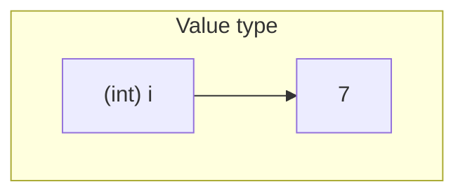
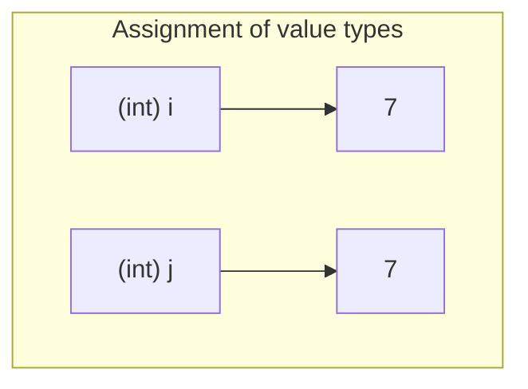
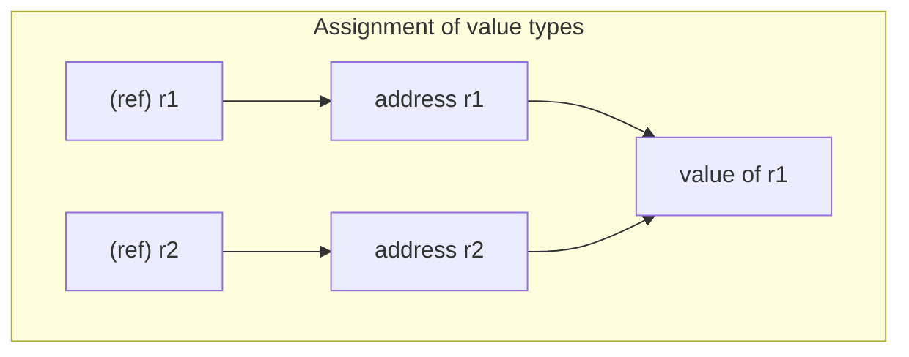

# Go 语法

Go 语言的基础组成有以下几个部分：包声明、引入包、函数、变量、语句 & 表达式和注释。

```go
package main
import "fmt"
func main() {
   /* 这是我的第一个简单的程序 */
   fmt.Println("Hello, World!")
}
```


1. 第一行代码 *package main* 定义了包名。你必须在源文件中非注释的第一行指明这个文件属于哪个包，如：package main。package main表示一个可独立执行的程序，每个 Go 应用程序都包含一个名为 main 的包。
2. 下一行 *import "fmt"* 告诉 Go 编译器这个程序需要使用 fmt 包（的函数，或其他元素），fmt 包实现了格式化 IO（输入/输出）的函数。
3. 下一行 *func main()* 是程序开始执行的函数。main 函数是每一个可执行程序所必须包含的，一般来说都是在启动后第一个执行的函数（如果有 init() 函数则会先执行该函数）。
4. 下一行 /*...*/ 是注释，在程序执行时将被忽略。单行注释是最常见的注释形式，你可以在任何地方使用以 // 开头的单行注释。多行注释也叫块注释，均已以 /* 开头，并以 */ 结尾，且不可以嵌套使用，多行注释一般用于包的文档描述或注释成块的代码片段。
5. 下一行 *fmt.Println(...)* 可以将字符串输出到控制台，并在最后自动增加换行字符 \n。
6. 当标识符（包括常量、变量、类型、函数名、结构字段等等）以一个大写字母开头，如：Group1，那么使用这种形式的标识符的对象就可以被外部包的代码所使用（客户端程序需要先导入这个包），这被称为导出（像面向对象语言中的 public）；标识符如果以小写字母开头，则对包外是不可见的，但是他们在整个包的内部是可见并且可用的（像面向对象语言中的 protected ）。


需要注意的是 **{** 不能单独放在一行，所以以下代码在运行时会产生错误：

```go
package main
import "fmt"
func main() 
{   // 错误，{ 不能在单独的行上
    fmt.Println("Hello, World!")
}
```


在 Go 程序中，一行代表一个语句结束。每个语句不需要像 C 家族中的其它语言一样以分号 ; 结尾，因为这些工作都将由 Go 编译器自动完成。如果打算将多个语句写在同一行，则必须使用 ; 区分，实际开发中并不鼓励这种做法。

```go
fmt.Println("Hello, World!")
fmt.Println("菜鸟教程：runoob.com")
```


## 表达式和语句

一个表达式表示一个值或多个值，而一条语句表示一个操作，有些语句可能是由很多更基本的语句组成的，根据场合不同，某些语句也可以被视为表达式。Go中各种流程控制语句的某些部分可能会被要求必须为简单语句或者表达式。


### 表达式示例

单值表达式只表示一个值，多表达式可以表示多个值。字面量、变量和具名常量等均属于单值表达式，它们可称为基本表达式。运算符操作（不包括赋值部分）也都属于单值表达式。通道的接收数据操作（不包括赋值部分）也属于表达式。Go中的一些表达式，包括通道的接收数据操作，可能会表示可变数量的值，根据不同的场景，这样的表达式可能呈现为单值表达式，也可能呈现为多值表达式。

如果一个函数或方法至少返回一个值，则它的调用属于表达式；如果此函数或方法返回两个或两个以上的值，则对它的调用称为多值表达式；不返回任何结果的函数或方法的调用不属于表达式。

```go
// 一些表达式的例子：
123
true
B
B + " language" // 运算符操作
a - 789 // 运算符操作
a > 0 // 运算符操作，一个类型不确定布尔值
f     // 一个类型为“func ()”的表达式

// 下面这些即可以被视为简单语句，也可以被视为表达式。
f() // 函数调用
<-c // 通道接收操作
```


### 简单语句示例

Go中有六种简单语句类型：

1. 变量短声明语句；
2. 纯赋值语句，包括`x op= y`这种运算形式；
3. 有返回结果的函数或方法调用，以及通道的接收数据操作；
4. 通道的发送数据操作；
5. 空语句；
6. 自增（`x++`）和自减（`x--`）语句，该语句不能当作表达式使用；

```go
// 一些简单语句的例子：
c := make(chan bool) // 通道将在以后讲解
a = 789
a += 5
a = f() // 这是一个纯赋值语句
a++
a--
c <- true // 一个通道发送操作
z := <-c  // 一个使用通道接收操作做为源值的变量短声明语句
```


### 非简单语句示例

下面是一个非简单语句的不完整列表：

- 标准变量声明语句；
- （具名）常量声明语句；
- 类型声明语句；
- （代码）包引入语句；
- 显式代码块，一个显式代码块起始于一个左大括号`{`，终止于一个右大括号`}`，一个显式代码块中可以包含若干子语句；
- 函数声明，一个函数声明中可以包含若干子语句；
- 流程控制跳转语句；
- 函数返回（`return`）语句；
- 延迟函数调用和协程创建语句；

```go
// 一些非简单语句：
import "time"
var a = 123
const B = "Go"
type Choice bool
func f() int {
	for a < 10 {
		break
	}

	// 这是一个显式代码块。
	{
		// ...
	}
	return 567
}
```


## 表达式估值顺序规则

### 依赖关系决定估值顺序

表达式将在组成它的子表达式都估值之后才能进行估值，比如，在一个函数调用`f(x, y[n])`中，

- `f()`将在它所依赖的子表达式`f`、`x`和`y[n]`估值之后进行估值；
- 表达式`y[n]`将在它所依赖的子表达式`n`和`y`估值之后进行估值。


### 包级变量估值顺序

在运行时刻，当一个包被加载的时候，不依赖于任何其它未初始化包级变量的未初始化包级变量将按照它们在代码中的声明顺序被初始化，直到此过程中不再有任何包级变量被初始化。对于一个成功编译了的Go程序，当所有这样的过程结束之后，所有的包级变量都应该被初始化了。在包级变量初始化过程中，呈现为空标识符的包级变量和其它包级变量被同等对待。

举个例子，在下面的这个程序中，变量`a`依赖于变量`b`，变量`c`和`_`依赖于变量`a`。 所以

1. 第一个被初始化的变量是`b`，因为它是第一个不依赖于其它变量的包级变量；
2. 第二个被初始化的变量是`a`，因为在变量`b`初始化之后，变量`a`是第一个不再依赖于未初始化包级变量的包级变量；
3. 第三和第四个被初始化的变量是`_`和`c`。 在变量`a`和`b`初始化之后，标记变量`_`和`c`均不再依赖于未初始化包级变量。

```go
package main

import "fmt"

var (
	_ = f()
	a = b / 2
	b = 6
	c = f()
)

func f() int {
	a++
	return a
}

func main() {
	fmt.Println(a, b, c) // 5 6 5
}
```


通过一个多值表达式源值来初始化的多个包级变量将被一起初始化。比如，在包级变量声明`var x, y = f()`中，变量`x`和`y`将被一起初始化。或者说，在它们的初始化之间不会有其它包级变量被初始化。在初始化所有包级变量之前，含有多个源值表达式的包级变量声明将被拆解为多个单源值表达式变量声明，比如：

```go
var m, n = expr1, expr2
```


和下述表达式时等价的：

```go
var m = expr1
var n = expr2
```


如果一些包级变量之间存在着编译器难以觉察的依赖关系，则这些包级变量的初始化顺序是未定义的，依赖于具体编译器实现。在下面这个Go白皮书中的例子中，

- 变量`a`肯定在变量`b`之后初始化；
- 但是变量`x`有可能在变量`b`之前、或者在变量`b`和变量`a`之间、或者在变量`a`之后初始化，取决于具体的编译器实现；
- 函数`sideEffect()`有可能在变量`x`初始化之前或者之后被调用，取决于具体的编译器实现。

```go
// x是否依赖于a和b，不同的编译器有不同的见解。
var x = I(T{}).ab()
// 假设函数sideEffect和x、a以及b均无关系。
var _ = sideEffect()
var a = b
var b = 42

type I interface    { ab() []int }
type T struct{}
func (T) ab() []int { return []int{a, b} }
```


注意：因为一个代码包中常常包含若干个代码源文件，而Go白皮书并没有强制规定编译器按照如何顺序来编译一个代码包中的源文件，所以尽量不要让一个代码包中不同源文件中的包级变量存在复杂的依赖关系；否则不同的编译器可能会将一些包级变量初始化为不同结果。


### 布尔运算表达式的估值顺序

在一个布尔运算`a && b`中，右操作数表达式`b`只在左操作数表达式`a`被估值为`true`的时候才会被估值。所以，操作数表达式`b`如果需要被估值的话，它肯定在操作数表达式`a`之后估值。在一个布尔运算`a || b`中，右操作数表达式`b`只在左操作数表达式`a`被估值为`false`的时候才会被估值。所以，操作数表达式`b`如果需要被估值的话，它肯定在操作数表达式`a`之后估值。


### 通常估值顺序

Go白皮书这样描述**通常估值顺序**（The Usual Order）：...，当估值一个表达式、赋值语句或者函数返回语句中的操作数时，所有的函数调用、方法调用和通道操作将按照它们在代码中的出现顺序进行估值。注意：一个显式类型转换`T(v)`不属于函数调用。


举个例子，在表达式`[]int{x, fa(), fb(), y}`中，假设`x`和`y`是两个`int`类型的变量，`fa`和`fb`是两个返回值为`int`类型的函数，则调用`fa()`保证在调用`fb()`之前执行。 但是，下面这两个估值顺序没有在Go白皮书中指定：

- 变量`x`（或者`y`）和调用`fa()`（或者`fb()`）的相对估值顺序；
- 变量`x`、变量`y`、函数值`fa`和函数值`fb`的相对估值顺序。


下面是Go白皮书中提到的另一个例子：

```go
y[z.f()], ok = g(h(a, b), i()+x[j()], <-c), k()
```


在此赋值语句中，

- `c`是一个通道表达式，它将被估值为一个通道值；
- `g`、`h`、`i`、`j`和`k`是一些函数表达式，它们将被估值为一些函数值；
- `f`是表达式`z`值的一个方法。


综合考虑上一节和本节上面已经提到的规则，编译器应该保证下列在运行时刻的估值顺序：

- 此赋值中涉及到的函数调用、方法调用和通道操作必须按照这样的顺序执行：`z.f()`→`h()`→`i()`→`j()`→`<-c`→`g()`→`k()`；
- 调用`h()`在表达式`h`、`a`和`b`估值之后调用；
- `y[]`在方法调用`z.f()`执行之后被估值；
- 方法调用`z.f()`在表达式`z`估值之后执行；
- `x[]`在调用`j()`执行之后被估值。


然而，下列次序在Go白皮书中未指定，它们依赖于具体编译器实现：

- 表达式`y`、`z`、`g`、`h`、`a`、`b`、`x`、`i`、`j`、`c`和`k`之间的相对估值顺序；
- 表达式`y[]`、`x[]`和`<-c`之间的相对估值顺序。


根据上述通常估值顺序规则知道下面声明的变量`x`、`m`和`n`的初始值可能将出现歧义。

```go
	a := 1
	f := func() int { a++; return a }

	// x可能初始化为[1, 2]或者[2, 2]，因为a和f()的相对估值顺序未指定。
	x := []int{a, f()}

	// m可能初始化为{2: 1}或者{2: 2}，因为两个映射元素的赋值顺序未指定。
	m := map[int]int{a: 1, a: 2}

	// n可能初始化为{2: 3}或者{3: 3}，因为a和f()的相对估值顺序未指定。
	n := map[int]int{a: f()}
```


### 赋值语句中的表达式估值和赋值执行顺序

Go白皮书对赋值语句中的表达式估值和各个单值赋值执行顺序进行了更多描述，一条赋值语句的执行分为两个阶段。首先，做为目标值的元素索引表达式中的容器值表达式和索引值表达式、做为目标值的指针解引用表达式中的指针值表达式、以及此赋值语句中的其它非目标值表达式将按照上述通常估值顺序估值。然后各个单值赋值将按照从左到右的顺序执行。

以后可以称第一个阶段为估值阶段，称第二个阶段为实施阶段。

Go白皮书并没有清楚地说明在第二个阶段中发生的赋值操作是否会对在第一个阶段结尾确定下来的各个子表达式的估值结果造成影响，此举曾造成了一些争议。所以，这里下面将对赋值语句中的表达式估值顺序做出一些补充解释。

首先，先明确一下：第二个阶段中发生的赋值操作绝不会对在第一个阶段结尾确定下来的各个子表达式的估值结果造成影响.

为了方便下面的解释，对于一个赋值语句，假设一个做为目标值的容器（切片或者映射）元素索引表达式中的映射值总是可寻址的。如果它是不可寻址的，可以认为在实施第二个阶段之前，此容器值已经被赋给了一个临时变量（可寻址的）并且在此赋值语句中此容器值已经被此临时变量取代。

在估值阶段结束之后、实施阶段开始之前的时刻，赋值语句中的每个目标值表达式都已经被估值为它的最基本形式，不同风格的目标值表达式有着不同的最基本形式：

- 如果一个目标值表达式是一个空标识符，则它的最基本形式依旧是一个空标识符；
- 如果一个目标值表达式是一个容器（数组或者切片或者映射）元素索引表达式`c[k]`，则它的最基本形式为`(*cAddr)[k]`，其中一个`cAddr`为指向`c`的指针；
- 对于其它情形的任何一个目标值表达式，它必然是可寻址的，则它的最基本形式为它的地址的解引用形式。


假设`a`和`b`为两个可寻址的同类型变量，则下面的赋值语句

```go
	a, b = b, a
```

将按照如下步骤执行：

```go
// 估值阶段
P0 := &a; P1 := &b
R0 := b; R1 := a

// 最基本形式：*P0, *P1 = R0, R1

// 实施阶段
*P0 = R0
*P1 = R1
```


下面是另外一个例子，其中`x[0]`而不是`x[1]`被修改了。

```go
	x := []int{0, 0}
	i := 0
	i, x[i] = 1, 2
	fmt.Println(x) // [2 0]
```


上例中的第3行的分解执行步骤如下：

```go
// 估值阶段
P0 := &i; P1 := &x; T2 := i
R0 := 1; R1 := 2
// 到这里，T2 == 0

// 最基本形式：*P0, (*P1)[T2] = R0, R1

// 实施阶段
*P0 = R0
(*P1)[T2] = R1
```


下面是一个略为复杂一点的例子。

```go
package main

import "fmt"

func main() {
	m := map[string]int{"Go": 0}
	s := []int{1, 1, 1}; olds := s
	n := 2
	p := &n
	s, m["Go"], *p, s[n] = []int{2, 2, 2}, s[1], m["Go"], 5
	fmt.Println(m, s, n) // map[Go:1] [2 2 2] 0
	fmt.Println(olds)    // [1 1 5]
}
```


上例中的第10行的分解执行步骤如下：

```go
// 估值阶段
P0 := &s; PM1 := &m; K1 := "Go"; P2 := p; PS3 := &s; T3 := 2
R0 := []int{2, 2, 2}; R1 := s[1]; R2 := m["Go"]; R3 := 5
// 到这里，R1 == 1, R2 == 0

// 最基本形式：*P0, (*PM1)[K1], *P2, (*PS3)[T3] = R0, R1, R2, R3

// 实施阶段
*P0 = R0
(*PM1)[K1] = R1
*P2 = R2
(*PS3)[T3] = R3
```


下面这个例子将一个切片中的所有元素循环顺移了一位。

```go
	x := []int{2, 3, 5, 7, 11}
	t := x[0]
	var i int
	for i, x[i] = range x {}
	x[i] = t
	fmt.Println(x) // [3 5 7 11 2]
```


另一个例子：

```go
	x := []int{123}
	x, x[0] = nil, 456        // 此句不会发生恐慌
	x, x[0] = []int{123}, 789 // 此句将产生恐慌
```


尽管使用复杂的多值赋值语句是合法的，但是在实践中并不推荐使用，因为复杂多值赋值语句的可读性不高，编译速度较慢，并且执行效率相对略低。

上面已经提到了，并非所有的估值顺序都在Go白皮书中指定清楚了，所以不同的Go编译器对这些未指定的估值顺序有着自己的理解。一些跨编译器兼容性不好的代码将导致使用不同的编译器编译的程序的运行结果不同。在下面这个例子中，表达式`x+1`和`f(&x)`的估值顺序是编译器相关的，所以此程序输出`100 99`或者`1 99`都是合理的。

```go
package main

import "fmt"

func main() {
	f := func (p *int) int {
		*p = 99
		return *p
	}

	x := 0
	y, z := x+1, f(&x)
	fmt.Println(y, z)
}
```


下面是另一个可能输出不同结果的程序。它可能输出`1 7 2`、`1 8 2`或者`1 9 2`，取决于不同的编译器实现。

```go
package main

import "fmt"

func main() {
	x, y := 0, 7
	f := func() int {
		x++
		y++
		return x
	}
	fmt.Println(f(), y, f())
}
```


**不要使用其中涉及到的表达式之间会相互干涉的赋值语句**

目前(Go 1.23)，在一些多值赋值中有一些表达式估值顺序是未指定的。因此，如果一个多值赋值语句中涉及的表达式会相互干涉，或者不太容易确定是否会相互干涉，则应该将此多值赋值语句分拆成多个单值赋值语句。换言之，一条赋值语句中的某个函数调用表达式的估值有可能会影响到其它非函数调用表达式的估值结果。

事实上，在一些写得很糟糕的代码中，单值赋值中的表达式求值顺序也有可能是有歧义的。例如下面的程序可能会打印`[7 0 9]`、`[0 8 9]`或者`[7 8 9]`，依赖于具体编译器实现。

```go
var a = &[]int{1, 2, 3}
var i int
func f() int {
	i = 1
	a = &[]int{7, 8, 9}
	return 0
}

func main() {
	// 表达式"a"、"i"和"f()"的估值顺序未定义。
	(*a)[i] = f()
	fmt.Println(*a)
}
```


### `switch-case`中的表达式估值顺序

`switch-case`流程控制代码块中的表达式估值顺序已经在前面的文章中大致描述过了。简单来说，在进入一个分支代码块之前，各个`case`关键字后跟随的表达式将按照从上到下和从左到右的顺序进行估值，直到某个比较结果为`true`为止。

```go
package main

import "fmt"

func main() {
	f := func(n int) int {
		fmt.Printf("f(%v) is called.\n", n)
		return n
	}

	switch x := f(3); x + f(4) {
	default:
	case f(5):
	case f(6), f(7), f(8):
	case f(9), f(10):
	}
}
```


在运行时刻，各个`f()`调用将按照传给它们参数的大小顺序进行估值，直到和调用`f(7)`的比较结果为`true`为止。 所以调用`f(8)`、`f(9)`和`f(10)`将不会被估值。输出结果：

```
f(3) is called.
f(4) is called.
f(5) is called.
f(6) is called.
f(7) is called.
```


### `select-case`中的表达式估值顺序

当执行一个`select-case`流程控制代码块时，各个`case`关键值后跟随的所有通道操作中的通道表达式和所有通道发送操作中的发送值表达式都将被按照它们在代码中的出现次序（从上到下从左到右）估值一次。注意：以通道接收操作做为源值的赋值语句中的目标值表达式只有在此通道接收操作被选中之后才会被估值。

比如，在下面这个例子中，表达式`*fptr("aaa")`将永不会得到估值，因为它对应的通道接收操作`<-fchan("bbb", nil)`是个不可能被选中的阻塞操作。

```go
package main

import "fmt"

func main() {
	c := make(chan int, 1)
	c <- 0
	fchan := func(info string, c chan int) chan int {
		fmt.Println(info)
		return c
	}
	fptr := func(info string) *int {
		fmt.Println(info)
		return new(int)
	}

	select {
	case *fptr("aaa") = <-fchan("bbb", nil): // blocking
	case *fptr("ccc") = <-fchan("ddd", c):   // non-blocking
	case fchan("eee", nil) <- *fptr("fff"):  // blocking
	case fchan("ggg", nil) <- *fptr("hhh"):  // blocking
	}
}
```


上例的输出结果：

```
bbb
ddd
eee
fff
ggg
hhh
ccc
```


注意，表达式`*fptr("ccc")`是上例中最后一个被估值的表达式。 它在对应的数据接收操作`<-fchan("ddd", c)`被选中之后才会进行估值。


## 代码断行规则

Go代码不能随意在某个空格或者符号字符处断行。


### 分号插入规则

正式的Go语法是使用分号`;`做为结尾标识符的，Go代码中大多数分号都是可选的，下面这个程序中的十个分号都是可以被省略掉的。

> 假设这个程序存储在一个`semicolons.go`文件中，可以运行`go fmt semicolons.go`将此程序中的不必要的分号去除掉。

```go
package main;

import "fmt";

func main() {
	var (
		i   int;
		sum int;
	);
	for i < 6 {
		sum += i;
		i++;
	};
	fmt.Println(sum);
};
```


在编译时，Go编译器会在如下情形自动插入这些省略的分号。编译器不会为其它任何情形插入分号，如果其它任何情形需要一个分号，必须手动插入此分号。自动插入规则如下：

- 注释除外，如果代码行的最后一个语法词段（token）为下列所示之一，则分号将自动插入在此字段后（即行尾）：

  - 一个标识符；

  - 一个整数、浮点数、虚部、码点或者字符串字面量；

  - 跳转关键字：`break`、`continue`、`fallthrough`和`return`；

  - 自增运算符`++`或者自减运算符`--`；

  - 一个右括号：`)`、`]`或`}`。

- 为了允许一条复杂语句完全显示在一个代码行中，分号可能被插入在一个右小括号`)`或者右大括号`}`之前。


#### 右大（小）括号之前分号插入

分号可能被插入在一个右小括号`)`或者右大括号`}`之前规则允许写出如下的代码：

```go
import (_ "math"; "fmt")
var (a int; b string)
const (M = iota; N)
type (MyInt int; T struct{x bool; y int32})
type I interface{m1(int) int; m2() string}
func f() {print("a"); panic(nil)}
```


编译器在编译时刻将自动插入所需的分号，如下所示：

```go
var (a int; b string;);
const (M = iota; N;);
type (MyInt int; T struct{x bool; y int32;};);
type I interface{m1(int) int; m2() string;};
func f() {print("a"); panic(nil);};
```


每行中的第一个分号必须手动插入。下例中的分号也都需要手动插入。

```go
var a = 1; var b = true
a++; b = !b
print(a); print(b)
```


#### for循环中分号插入

显式代码块的起始左大括号`{`不能放在下一行，下面这个`for`循环代码块编译将失败：

```go
for i := 5; i > 0; i--
{ // error: 未预料到的新行
}
```


上面的`for`循环代码块应该像下面这样进行修改：

```go
for i := 5; i > 0; i-- {
}
```


然而，有时候起始左大括号`{`却可以放在一个新行上，比如下面这个`for`循环代编译时没有问题的：

```go
for // 分号不会插入在`for`关键字后，所以裸`for`循环是合法的
{ 
    // do something ...
}
```


#### 自增和自减分号插入

自增和自减运算必须呈现为单独的语句，不能被当作表达式使用。下面的代码是编译不通过的：

```go
func f() {
	a := 0
	println(a++)
	println(a--)
}
```


上面代码编译不通过的原因是它等价于下面的代码：

```go
func f() {
	a := 0
	println(a++;)
	println(a--;)
}
```


#### 句点.后分后插入

不能在选择器的句点`.`之前断行，在选择器中的句点之后断行是允许的，比如：

```go
	anObject.
		MethodA().
		MethodB().
		MethodC()
```


而下面这样是非法的：

```go
	anObject
		.MethodA()
		.MethodB()
		.MethodC()
```


此代码片段是非法的原因是编译器将自动在每个右小括号`)`后插入一个分号，如下面所示：

```go
	anObject;
		.MethodA();
		.MethodB();
		.MethodC();
```


#### switch-case分号插入

```go
package main

import "fmt"

func alwaysFalse() bool {return false}

func main() {
	switch alwaysFalse() // 行尾自动插入分号
	{
	case true: fmt.Println("true")
	case false: fmt.Println("false")
	}
}
```


上例中的`switch-case`代码块将输出`true`，而不是`false`，此代码块和下面这个是不同的：

```go
	switch alwaysFalse() {
	case true: fmt.Println("true")
	case false: fmt.Println("false")
	}
```


如果使用`go fmt`命令格式化前者，一个分号将自动添加到`alwaysFalse()`函数调用之后，如下所示：

```go
	switch alwaysFalse();
	{
	case true: fmt.Println("true")
	case false: fmt.Println("false")
	}
```


插入此分号后，此代码块将和下者等价，这就是它输出`true`的原因。

```go
	switch alwaysFalse(); true {
	case true: fmt.Println("true")
	case false: fmt.Println("false")
	}
```


#### goto跳转分号插入

下述代码看上去是合法的，但是实际上是编译不通过的。

```go
func f() {
	switch x {
	case 1:
	{
		goto A
		A: // 这里编译没问题
	}
	case 2:
		goto B
		B: // syntax error: 跳转标签后缺少语句
	case 0:
		goto C
		C: // 这里编译没问题
	}
}
```


编译错误信息表明跳转标签的声明之后必须跟一条语句，为什么只有`B:`标签声明是不合法的呢？原因是根据上述第二条分号自动插入规则，编译器将在`A:`和`C:`标签声明之后的右大括号`}`字符之前插入一个分号，如下所示：

```go
func f(x int) {
	switch x {
	case 1:
	{
		goto A
		A:
	;} // 一个分号插入到了这里
	case 2:
		goto B
		B: // syntax error: 跳转标签后缺少语句，可以在B:后添加分号来解决编译异常
	case 0:
		goto C
		C:
	;} // 一个分号插入到了这里
}
```


一个单独的分号表示一条空语句，即`A:`和`C:`标签声明之后确实跟随了一条语句，所以它们是合法的。而`B:`标签声明跟随的`case 0:`不是一条语句，所以它是不合法的。可以在`B:`标签声明之后手动插入一个分号使之变得合法。


#### 总结

可以通过上述分号自动插入规则写出更简洁的代码，同时也会写出一些合法的但看上去有些怪异的代码，比如：

```go
package main

import "fmt"

func alwaysFalse() bool {return false}

func main() {
	for
	i := 0 // 行尾自动插入分号
	i < 6 // 行尾自动插入分号
	i++ {
		// 使用i ...
	}

	if x := alwaysFalse() // 行尾自动插入分号
	!x {
		// ...
	}
}
```


上例中所有的流程控制代码块都是合法的，常使用`go fmt`和`go vet`命令来格式化和发现可能的逻辑错误是一个好习惯。


### 逗号不会被自动插入

包含多个类似项目的语法形式多用逗号`,`来做为这些项目之间的分割符，比如组合字面量和函数参数列表等。在这样的一个语法形式中，最后一个项目后总可以跟一个可选的逗号。 如果此逗号为它所在代码行的最后一个有效字符，则此逗号是必需的，否则，此逗号可以省略。编译器在任何情况下都不会自动插入逗号。比如，下面的代码是合法的：

```go
func f1(a int, b string,) (x bool, y int,) {
	return true, 789
}
var f2 func (a int, b string) (x bool, y int)
var f3 func (a int, b string, // 最后一个逗号是必需的
) (x bool, y int,             // 最后一个逗号是必需的
)
var _ = []int{2, 3, 5, 7, 9,} // 最后一个逗号是可选的
var _ = []int{2, 3, 5, 7, 9,  // 最后一个逗号是必需的
}
var _ = []int{2, 3, 5, 7, 9}
var _, _ = f1(123, "Go",) // 最后一个逗号是可选的
var _, _ = f1(123, "Go",  // 最后一个逗号是必需的
)
var _, _ = f1(123, "Go")
// 对于显式转换也是一样的：
var _ = string(65,) // 最后一个逗号是可选的
var _ = string(65,  // 最后一个逗号是必需的
)
```


而下面这段代码是不合法的，因为编译器将自动在每一行的行尾插入一个分号（除了第二行）。 其中三行在插入分号后将导致编译错误。

```go
func f1(a int, b string,) (x bool, y int // error
) {
	return true, 789
}
var _ = []int{2, 3, 5, 7, 9 // error: unexpected newline
}
var _, _ = f1(123, "Go" // error: unexpected newline
)
```


### 总结

在Go代码中，以下断行方式是允许的：

- 在除了`break`、`continue`和`return`这几个跳转关键字之外的任何关键字之后断行，或者在不跟随标签的`break`和`continue`关键字以及不跟随返回值的`return`关键字之后断行；
- 在（显式输入的或者隐式被编译器插入的）分号`;`之后断行；
- 在不会导致新的隐式分号被编译器插入的情况下断行。


## 代码块和标识符作用域

### 代码块

代码块主要用来解释各种代码元素声明中的标识符的可声明位置和作用域，Go代码中有四种代码块：

- 万物代码块（the universe code block）：一个程序只有一个万物代码块，它包含着一个程序中所有的代码；
- 包代码块（package code block）：一个包代码块含着一个代码包中的所有代码，但不包括此代码包中的源代码文件中的所有引入声明；
- 文件代码块（file code block）：一个文件代码块包含着一个源文件中的所有代码，包括此文件中的包引入声明；
- 局部代码块（local code block）：一对大括号`{}`中的代码形成了一个局部代码块，但是也有一些局部代码块并不包含在一对大括号中，这样的代码块称为隐式代码块，而包含在一对大括号中的局部代码块称为显式代码块。组合字面量中的大括号和代码块无关。


各种控制流程中的一些关键字跟随着一些隐式局部代码块：

- 一个`if`、`switch`或者`for`关键字跟随着两个内嵌在一起的局部代码块，其中一个代码块是隐式的，另一个是显式的，此显式的代码块内嵌在此隐式代码块之中。如果这样的一个关键字跟随着一个变量短声明形式，则被声明的变量声明在此隐式代码块中；
- 一个`else`关键字可以跟随着一个显式或者隐式代码块，此显式或者隐式代码块内嵌在跟随在对应`if`关键字后的隐式代码块中。如果此`else`关键字立即跟随着另一个`if`关键字，则跟随在此`else`关键字后的代码块可以为隐式的，否则，此代码块必须为显式的；
- 一个`select`关键字跟随着一个显式局部代码块；
- 每个`case`和`default`关键字后跟随着一个隐式代码块，此隐式代码块内嵌在对应的`switch`或者`select`关键字后跟随的显式代码块中。


不内嵌在任何其它局部代码块中的局部代码块称为顶层（或者包级）局部代码块，顶层局部代码块肯定都是函数体。注意，函数声明中的输入参数和输出结果变量都被看作是声明在此函数体代码块内，虽然看上去它们好像声明在函数体代码块之外。


各种代码块的层级关系：

- 所有的包代码块均直接内嵌在万物代码块中；
- 所有的文件代码块也均直接内嵌在万物代码块中；
- 每个顶层局部代码块同时直接内嵌在一个包代码块和一个文件代码块中；
- 一个非顶层局部代码块肯定直接内嵌在另一个局部代码块中。


下面是一张展示上述代码块层级关系的图片：


### 代码元素可声明位置

可以声明六种代码元素：

- 包引入；
- 定义类型和类型别名；
- 具名常量；
- 变量；
- 函数；
- 跳转标签。


在代码元素的声明中，标识符和代码元素绑定，或者说，被声明的代码元素将被赋予此标识符做为它的名称，此后就可以用此标识符来代表此代码元素。下表展示了各种代码元素可以被直接声明在何种代码块中：

|                                  | 万物代码块 | 包代码块 | 文件代码块 | 局部代码块 |
| :------------------------------: | :--------: | :------: | :--------: | :--------: |
| 预声明的（即内置的）代码元素(1)  |    可以    |          |            |            |
|              包引入              |            |          |    可以    |            |
| 定义类型和类型别名（不含内置的） |            |   可以   |    可以    |    可以    |
|     具名常量（不含内置常量）     |            |   可以   |    可以    |    可以    |
|     变量（不含内置变量）(2)      |            |   可以   |    可以    |    可以    |
|       函数（不含内置函数）       |            |   可以   |    可以    |            |
|             跳转标签             |            |          |            |    可以    |

- (1) 预声明代码元素展示在`builtin`标准库中；
- (2) 不包括结构体字段变量声明。


所以，

- 包引入不能声明在包代码块和局部代码块中；
- 函数不能被声明在局部代码块中，匿名函数可以定义在局部代码块中，但它们不属于元素声明；
- 跳转标签只能被声明在局部代码块中。


请注意：

- 如果包含两个代码元素声明的最内层代码块为同一个，则这两个代码元素不能同名；
- 声明在一个包中的一个包级代码元素的名称不能和此包中任何源文件中的包引入名同名，或者反过来说更容易理解：一个包中的任何包引入名不能和此包中的任何包级代码元素的名称重名；
- 如果包含两个跳转标签的最内层函数体为同一个，则这两个标签不能同名；
- 一个跳转标签的所有引用必须处于包含此跳转标签声明的最内层函数体代码块内；
- 各种控制流程中的隐式代码块对元素声明有特殊的要求，声明语句不允许出现在这样的隐式代码块中，除了一些变量短声明：
  - 每个`if`、`switch`或者`for`关键字后可以紧跟着一条变量短声明语句；
  - 一个`select`控制流程中的每个`case`关键字后可以紧跟着一条变量短声明语句。


声明在包代码块中并且在所有局部代码块之外的代码元素称为包级（package-level）元素，包级元素可以是具名常量、变量、函数、定义类型或类型别名。


类型、常量和函数允许被声明而不使用，包级全局变量允许被声明而不使用，但局部变量不允许被声明而不使用（对于官方标准编译器）；

包引入、类型、变量、常量可多个被一起声明在一对小括号`()`中，函数是不能多个被一起声明在一对小括号`()`中的，跳转标签也不能；

类型、变量、常量既可以被声明在函数内也可以被声明在函数外，函数必须声明在任何函数体之外，匿名函数可以定义在函数体内，但那不属于声明，跳转标签必须声明在函数体内。

包引入必须被声明在其它种类的代码元素的声明之前。


### 代码元素标识符的作用域

一个代码元素标识符的作用域是指此标识符可被识别的代码范围（或可见范围），Go白皮书这样描述各种代码元素的标识符的作用域：

- 内置代码元素标识符的作用域为整个万物代码块；
- 一个包引入声明标识符的作用域为包含它的声明的文件代码块；
- 直接声明在一个包代码块中的一个常量、类型、变量或者函数（不包括方法）的标识符的作用域为此包代码块；
- 在函数体中声明的一个常量或者变量的标识符的作用域起始于此常量或者变量的描述（specification）的结尾（对于变量短声明，为此变量声明的结尾），并终止于包含此常量或者变量的声明的最内层代码块的结尾；
- 一个函数参数（包括方法属主参数）和结果标识符的作用域为其对应函数体局部代码块；
- 在函数体中声明的一个类型的标识符的作用域起始于此类型的描述中它的标识符的结尾，并终止于包含此类型的声明的最内层代码块的结尾；
- 一个跳转标签的标识符的作用域为包含此标签的声明的最内层函数体代码块，但要排除掉此内嵌在此最内层函数体代码块中的各个匿名函数体代码块；
- 空标识符没有作用域。


局部定义类型的作用域和其它局部元素（变量、常量和类型别名）的作用域的差别体现在一个定义类型的声明中可以立即使用此定义类型的标识符。下面这个例子展示了这一差异：

```go
package main

func main() {
	// var v int = v   // error: v未定义
	// const C int = C // error: C未定义
	/*
	type T = struct {
		*T    // error: 不可循环引用
		x []T // error: 不可循环引用
	}
	*/

	// 下面所有的类型定义声明都是合法的。
	type T struct {
		*T
		x []T
	}
	type A [5]*A
	type S []S
	type M map[int]M
	type F func(F) F
	type Ch chan Ch
	type P *P

	// ...
	var p P
	p = &p
	p = ***********************p
	***********************p = p

	var s = make(S, 3)
	s[0] = s
	s = s[0][0][0][0][0][0][0][0]

	var m = M{}
	m[1] = m
	m = m[1][1][1][1][1][1][1][1]
}
```


注意：`fmt.Print(s)`和`fmt.Print(m)`调用都将导致恐慌（因为堆栈溢出）。下面是一个展示了包级声明和局部声明的标识符的作用域差异的例子：

```go
package main

// 下面这两行中各自等号左边和右边的标识符表示同一个代码元素，右边的标识符不是预声明的标识符。
/*
const iota = iota // error: 循环引用
var true = true   // error: 循环引用
*/

var a = b // 可以使用其后声明的变量的标识符
var b = 123

func main() {
	// 下面两行中右边的标识符为预声明的标识符。
	const iota = iota // ok
	var true = true   // ok
	_ = true

	// 下面几行编译不通过。
	/*
	var c = d // 不能使用其后声明变量标识符
	var d = 123
	_ = c
	*/
}
```


### 标识符遮挡

不考虑跳转标签，一个在外层代码块直接声明的标识符将被在内层代码块直接声明的相同标识符所遮挡。跳转标签标识符不会被遮挡。如果一个标识符被遮挡了，它的作用域将不包括遮挡它的标识符的作用域。

下面是一个有趣的例子。在此例子中，有6个变量均被声明为`x`。 一个在更深层代码块中声明的`x`遮挡了所有在外层声明的`x`。

```go
package main

import "fmt"

var p0, p1, p2, p3, p4, p5 *int
var x = 9999 // x#0

func main() {
	p0 = &x
	var x = 888  // x#1
	p1 = &x
	for x := 70; x < 77; x++ {  // x#2
		p2 = &x
		x := x - 70 //  // x#3
		p3 = &x
		if x := x - 3; x > 0 { // x#4
			p4 = &x
			x := -x // x#5
			p5 = &x
		}
	}

	// 9999 888 77 6 3 -3
	fmt.Println(*p0, *p1, *p2, *p3, *p4, *p5)
}
```


下面是另一个关于标识符遮挡和作用域的例子，此例子程序运行将输出`Sheep Goat`而不是`Sheep Sheep`。

```go
package main

import "fmt"

var f = func(b bool) {
	fmt.Print("Goat")
}

func main() {
	var f = func(b bool) {
		fmt.Print("Sheep")
		if b {
			fmt.Print(" ")
			f(!b) // 此f乃包级变量f也。
		}
	}
	f(true) // 此f为刚声明的局部变量f。
}
```


如果将上例更改为如下所示，则此程序将运行输出`Sheep Sheep`。

```go
func main() {
	var f func(b bool)
	f = func(b bool) {
		fmt.Print("Sheep")
		if b {
			fmt.Print(" ")
			f(!b) // 现在，此f变为局部变量f了。
		}
	}
	f(true)
}
```


在某些情况下，当一些标识符被内层的一个变量短声明中声明的变量所遮挡时，一些程序员会搞不清楚此变量短声明中声明的哪些变量是新声明的变量。下面这个例子（含有bug）展示了Go编程中一个比较有名的陷阱：

```go
package main

import "fmt"
import "strconv"

func parseInt(s string) (int, error) {
	n, err := strconv.Atoi(s)
	if err != nil {
		// 一些新手Go程序员会认为下一行中声明的err变量已经在外层声明过了。然而其实下一行中的b和err都是新声明的变量。此新声明的err遮挡了外层声明的err。
		b, err := strconv.ParseBool(s)
		if err != nil {
			return 0, err
		}

		// 如果代码运行到这里，一些新手Go程序员期望着内层的nil err将被返回。但是其实返回是外层的非nil err。因为内层的err的作用域到外层if代码块结尾就结束了。
		if b {
			n = 1
		}
	}
	return n, err
}

func main() {
	fmt.Println(parseInt("TRUE"))
}
```

程序输出：

```
1 strconv.Atoi: parsing "TRUE": invalid syntax
```


Go语言目前只有25个关键字，关键字不能被用做标识符。Go中很多常见的名称，比如`int`、`bool`、`string`、`len`、`cap`、`nil`等，并不是关键字，它们是预声明标识符。这些预声明的标识符声明在万物代码块中，所以它们可以被声明在内层的相同标识符所遮挡。下面是一个展示了预声明标识符被遮挡的古怪的例子。它编译和运行都没有问题。

```go
package main

import (
	"fmt"
)

const len = 3      // 遮挡了内置函数len
var true = 0       // 遮挡了内置常量true
type nil struct {} // 遮挡了内置变量nil
func int(){}       // 遮挡了内置类型int

func main() {
	fmt.Println("a weird program")
	var output = fmt.Println

	var fmt = [len]nil{{}, {}, {}} // 遮挡了包引入fmt
	// var n = len(fmt) // error: len是一个常量
	var n = cap(fmt)    // 我们只好使用内置cap函数

	// for关键字跟随着一个隐式代码块和一个显式代码块。
	// 变量短声明中的true遮挡了全局变量true。
	for true := 0; true < n; true++ {
		// 下面声明的false遮挡了内置常量false。
		var false = fmt[true]
		// 下面声明的true遮挡了循环变量true。
		var true = true+1
		// 下一行编译不通过，因为fmt是一个数组。
		// fmt.Println(true, false)
		output(true, false)
	}
}
```

输出结果：

```
a weird program
1 {}
2 {}
3 {}
```


此例子是一个极端的例子，标识符遮挡是一个有用的特性，但是千万不要滥用之。


## 标识符

标识符用来命名变量、类型等程序实体。一个标识符实际上就是一个或是多个字母(A~Z和a~z)数字(0~9)、下划线_组成的序列，但是第一个字符必须是字母或下划线而不能是数字。

Go语言中，使用大小写来决定该常量、变量、类型、接口、结构或函数是否可以被外部包所调用。


以下是有效的标识符：

```
mahesh   kumar   abc   move_name   a_123
myname50   _temp   j   a23b9   retVal
```


以下是无效的标识符：

```
1ab（以数字开头） case（Go 语言的关键字） a+b（运算符是不允许的）
```


## 关键字

下面列举了 Go 代码中会使用到的 25 个关键字或保留字：

| 关键字      | 作用                                                      |
| ----------- | --------------------------------------------------------- |
| break       | switch 条件语句或for循环语句中断执行                      |
| default     | switch 条件语句中未匹配成功时默认执行的代码块             |
| func        | 声明函数                                                  |
| interface   | 声明接口                                                  |
| select      | select 条件语句，用于通道操作                             |
| case        | switch 条件语句中声明条件分支                             |
| defer       |                                                           |
| go          | 开启 goroutine 轻量级线程                                 |
| map         | 声明 map 集合                                             |
| struct      | 声明结构体                                                |
| chan        | 声明通道                                                  |
| else        | if ...else 条件语句，条件为false时执行其后紧跟的代码块    |
| goto        | 将控制转移到被标记的语句                                  |
| package     | 用于包声明                                                |
| switch      | 声明 switch 条件语句                                      |
| const       | 声明常量                                                  |
| fallthrough | switch 条件语句，表示执行匹配成功的case后面的case的代码块 |
| if          | if 条件语句，条件为true时执行其后紧跟的代码块             |
| range       | 用于 for 循环中迭代数组、切片、通道或集合的元素           |
| type        | 进行结构(struct)和接口(interface)的声明                   |
| continue    | 跳过当前循环的剩余语句，然后继续进行下一轮循环            |
| for         | 声明循环语句                                              |
| import      | 用于导入其他非main包                                      |
| return      | 用于结束方法或循环，并返回返回值                          |
| var         | 在函数体外进行全局变量的声明和赋值                        |


除了以上介绍的这些关键字，Go 语言还有 36 个预定义标识符：

| 关键字 | 关键字  | 关键字  | 关键字  | 关键字 | 关键字  | 关键字    | 关键字     | 关键字  |
| ------ | ------- | ------- | ------- | ------ | ------- | --------- | ---------- | ------- |
| append | bool    | byte    | cap     | close  | complex | complex64 | complex128 | uint16  |
| copy   | false   | float32 | float64 | imag   | int     | int8      | int16      | uint32  |
| int32  | int64   | iota    | len     | make   | new     | nil       | panic      | uint64  |
| print  | println | real    | recover | string | true    | uint      | uint8      | uintptr |


程序一般由关键字、常量、变量、运算符、类型和函数组成。程序中可能会使用到这些分隔符：括号 ()，中括号 [] 和大括号 {}。程序中可能会使用到这些标点符号：**.**、**,**、**;**、**:** 和 **…**。


## NaN和Inf

Go中NaN和Inf遵循IEEE-754标准，并与大多数其它语言是一致的。

```go
func TestNaNValue(t *testing.T) {
	var a = math.Sqrt(-1.0)
	fmt.Println(a)      // NaN
	fmt.Println(a == a) // false

	var x = 0.0
	var y = 1.0 / x
	var z = 2.0 * y
	fmt.Println(y, z, y == z) // +Inf +Inf true
}
```


使用NaN作为映射键值的条目时，是无法通过该键值获取到对应的值的。

```go
func TestNaNAsMapKey(t *testing.T) {
	var a = math.NaN()
	fmt.Println(a) // NaN

	var m = map[float64]int{}
	m[a] = 123
	v, present := m[a]
	fmt.Println(v, present) // 0 false
	m[a] = 789
	v, present = m[a]
	fmt.Println(v, present) // 0 false

	fmt.Println(m) // map[NaN:789 NaN:123]
	delete(m, a)   // no-op
	fmt.Println(m) // map[NaN:789 NaN:123]

	for k, v := range m {
		fmt.Println(k, v)
	}
	// the above loop outputs:
	// NaN 123
	// NaN 789
}
```


## 注释

注释不会被编译，每一个包应该有相关注释。单行注释是最常见的注释形式，可以在任何地方使用以 // 开头的单行注释。多行注释也叫块注释，均已以 /* 开头，并以 */ 结尾。

```go
func TestSingleLineComment(t *testing.T) {
	// 单行注释
	fmt.Println("hello world")

	/*
	 多行注释
	*/
	fmt.Println("hello world")
}
```


# Go 基础 常量和变量

### 变量

Go 语言变量名由字母、数字、下划线组成，其中首个字符不能为数字。变量可以通过变量名访问。声明变量的一般形式是使用 var 关键字：

```go
var identifier type
var identifier1, identifier2 type
```


#### 单变量声明

**指定变量类型，如果没有初始化，则变量默认为零值**。

```go
package main
import "fmt"
func main() {
    var i int
    var f float64
    var b bool
    var s string
    fmt.Printf("%v %v %v %q\n", i, f, b, s)
}
```


**根据值自行判定变量类型。**

```go
package main
import "fmt"
func main() {
    var d = true
    fmt.Println(d)
}
```


#### 多变量声明

同一类型的多个变量可以声明在同一行。

```go
package main
import "fmt"

var x, y, z int // 类型相同多个变量
var (  // 这种因式分解关键字的写法一般用于声明全局变量
    a int
    b bool
)

var c, d int = 1, 2
var e, f = 123, "hello"

// 这种不带声明格式的只能在函数体中出现
// g, h := 123, "hello"
func main(){
    g, h := 123, "hello"
    fmt.Println(x, y, z, a, b, c, d, e, f, g, h)
}
```


#### := 赋值操作符

变量可以在初始化时省略变量的类型而由系统自动推断，声明语句写上 var 关键字显得有些多余，因此可以简写为 a := 50 或 b := false。a 和 b 的类型（int 和 bool）将由编译器自动推断。这是使用变量的首选形式，但是只能被用在函数体内，而不可以用于全局变量的声明与赋值。使用操作符 := 可以高效地创建一个新的变量，称之为初始化声明。

在相同的代码块中，不可以再次对于相同名称的变量使用初始化声明，例如：a := 20 就是不被允许的，编译器会提示错误 no new variables on left side of :=，但是 a = 20 是可以的，因为这是给相同的变量赋予一个新的值。

**变量已经使用 var 声明过了，再使用 \**:=\** 声明变量，就产生编译错误，格式：**

```go
package main
import "fmt"
func main() {
    f := "Runoob" // var f string = "Runoob"
  	var g int
    g := 1 // 编译错误，因为 g 已经声明，不需要重新声明
    fmt.Println(f)
}
```


**intVal := 1** 相等于：

```go
var intVal int 
intVal = 1 
```


在定义变量 a 之前使用它，则会得到编译错误 undefined: a。

如果声明了一个局部变量却没有在相同的代码块中使用它，同样会得到编译错误。但是全局变量是允许声明但不使用的。 

```go
package main
import "fmt"
func main() {
   var a string = "abc"
   fmt.Println("hello, world") // 编译错误 a declared but not used。
}
```


```go
package main
import "fmt"
func main() {
   var a string = "abc"
   fmt.Println("hello, world", a) // 编译通过
}
```


#### 并行赋值

多变量可以在同一行进行赋值，如：

```go
var a, b int
var c string
a, b, c = 5, 7, "abc"
```

上面这行假设了变量 a，b 和 c 都已经被声明，否则的话应该这样使用：

```go
a, b, c := 5, 7, "abc"
```

右边的这些值以相同的顺序赋值给左边的变量，所以 a 的值是 5， b 的值是 7，c 的值是 "abc"。这被称为 并行 或 同时 赋值。并行赋值也被用于当一个函数返回多个返回值时，比如这里的 val 和错误 err 是通过调用 Func1 函数同时得到：val, err = Func1(var1)。


#### 变量值交换

如果想要交换两个变量的值，则可以简单地使用 **a, b = b, a**，两个变量的类型必须是相同。


#### 空白标识符

空白标识符 _ 也被用于抛弃值，如值 5 在：_, b = 5, 7 中被抛弃。

_ 实际上是一个只写变量，不能得到它的值。这样做是因为 Go 语言中必须使用所有被声明的变量，但有时并不需要使用从一个函数得到的所有返回值。空白标识符在函数返回值时的使用：

```go
package main
import "fmt"
func main() {
  _,numb,strs := numbers() //只获取函数返回值的后两个
  fmt.Println(numb,strs)
}

//一个可以返回多个值的函数
func numbers()(int,int,string){
  a , b , c := 1 , 2 , "str"
  return a,b,c
}
```


### 常量

#### 常量声明

常量是一个简单值的标识符，在程序运行时，不会被修改的量。常量中的数据类型只可以是布尔型、数字型（整数型、浮点型和复数）和字符串型。常量的定义格式：

```go
const identifier [type] = value
const identifier1, identifier2 [type] = value1, value2
// 在定义常量组时，如果不提供初始值，则表示将使用上行的表达式。
const (
	identifier1 = 1
  identifier2 = 2
  identifier3 // identifier3没有提供初始值，则使用上行的表达式的赋值，为2
)
```


可以省略类型说明符 [type]，因为编译器可以根据变量的值来推断其类型。

- 显式类型定义： `const b string = "abc"`
- 隐式类型定义： `const b = "abc"`

多个相同类型的声明可以简写为：

```go
const c_name1, c_name2 = value1, value2
```


```go
package main
import "fmt"
func main() {
   const LENGTH int = 10
   const WIDTH int = 5   
   var area int
   const a, b, c = 1, false, "str" //多重赋值

   area = LENGTH * WIDTH
   fmt.Printf("面积为 : %d", area)
   println()
   println(a, b, c)   
}
```


#### 枚举常量

常量还可以用作枚举：

```go
const (
    Unknown = 0
    Female = 1
    Male = 2
)
```


#### 函数表达式结果取值

常量可以用len(), cap(), unsafe.Sizeof()函数计算表达式的值。常量表达式中，函数必须是内置函数，否则编译不过：

```go
package main
import "unsafe"
const (
    a = "abc"
    b = len(a)
    c = unsafe.Sizeof(a)
)
func main(){
    println(a, b, c) // abc 3 16
}
```


unsafe.Sizeof(a)输出结果为16，是因为字符串类型在 go 里是个结构, 包含指向底层数组的指针和长度,这两部分每部分都是 8 个字节，所以字符串类型大小为 16 个字节。


#### iota

iota，特殊常量，可以认为是一个可以被编译器修改的常量。iota 在 const关键字出现时将被重置为 0(const 内部的第一行之前)，const 中每新增一行常量声明将使 iota 计数一次(iota 可理解为 const 语句块中的行索引)。iota 可以被用作枚举值：

```go
const (
    a = iota
    b = iota
    c = iota
)
```


第一个 iota 等于 0，每当 iota 在新的一行被使用时，它的值都会自动加 1；所以 a=0, b=1, c=2 可以简写为如下形式：

```go
const (
    a = iota
    b
    c
)
```


```go
package main
import "fmt"
func main() {
    const (
            a = iota   //0
            b          //1
            c          //2
            d = "ha"   //独立值，iota += 1
            e          //"ha"   iota += 1
            f = 100    //iota +=1
            g          //100  iota +=1
            h = iota   //7,恢复计数
            i          //8
    )
    fmt.Println(a,b,c,d,e,f,g,h,i) // 结果：0 1 2 ha ha 100 100 7 8
}
```


iota 只是在同一个 const 常量组内递增，每当有新的 const 关键字时，iota 计数会重新开始。

```go
package main
const (
    i = iota
    j = iota
    x = iota
)
const xx = iota
const yy = iota
func main(){
    println(i, j, x, xx, yy) // 输出是 0 1 2 0 0
}
```


##### iota位运算

```go
package main
import "fmt"
const (
    i=1<<iota
    j=3<<iota
    k
    l
)

func main() {
    fmt.Println("i=",i) // 结果：i=1
    fmt.Println("j=",j) // 结果：j=6
    fmt.Println("k=",k) // 结果：k=12
    fmt.Println("l=",l) // 结果：l=24
}
```


iota 表示从 0 开始自动加 1，所以 **i=1<<0**, **j=3<<1**（**<<** 表示左移的意思），即：i=1, j=6，这没问题，关键在 k 和 l，从输出结果看 **k=3<<2**，**l=3<<3**。简单表述:

- **i=1**：左移 0 位，不变仍为 1。
- **j=3**：左移 1 位，变为二进制 **110**，即 6。
- **k=3**：左移 2 位，变为二进制 **1100**，即 12。
- **l=3**：左移 3 位，变为二进制 **11000**，即 24。


### 变量作用域

作用域为已声明标识符所表示的常量、类型、变量、函数或包在源代码中的作用范围。Go 语言中变量可以在三个地方声明：

- 函数内定义的变量称为局部变量
- 函数外定义的变量称为全局变量
- 函数定义中的变量称为形式参数


#### 局部变量

局部变量：在函数体内声明的变量称之为局部变量，它们的作用域只在函数体内，参数和返回值变量也是局部变量。局部变量不会一直存在，在函数被调用时存在，函数调用结束后变量就会被销毁，即生命周期。

```go
package main

import "fmt"

func main() {
   /* 声明局部变量 */
   var a, b, c int

   /* 初始化参数 */
   a = 10
   b = 20
   c = a + b

   fmt.Printf ("结果： a = %d, b = %d and c = %d\n", a, b, c)
}
```

```
结果： a = 10, b = 20 and c = 30
```


#### 全局变量

全局变量：在函数体外声明的变量称之为全局变量，全局变量可以在整个包甚至外部包（被导出后）使用。

```go
package main

import "fmt"

/* 声明全局变量 */
var g int

func main() {

   /* 声明局部变量 */
   var a, b int

   /* 初始化参数 */
   a = 10
   b = 20
   g = a + b

   fmt.Printf("结果： a = %d, b = %d and g = %d\n", a, b, g)
}
```

```
结果： a = 10, b = 20 and g = 30
```


Go 语言程序中全局变量与局部变量名称可以相同，但是函数内的局部变量会被优先考虑。

```go
package main

import "fmt"

/* 声明全局变量 */
var g int = 20

func main() {
   /* 声明局部变量 */
   var g int = 10

   fmt.Printf ("结果： g = %d\n",  g)
}
```

```
结果： g = 10
```


#### 形式参数

形式参数会作为函数的局部变量来使用。实例如下：

```go
package main

import "fmt"

/* 声明全局变量 */
var a int = 20;

func main() {
   /* main 函数中声明局部变量 */
   var a int = 10
   var b int = 20
   var c int = 0

   fmt.Printf("main()函数中 a = %d\n",  a);
   c = sum( a, b);
   fmt.Printf("main()函数中 c = %d\n",  c);
}

/* 函数定义-两数相加 */
func sum(a, b int) int {
   fmt.Printf("sum() 函数中 a = %d\n",  a);
   fmt.Printf("sum() 函数中 b = %d\n",  b);

   return a + b;
}
```

```
main()函数中 a = 10
sum() 函数中 a = 10
sum() 函数中 b = 20
main()函数中 c = 30
```


#### for循环初始化变量

在 for 循环的 initialize（a:=0） 中，此时 initialize 中的 a 与外层的 a 不是同一个变量，initialize 中的 a 为 for 循环中的局部变量，因此在执行完 for 循环后，输出 a 的值仍然为 0。

而 initialize（a=0） 中的 a 便于外层的 a 为同一个变量，因此在执行完 for 循环后，输出 a 的值为 10。

```go
package main

import "fmt"

func main(){
  var a int = 0
  fmt.Println("for start")
  for a:=0; a < 10; a++ { 
    fmt.Println(a)
  }
  fmt.Println("for end")
  fmt.Println(a)
  
  fmt.Println("for start")
  for a = 0; a < 10; a++ {
    fmt.Println(a)
  }
  fmt.Println("for end")
  fmt.Println(a)
}
```


#### {} 控制作用域

可通过花括号来控制变量的作用域，花括号中的变量是单独的作用域，同名变量会覆盖外层。


- 同名变量

```
a := 5
{
    a := 3
    fmt.Println("in a = ", a)
}
fmt.Println("out a = ", a)
```

```
in a = 3
out a = 5
```


- 使用{}外部变量

```
a := 5
{
    fmt.Println("in a = ", a)
}
fmt.Println("out a = ", a)
```

```
in a = 5
out a = 5
```


- 未使用外部变量

```
a := 5
{
    a := 3    
    fmt.Println("a = ", a)
}
```

```
a declared and not used
```


# Go 基础 数据类型

## 数据类型

在 Go 编程语言中，数据类型用于声明函数和变量。数据类型的出现是为了把数据分成所需内存大小不同的数据，编程的时候需要用大数据的时候才需要申请大内存，就可以充分利用内存。

Go 语言按类别有以下几种数据类型：

| 类型       | 描述                                                         |
| ---------- | ------------------------------------------------------------ |
| 布尔型     | 布尔型的值只可以是常量 true 或者 false。一个简单的例子：var b bool = true。 |
| 数字类型   | 整型 int 和浮点型 float32、float64，Go 语言支持整型和浮点型数字，并且支持复数，其中位的运算采用补码。<br />- uint8：无符号 8 位整型 (0 到 255)<br />- uint16：无符号 16 位整型 (0 到 65535)<br />- uint32：无符号 32 位整型 (0 到 4294967295)<br />- uint64：无符号 64 位整型 (0 到 18446744073709551615)<br />- int8：有符号 8 位整型 (-128 到 127)<br />- int16：有符号 16 位整型 (-32768 到 32767)<br />- int32：有符号 32 位整型 (-2147483648 到 2147483647)<br />- int64：有符号 64 位整型 (-9223372036854775808 到 9223372036854775807)<br />- float32：IEEE-754 32位浮点型数<br />- float64：IEEE-754 64位浮点型数<br />- complex64：32 位实数和虚数<br />- complex128：64 位实数和虚数<br />- byte：类似 uint8<br />- rune：类似 int32<br />- uint：32 或 64 位<br />- int：与 uint 一样大小<br />- uintptr：无符号整型，用于存放一个指针 |
| 字符串类型 | 字符串就是一串固定长度的字符连接起来的字符序列。Go 的字符串是由单个字节连接起来的。Go 语言的字符串的字节使用 UTF-8 编码标识 Unicode 文本。 |
| 派生类型   | 包括：<br />- 指针类型（Pointer）<br />- 数组类型 <br />- 结构化类型(struct) <br />- Channel 类型 <br />- 函数类型 <br />- 切片类型 <br />- 接口类型（interface） <br />- Map 类型 |


go 1.9版本对于数字类型，无需定义int及float32、float64，系统会自动识别。

```go
package main
import "fmt"
func main() {
   var a = 1.5
   var b = 2
   fmt.Println(a,b)
}
```


### 零值

零值指的是变量没有做初始化时系统默认设置的值。

- 数值类型（包括complex64/128）为 **0**
- 布尔类型为 **false**
- 字符串为 **""**（空字符串）
- 以下几种类型为 **nil**：

```go
var a *int
var a []int
var a map[string] int
var a chan int
var a func(string) int
var a error // error 是接口
```


### 值类型和引用类型

所有像 int、float、bool 和 string 这些基本类型都属于值类型，使用这些类型的变量直接指向存在内存中的值：



当使用等号 `=` 将一个变量的值赋值给另一个变量时，如：`j = i`，实际上是在内存中将 i 的值进行了拷贝：



可以通过 &i 来获取变量 i 的内存地址，例如：0xf840000040（每次的地址都可能不一样）。值类型变量的值存储在堆中。内存地址会根据机器的不同而有所不同，甚至相同的程序在不同的机器上执行后也会有不同的内存地址。因为每台机器可能有不同的存储器布局，并且位置分配也可能不同。


更复杂的数据通常会需要使用多个字，这些数据一般使用引用类型保存。一个引用类型的变量 r1 存储的是 r1 的值所在的内存地址（数字），或内存地址中第一个字所在的位置。



这个内存地址称之为指针，这个指针实际上也被存在另外的某一个值中。同一个引用类型的指针指向的多个字可以是在连续的内存地址中（内存布局是连续的），这也是计算效率最高的一种存储形式；也可以将这些字分散存放在内存中，每个字都指示了下一个字所在的内存地址。

当使用赋值语句 r2 = r1 时，只有引用（地址）被复制。如果 r1 的值被改变了，那么这个值的所有引用都会指向被修改后的内容，在这个例子中，r2 也会受到影响。


## 类型转换

类型转换用于将一种数据类型的变量转换为另外一种类型的变量，Go不支持隐式转换。

Go 语言类型转换基本格式如下：

```
type_name(expression)
```

type_name 为类型，expression 为表达式。


### 数值类型转换

将整型转换为浮点型：

```go
func main() {
	var sum int = 17
	var count int = 5
	var mean float32

	mean = float32(sum) / float32(count)
	fmt.Printf("mean 的值为: %f\n", mean)
}
```

```
mean 的值为: 3.400000
```


### 字符串类型转换

将一个字符串转换成另一个类型，可以使用以下语法：

```go
var str string = "10"
var num int
num, _ = strconv.Atoi(str)
```


以上代码将字符串变量 str 转换为整型变量 num。注意，strconv.Atoi 函数返回两个值，第一个是转换后的整型值，第二个是可能发生的错误，我们可以使用空白标识符 **_** 来忽略这个错误。

```go
func main() {
	str := "123"
	num, err := strconv.Atoi(str)
	if err != nil {
		fmt.Println("转换错误:", err)
	} else {
		fmt.Printf("字符串 '%s' 转换为整数为：%d\n", str, num)
	}

	numStr := strconv.Itoa(num)
	fmt.Printf("整数 %d  转换为字符串为：'%s'\n", num, numStr)

	floatNumStr := "3.14"
	floatNum, err := strconv.ParseFloat(floatNumStr, 64)
	if err != nil {
		fmt.Println("转换错误:", err)
	} else {
		fmt.Printf("字符串 '%s' 转为浮点型为：%f\n", floatNumStr, floatNum)
	}
}
```

```
字符串 '123' 转换为整数为：123
整数 123  转换为字符串为：'123'
字符串 '3.14' 转为浮点型为：3.140000
```


### 接口类型转换

接口类型转换有两种情况**：类型断言**和**类型转换**。


#### 类型断言

类型断言用于将接口类型转换为指定类型，其语法为：

```go
value.(type) 
// 或者 
value.(T)
```


其中 value 是接口类型的变量，type 或 T 是要转换成的类型。如果类型断言成功，它将返回转换后的值和一个布尔值，表示转换是否成功。

```go
func main() {
	var i interface{} = "Hello, World"
	str, ok := i.(string)
	if ok {
		fmt.Printf("'%s' is a string\n", str)
	} else {
		fmt.Println("conversion failed")
	}
}
```


以上实例中定义了一个接口类型变量 i，并将它赋值为字符串 "Hello, World"。然后使用类型断言将 i 转换为字符串类型，并将转换后的值赋值给变量 str。最后使用 ok 变量检查类型转换是否成功，如果成功，则打印转换后的字符串；否则打印转换失败的消息。


#### 类型转换

类型转换用于将一个接口类型的值转换为另一个接口类型，其语法为：

```go
T(value)
```


Go 在进行类型转换的时候，编译器会对类型的**底层结构**进行比对，如果结构无法对应，则编译错误。这从一定程度上减少了运行时错误。

T 是目标接口类型，value 是要转换的值。在类型转换中，必须保证要转换的值和目标接口类型之间是兼容的，否则编译器会报错。

```go
func main() {
	var w Writer = &StringWriter{}
	sw := w.(*StringWriter)
	sw.str = "Hello, World"
	fmt.Println(sw.str)
}

type Writer interface {
	Write([]byte) (int, error)
}

type StringWriter struct {
	str string
}

func (sw *StringWriter) Write(data []byte) (int, error) {
	sw.str += string(data)
	return len(data), nil
}
```


以上实例中定义了一个 Writer 接口和一个实现了该接口的结构体 StringWriter。然后将 StringWriter 类型的指针赋值给 Writer 接口类型的变量 w。接着使用类型转换将 w 转换为 StringWriter 类型，并将转换后的值赋值给变量 sw。最后使用 sw 访问 StringWriter 结构体中的字段 str，并打印出它的值。


### 切片类型转换

Go无法直接将`[]int` 转换成 `[]interface{}`，因为类型为 `[]interface{}` 的变量不是接口，它是一个元素类型恰好是 `interface{}` 的切片。 

`[]interface{}` 类型的变量具有特定的内存布局，在编译时已知，每个 `interface{}` 占用两个词（一个词表示所包含内容的类型，另一个词表示包含的数据或指向它的指针）。 因此，长度为 N 且类型为 `[]interface{}` 的切片由 N*2 个字长的数据块支持。这与支持具有 `[]MyType` 类型和相同长度的切片的数据块不同。 它的数据块将是 `N*sizeof(MyType)` 个字长。结果是不能快速将 `[]MyType` 类型的东西分配给 `[]interface{}` 类型的东西，两者底层数据不同。

这种场景下，Go [官方文档](https://github.com/golang/go/wiki/InterfaceSlice)建议就是循环转换每一个元素。


#### 反射实现

```go
func InterfaceSliceByReflect(slice interface{}) []interface{} {
	s := reflect.ValueOf(slice)
	if s.Kind() != reflect.Slice {
		panic("InterfaceSlice() given a non-slice type")
	}

	// Keep the distinction between nil and empty slice input
	if s.IsNil() {
		return nil
	}

	ret := make([]interface{}, s.Len())

	for i := 0; i < s.Len(); i++ {
		ret[i] = s.Index(i).Interface()
	}

	return ret
}

func TestInterfaceSlice(t *testing.T) {
	intSlice := []int{1, 2, 3, 4, 5}
	reflectSlice := InterfaceSliceByReflect(intSlice)
	fmt.Printf("len=%d cap=%d slice=%v\n", len(reflectSlice), cap(reflectSlice), reflectSlice)
}
```


#### 泛型实现

```go
func InterfaceSliceByGeneric[T interface{}](slice []T) []interface{} {
	res := make([]interface{}, len(slice))
	for i, v := range slice {
		res[i] = v
	}
	return res
}

func TestInterfaceSlice(t *testing.T) {
	intSlice := []int{1, 2, 3, 4, 5}
	genericSlice := InterfaceSliceByGeneric(intSlice)
	fmt.Printf("len=%d cap=%d slice=%v\n", len(genericSlice), cap(genericSlice), genericSlice)
}
```


# Go 基础 运算符

### 运算符

运算符用于在程序运行时执行数学或逻辑运算。Go 语言内置的运算符有：

- 算术运算符
- 关系运算符
- 逻辑运算符
- 位运算符
- 赋值运算符
- 其他运算符


#### 算术运算符

下表列出了所有Go语言的算术运算符。假定 A 值为 10，B 值为 20：

| 运算符 | 描述 | 实例               |
| :----- | :--- | :----------------- |
| +      | 相加 | A + B 输出结果 30  |
| -      | 相减 | A - B 输出结果 -10 |
| *      | 相乘 | A * B 输出结果 200 |
| /      | 相除 | B / A 输出结果 2   |
| %      | 求余 | B % A 输出结果 0   |
| ++     | 自增 | A++ 输出结果 11    |
| --     | 自减 | A-- 输出结果 9     |


Go 的自增，自减只能作为表达式使用，而不能用于赋值语句。

```go
a++ // 这是允许的，类似 a = a + 1,结果与 a++ 相同
a-- //与 a++ 相似
a = a++ // 这是不允许的，会出现编译错误 syntax error: unexpected ++ at end of statement
```


#### 关系运算符

下表列出了所有Go语言的关系运算符。假定 A 值为 10，B 值为 20：

| 运算符 | 描述                                                         | 实例              |
| :----- | :----------------------------------------------------------- | :---------------- |
| ==     | 检查两个值是否相等，如果相等返回 True 否则返回 False。       | (A == B) 为 False |
| !=     | 检查两个值是否不相等，如果不相等返回 True 否则返回 False。   | (A != B) 为 True  |
| >      | 检查左边值是否大于右边值，如果是返回 True 否则返回 False。   | (A > B) 为 False  |
| <      | 检查左边值是否小于右边值，如果是返回 True 否则返回 False。   | (A < B) 为 True   |
| >=     | 检查左边值是否大于等于右边值，如果是返回 True 否则返回 False。 | (A >= B) 为 False |
| <=     | 检查左边值是否小于等于右边值，如果是返回 True 否则返回 False。 | (A <= B) 为 True  |


#### 逻辑运算符

下表列出了所有Go语言的逻辑运算符。假定 A 值为 True，B 值为 False：

| 运算符 | 描述                                                         | 实例               |
| :----- | :----------------------------------------------------------- | :----------------- |
| &&     | 逻辑 AND 运算符。 如果两边的操作数都是 True，则条件 True，否则为 False。 | (A && B) 为 False  |
| \|\|   | 逻辑 OR 运算符。 如果两边的操作数有一个 True，则条件 True，否则为 False。 | (A \|\| B) 为 True |
| !      | 逻辑 NOT 运算符。 如果条件为 True，则逻辑 NOT 条件 False，否则为 True。 | !(A && B) 为 True  |


#### 位运算符

位运算符对整数在内存中的二进制位进行操作。下表列出了位运算符 &, |, 和 ^ 的计算：

| p    | q    | p & q | p \| q | p ^ q |
| :--- | :--- | :---- | :----- | :---- |
| 0    | 0    | 0     | 0      | 0     |
| 0    | 1    | 0     | 1      | 1     |
| 1    | 1    | 1     | 1      | 0     |
| 1    | 0    | 0     | 1      | 1     |


Go 语言支持的位运算符如下表所示。假定 A 为60，B 为13：

| 运算符 | 描述                                                         | 实例                                   |
| :----- | :----------------------------------------------------------- | :------------------------------------- |
| &      | 按位与运算符"&"是双目运算符。 其功能是参与运算的两数各对应的二进位相与。 | (A & B) 结果为 12, 二进制为 0000 1100  |
| \|     | 按位或运算符"\|"是双目运算符。 其功能是参与运算的两数各对应的二进位相或 | (A \| B) 结果为 61, 二进制为 0011 1101 |
| ^      | 按位异或运算符"^"是双目运算符。 其功能是参与运算的两数各对应的二进位相异或，当两对应的二进位相异时，结果为1。 | (A ^ B) 结果为 49, 二进制为 0011 0001  |
| <<     | 左移运算符"<<"是双目运算符。左移n位就是乘以2的n次方。 其功能把"<<"左边的运算数的各二进位全部左移若干位，由"<<"右边的数指定移动的位数，高位丢弃，低位补0。 | A << 2 结果为 240 ，二进制为 1111 0000 |
| >>     | 右移运算符">>"是双目运算符。右移n位就是除以2的n次方。 其功能是把">>"左边的运算数的各二进位全部右移若干位，">>"右边的数指定移动的位数。 | A >> 2 结果为 15 ，二进制为 0000 1111  |


#### 赋值运算符

下表列出了所有Go语言的赋值运算符：

| 运算符 | 描述                                           | 实例                                  |
| :----- | :--------------------------------------------- | :------------------------------------ |
| =      | 简单的赋值运算符，将一个表达式的值赋给一个左值 | C = A + B 将 A + B 表达式结果赋值给 C |
| +=     | 相加后再赋值                                   | C += A 等于 C = C + A                 |
| -=     | 相减后再赋值                                   | C -= A 等于 C = C - A                 |
| *=     | 相乘后再赋值                                   | C *= A 等于 C = C * A                 |
| /=     | 相除后再赋值                                   | C /= A 等于 C = C / A                 |
| %=     | 求余后再赋值                                   | C %= A 等于 C = C % A                 |
| <<=    | 左移后赋值                                     | C <<= 2 等于 C = C << 2               |
| >>=    | 右移后赋值                                     | C >>= 2 等于 C = C >> 2               |
| &=     | 按位与后赋值                                   | C &= 2 等于 C = C & 2                 |
| ^=     | 按位异或后赋值                                 | C ^= 2 等于 C = C ^ 2                 |
| \|=    | 按位或后赋值                                   | C \|= 2 等于 C = C \| 2               |


#### 其他运算符

下表列出了Go语言的其他运算符：

| 运算符 | 描述             | 实例                       |
| :----- | :--------------- | :------------------------- |
| &      | 返回变量存储地址 | &a; 将给出变量的实际地址。 |
| *      | 指针变量。       | *a; 是一个指针变量         |


```go
package main

import "fmt"

func main() {
   var a int = 4
   var b int32
   var c float32
   var ptr *int

   /* 运算符实例 */
   fmt.Printf("第 1 行 - a 变量类型为 = %T\n", a ); // 结果：第 1 行 - a 变量类型为 = int
   fmt.Printf("第 2 行 - b 变量类型为 = %T\n", b ); // 结果：第 2 行 - b 变量类型为 = int32
   fmt.Printf("第 3 行 - c 变量类型为 = %T\n", c ); // 结果：第 3 行 - c 变量类型为 = float32

   /*  & 和 * 运算符实例 */
   ptr = &a     /* 'ptr' 包含了 'a' 变量的地址 */
   fmt.Printf("a 的值为  %d\n", a); // 结果：a 的值为  4
   fmt.Printf("*ptr 为 %d\n", *ptr); // 结果：*ptr 为 4
}
```


##### 指针变量*

指针变量 ***** 和地址值 **&** 的区别：指针变量保存的是一个地址值，会分配独立的内存来存储一个整型数字。当变量前面有 ***** 标识时，才等同于 **&** 的用法，否则会直接输出一个整型数字。

```go
func main() {
   var a int = 4
   var ptr *int
   ptr = &a
   println("a的值为", a);    // 4
   println("*ptr为", *ptr);  // 4
   println("ptr为", ptr);    // 824633794744
}
```


```go
func main(){
    var a int = 4
    var ptr int
    ptr = a 
    fmt.Println(ptr) // 4
    a = 15
    fmt.Println(ptr) // 4
    
    var b int = 5 
    var ptr1 *int
    ptr1 = &b 
    fmt.Println(*ptr1) // 5
    b=15 
    fmt.Println(*ptr1) // 15
}
```


#### 运算符优先级

有些运算符拥有较高的优先级，二元运算符的运算方向均是从左至右。下表列出了所有运算符以及它们的优先级，由上至下代表优先级由高到低：

| 优先级 | 运算符           |
| :----- | :--------------- |
| 5      | * / % << >> & &^ |
| 4      | + - \| ^         |
| 3      | == != < <= > >=  |
| 2      | &&               |
| 1      | \|\|             |

也可以通过使用括号来临时提升某个表达式的整体运算优先级。


# Go 异常处理

## 错误处理

Go 语言通过内置的错误接口提供了非常简单的错误处理机制。error 类型是一个接口类型，可以在编码中通过实现 error 接口类型来生成错误信息。这是它的定义：

```go
type error interface {
    Error() string
}
```


函数通常在最后的返回值中返回错误信息。使用 errors.New 可返回一个错误信息：

```go
func Sqrt(f float64) (float64, error) {
    if f < 0 {
        return 0, errors.New("math: square root of negative number")
    }
    // 实现
}
```


在调用 Sqrt 的时候传递的一个负数，然后就得到了 non-nil 的 error 对象，将此对象与 nil 比较，结果为 true，所以 fmt.Println(fmt 包在处理 error 时会调用 Error 方法)被调用，以输出错误，请看下面调用的示例代码：

```
result, err:= Sqrt(-1)

if err != nil {
   fmt.Println(err)
}
```


### 自定义错误

通过实现 error 接口类型来自定义错误。

```go
type DivideError struct {
	dividee int
	divider int
}

// 实现 `error` 接口
func (de *DivideError) Error() string {
	strFormat := `
    	Cannot proceed, the divider is zero.
    	dividee: %d
    	divider: 0`
	return fmt.Sprintf(strFormat, de.dividee)
}

// 定义 `int` 类型除法运算的函数
func Divide(varDividee int, varDivider int) (result int, errorMsg string) {
	if varDivider == 0 {
		dData := DivideError{
			dividee: varDividee,
			divider: varDivider,
		}
		errorMsg = dData.Error()
		return
	} else {
		return varDividee / varDivider, ""
	}
}

func main() {
	// 正常情况
	if result, errorMsg := Divide(100, 10); errorMsg == "" {
		fmt.Println("100/10 = ", result)
	}
	// 当除数为零的时候会返回错误信息
	if _, errorMsg := Divide(100, 0); errorMsg != "" {
		fmt.Println("errorMsg is: ", errorMsg)
	}
}
```

```
100/10 =  10
errorMsg is:  Cannot proceed, the divider is zero.
        dividee: 100
        divider: 0
```


### panic 和 recover

panic 与 recover 是 Go 的两个内置函数，这两个内置函数用于处理 Go 运行时的错误，panic 用于主动抛出错误，recover 用来捕获 panic 抛出的错误。

- 引发`panic`有两种情况，一是程序主动调用，二是程序产生运行时错误，由运行时检测并退出。
- 发生`panic`后，程序会从调用`panic`的函数位置或发生`panic`的地方立即返回，逐层向上执行函数的`defer`语句，然后逐层打印函数调用堆栈，直到被`recover`捕获或运行到最外层函数。
- `panic`不但可以在函数正常流程中抛出，在`defer`逻辑里也可以再次调用`panic`或抛出`panic`。`defer`里面的`panic`能够被后续执行的`defer`捕获。
- `recover`用来捕获`panic`，阻止`panic`继续向上传递。`recover()`和`defer`一起使用，但是`defer`只有在后面的函数体内直接被掉用才能捕获`panic`来终止异常，否则返回`nil`，异常继续向外传递。


- panic 在没有用 recover 前以及在 recover 捕获那一级函数栈，panic 之后的代码均不会执行；一旦被 recover 捕获后，外层的函数栈代码恢复正常，所有代码均会得到执行；
- 2、panic 后，不再执行后面的代码，立即按照逆序执行 defer，并逐级往外层函数栈扩散；defer 就类似 finally；
- 3、利用 recover 捕获 panic 时，defer 需要再 panic 之前声明，否则由于 panic 之后的代码得不到执行，因此也无法 recover；

