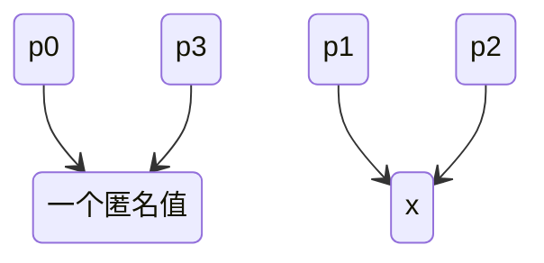

# Go 指针

## 基础概念

指针是Go中的一种类型，一个指针可以存储一个内存地址。

在编程中，内存地址用来定位一段内存。内存地址用一个操作系统原生字（native word）来存储。一个原生字在32位操作系统上占4个字节，在64位操作系统上占8个字节。所以，32位操作系统上的理论最大支持内存容量为4GB（1GB == 230字节），64位操作系统上的理论最大支持内存容量为264Byte，即16EB。

内存地址的字面形式常用整数的十六进制字面量来表示，比如`0x1234CDEF`。常简称内存地址为地址。

Go中一个值的地址是指此值的直接部分占据的内存的起始地址。在Go中，每个值都包含一个直接部分，但有些值可能还包含一个或多个间接部分。


### 取地址

取地址是指通过 `&` 操作符获取一个变量的内存地址。取地址的结果是一个指针，指向该变量的内存位置。


### 寻址

寻址是指一个变量是否可以通过 `&` 操作符获取其内存地址。如果一个变量是可寻址的，那么它就可以被取地址。不可寻址的值不可修改，虽然映射元素是不可寻址的，但是它们可以被修改且必须被整个覆盖修改。


#### 可寻址的变量

- 变量
- 可寻址的结构体的字段
- 可寻址的数组的元素
- 任意切片的元素（无论是可寻址切片或不可寻址切片）
- 指针解引用（dereference）操作


**非空切片的元素总是可被取地址，即便对于不可寻址的切片也是如此**

切片的内部类型是一个结构体，类似于

```go
struct {
	elements unsafe.Pointer // 引用着一个元素序列
	length   int
	capacity int
}
```

每一个切片间接引用一个元素序列。 尽管一个非空切片是不可取地址的，它的内部元素序列需要开辟在内存中的某处因而必须是可取地址的，取一个切片的元素地址事实上是取内部元素序列上的元素地址。因此不可寻址的非空切片的元素也是可以被取地址的。


#### 不可寻址的变量

- 函数返回值（除非返回的是指针或引用）
- 映射（map）的元素
- 字符串的字节元素
- 映射元素
- 接口值的动态值（类型断言的结果）
- 常量（包括具名常量和字面量如 `42` 或 `"hello"`）
- 声明的包级别函数
- 方法（用做函数值）
- 中间结果值
  - 函数调用
  - 显式值转换
  - 各种操作，不包含指针解引用（dereference）操作，但是包含：
    - 通道接收操作
    - 子字符串操作
    - 子切片操作
    - 加法、减法、乘法、以及除法等等。

请注意：`&T{}`在Go里是一个语法糖，它是`tmp := T{}; (&tmp)`的简写形式。 所以`&T{}`是合法的并不代表字面量`T{}`是可寻址的。


**映射元素不可被取地址**

在Go中，映射的设计保证一个映射值在内存允许的情况下可以加入任意个条目，另外为了防止一个映射中为其条目开辟的内存段支离破碎，官方标准编译器使用了哈希表来实现映射。并且为了保证元素索引的效率，一个映射值的底层哈希表只为其中的所有条目维护一段连续的内存段。因此，一个映射值随着其中的条目数量逐渐增加时，其维护的连续的内存段需要不断重新开辟来增容，并把原来内存段上的条目全部复制到新开辟的内存段上。另外，即使一个映射值维护的内存段没有增容，某些哈希表实现也可能在当前内存段中移动其中的条目。总之，映射中的元素的地址会因为各种原因而改变，如果映射元素可以被取地址，则Go运行时（runtime）必须在元素地址改变的时候修改所有存储了元素地址的指针值。这极大得增加了Go编译器和运行时的实现难度，并且严重影响了程序运行效率。因此目前Go中禁止取映射元素的地址。

映射元素不可被取地址的另一个原因是表达式`aMap[key]`可能返回一个存储于`aMap`中的元素，也可能返回一个不存储于其中的元素零值。这意味着表达式`aMap[key]`在`(&aMap[key]).Modify()`调用执行之后可能仍然被估值为元素零值。这将使很多人感到困惑，因此在Go中禁止取映射元素的地址。


### 解引用

**解引用**：通过`*`操作符访问指针指向的值。


## 指针类型和值

在Go中，一个无名指针类型的字面形式为`*T`，其中`T`为一个任意类型。类型`T`称为指针类型`*T`的基类型（base type）。如果一个指针类型的基类型为`T`，则我们可以称此指针类型为一个`T`指针类型。指针类型的零值的字面量使用预声明的`nil`来表示，一个nil指针（常称为空指针）中不存储任何地址。

如果一个指针类型的[底层类型](https://gfw.go101.org/article/type-system-overview.html#underlying-type)是`*T`，则它的基类型为`T`。如果一个指针类型的基类型为`T`，则此指针类型的值只能存储类型为`T`的值的地址。

如果两个无名指针类型的基类型为同一类型，则这两个无名指针类型亦为同一类型。一些指针类型的例子：

```go
*int  // 一个基类型为int的无名指针类型。
**int // 一个多级无名指针类型，它的基类型为*int。

type Ptr *int // Ptr是一个具名指针类型，它的基类型为int。
type PP *Ptr  // PP是一个具名多级指针类型，它的基类型为Ptr。
```


## 获取一个指针值

有两种方式来得到一个指针值：

- 用内置函数`new`来为任何类型的值开辟一块内存并将此内存块的起始地址做为此值的地址返回。假设`T`是任一类型，则函数调用`new(T)`返回一个类型为`*T`的指针值。存储在返回指针值所表示的地址处的值（可被看作是一个匿名变量）为`T`的零值。

```go
p0 := new(int)   // p0指向一个int类型的零值
fmt.Println(p0)  // 打印出一个十六进制形式的地址
fmt.Println(*p0) // 0
```


- 用前置取地址操作符`&`来获取一个可寻址的值的地址，对于一个类型为`T`的可寻址的值`t`，我们可以用`&t`来取得它的地址。`&t`的类型为`*T`。

```go
var a int
ptr = &a
```


一般说来，一个可寻址的值是指被放置在内存中某固定位置处的一个值（但放置在某固定位置处的一个值并非一定是可寻址的）。当一个变量被声明的时候，Go运行时将为此变量开辟一段内存，此内存的起始地址即为此变量的地址。


## 指针解引用

使用前置解引用操作符`*`来访问存储在一个指针所表示的地址处的值（即此指针所引用着的值）。对于基类型为`T`的指针类型的一个指针值`p`，可以用`*p`来表示地址`p`处的值,此值的类型为`T`,`*p`称为指针`p`的解引用。解引用是取地址的逆过程。解引用一个nil指针将产生一个恐慌。下面这个例子展示了如何取地址和解引用：

```go
func main() {
	p0 := new(int)   // p0指向一个int类型的零值
	fmt.Println(p0)  // （打印出一个十六进制形式的地址）
	fmt.Println(*p0) // 0

	x := *p0              // x是p0所引用的值的一个复制。
	p1, p2 := &x, &x      // p1和p2中都存储着x的地址，x、*p1和*p2表示着同一个int值。
	fmt.Println(p1 == p2) // true
	fmt.Println(p0 == p1) // false
    fmt.Printf("%T, %T \n", *p0, x) // int, int
	fmt.Printf("%T, %T \n", p0, p1) // *int, *int
    
	p3 := &*p0            // <=> p3 := &(*p0) <=> p3 := p0， p3和p0中存储的地址是一样的。
	fmt.Println(p0 == p3) // true
	*p0, *p1 = 123, 789
	fmt.Println(*p2, x, *p3) // 789 789 123
}
```


下面这张图描绘了上面这个例子中各个值之间的关系：



## 指针的应用

### 指向指针的指针

如果一个指针变量存放的又是另一个指针变量的地址，则称这个指针变量为指向指针的指针变量。当定义一个指向指针的指针变量时，第一个指针存放第二个指针的地址，第二个指针存放变量的地址：

```
var ptr **int;
```


指向指针的指针可以有多级，每多一级就多加一个`*`前缀。

```go
package main

import "fmt"

func main() {
	var a int
	var ptr *int
	var pptr **int
	var ppptr ***int

	a = 3000

	/* 指针 ptr 地址 */
	ptr = &a

	/* 指向指针 ptr 地址 */
	pptr = &ptr

	ppptr = &pptr

	/* 获取 pptr 的值 */
	fmt.Printf("变量 a = %d, 地址为 %d \n", a, &a)
	fmt.Printf("指针变量 ptr = %d,  *ptr = %d, 地址为 %d \n", ptr, *ptr, &ptr)
	fmt.Printf("指向指针的指针变量 pptr = %d, **pptr = %d, 地址为 %d \n", pptr, **pptr, &pptr)
	fmt.Printf("指向指针的指针的指针变量 ppptr = %d, ***ppptr = %d, 地址为 %d \n", ppptr, ***ppptr, &ppptr)
}
```

```
变量 a = 3000, 地址为 1374390673984
指针变量 ptr = 1374390673984,  *ptr = 3000, 地址为 1374390599768
指向指针的指针变量 pptr = 1374390599768, **pptr = 3000, 地址为 1374390599776
指向指针的指针的指针变量 ppptr = 1374390599776, ***ppptr = 3000, 地址为 1374390599784
```


### 作为函数参数

Go 语言允许向函数传递指针，只需要在函数定义的参数上设置为指针类型即可。

```go
package main

import "fmt"

func main() {
    /* 定义局部变量 */
   var a int = 100
   var b int= 200
   swap(&a, &b);

   fmt.Printf("交换后 a 的值 : %d\n", a )
   fmt.Printf("交换后 b 的值 : %d\n", b )
}

/* 交换函数这样写更加简洁，也是 go 语言的特性，可以用下，c++ 和 c# 是不能这么干的 */
 
func swap(x *int, y *int){
    *x, *y = *y, *x
}
```

```
交换后 a 的值 : 200
交换后 b 的值 : 100
```


让我们先看一个例子：

```go
package main

import "fmt"

func double(x int) {
	x += x
}

func main() {
	var a = 3
	double(a)
	fmt.Println(a) // 3
}
```

我们本期望上例中的`double`函数将变量`a`的值放大为原来的两倍，但是事实证明我们的期望没有得到实现。 为什么呢？因为在Go中，所有的赋值（包括函数调用传参）过程都是一个值复制过程。 所以在上面的`double`函数体内修改的是变量`a`的一个副本，而没有修改变量`a`本身。

当然我们可以让`double`函数返回输入参数的两倍数，但是此方法并非适用于所有场合。 下面这个例子通过将输入参数的类型改为一个指针类型来达到同样的目的。

```go
package main

import "fmt"

func double(x *int) {
	*x += *x
	x = nil // 此行仅为讲解目的
}

func main() {
	var a = 3
	double(&a)
	fmt.Println(a) // 6
	p := &a
	double(p)
	fmt.Println(a, p == nil) // 12 false
}
```

从上例可以看出，通过将`double`函数的输入参数的类型改为`*int`，传入的实参`&a`和它在此函数体内的一个副本`x`都引用着变量`a`。 所以对`*x`的修改等价于对`*p`（也就是变量`a`）的修改。 换句话说，新版本的`double`函数内的操作可以反映到此函数外了。

当然，在此函数体内对传入的指针实参的修改`x = nil`依旧不能反映到函数外，因为此修改发生在此指针的一个副本上。 所以在`double`函数调用之后，局部变量`p`的值并没有被修改为`nil`。

简而言之，指针提供了一种间接的途径来访问和修改一些值。 虽然很多语言中没有指针这个概念，但是指针被隐藏其它概念之中。


### 指针值作为选择器

具名的指针类型的值不能使用在选择器语法形式中。如果值`x`的类型为一个一级具名指针类型，`f`为字段并且`(*x).f`是一个合法的选择器，则`x.f`也是合法的。任何多级指针均不能出现在选择器语法形式中。

```go
type T struct {
	x int
}

func (T) y() {
}

type P *T
type PP **T // 一个多级指针类型

func main() {
	var t T
	var p P = &t
	var pt = &t   // pt的类型为*T
	var ppt = &pt // ppt的类型为**T
	var pp PP = ppt
	_ = pp

	_ = (*p).x // 合法
	_ = p.x    // 合法（因为x为一个字段）

	_ = (*p).y // 合法
	// _ = p.y // 不合法（因为y为一个方法）

	// 下面的选择器均不合法。
	/*
	_ = ppt.x
	_ = ppt.y
	_ = pp.x
	_ = pp.y
	*/
}
```


无论一个指针值的类型是具名的还是无名的，如果它的（指针）类型的基类型为一个结构体类型，则可以使用此指针值来选择它所引用着的结构体中的字段。但是如果此指针的类型为一个具名类型，则不能使用此指针值来选择它所引用着的结构体中的方法。总是不能使用二级以上指针来选择结构体字段和方法。

```go
func (T) m() {} // T有一个方法m。

type P *T  // P为一个具名一级指针类型。
type PP *P // PP为一个具名二级指针类型。

func TestPointerAsSelector(test *testing.T) {
	var t T
	var tp = &t
	var tpp = &tp
	var p P = tp
	var pp PP = &p
	tp.x = 12  // 没问题
	p.x = 34   // 没问题
	pp.x = 56  // error: 类型PP没有名为x的字段或者方法。
	tpp.x = 78 // error: 类型**T没有名为x的字段或者方法。

	tp.m()  // 没问题，因为类型*T也有一个m方法。
	p.m()   // error: 类型P没有名为m的字段或者方法。
	pp.m()  // error: 类型PP没有名为m的字段或者方法。
	tpp.m() // error: 类型**T没有名为m的字段或者方法。
}
```


## 指针值的限制

### 不支持算术运算

在Go中，指针是不能参与算术运算的。对于一个指针`p`， 运算`p++`和`p-2`都是非法的。如果`p`为一个指向一个数值类型值的指针，`*p++`将被编译器认为是合法的并且等价于`(*p)++`。 换句话说，解引用操作符`*`的优先级都高于自增`++`和自减`--`操作符。例子：

```go
package main

import "fmt"

func main() {
	a := int64(5)
	p := &a

	// 下面这两行编译不通过。
	/*
	p++
	p = (&a) + 8
	*/

	*p++
	fmt.Println(*p, a)   // 6 6
	fmt.Println(p == &a) // true

	*&a++
	*&*&a++
	**&p++
	*&*p++
	fmt.Println(*p, a) // 10 10
}
```


### 不能任意转换

在Go中，只有如下某个条件被满足的情况下，一个类型为`T1`的指针值才能被显式转换为另一个指针类型`T2`：

1. 类型`T1`和`T2`的底层类型必须一致（忽略结构体字段的标签）。如果类型`T1`和`T2`中只要有一个是无名类型并且它们的底层类型一致（考虑结构体字段的标签），则此转换可以是隐式的。
2. 类型`T1`和`T2`都为无名类型并且它们的基类型的底层类型一致（忽略结构体字段的标签）。


```go
type MyInt int64
type Ta    *int64
type Tb    *MyInt
```

对于上面所示的这些指针类型，下面的事实成立：

1. 类型`*int64`的值可以被隐式转换到类型`Ta`，反之亦然（因为它们的底层类型均为`*int64`）。
2. 类型`*MyInt`的值可以被隐式转换到类型`Tb`，反之亦然（因为它们的底层类型均为`*MyInt`）。
3. 类型`*MyInt`的值可以被显式转换为类型`*int64`，反之亦然（因为它们都是无名的并且它们的基类型的底层类型均为`int64`）。
4. 类型`Ta`的值不能直接被转换为类型`Tb`，即使是显式转换也是不行的。但是，通过上述三条事实，通过三层显式转换`Tb((*MyInt)((*int64)(ta)))`，一个类型为`Ta`的值`ta`可以被间接地转换为类型`Tb`。
5. 这些指针类型的任何值都无法被转换到类型`*uint64`。


### 不能任意比较

Go指针值是支持（使用比较运算符`==`和`!=`）比较的。 但是，两个指针只有在下列任一条件被满足的时候才可以比较：

1. 这两个指针的类型相同。
2. 其中一个指针可以被隐式转换为另一个指针的类型。换句话说，这两个指针的类型的底层类型必须一致并且至少其中一个指针类型为无名的（考虑结构体字段的标签）。
3. 其中一个并且只有一个指针用类型不确定的`nil`标识符表示。


```go
package main

func main() {
	type MyInt int64
	type Ta    *int64
	type Tb    *MyInt

	// 4个不同类型的指针：
	var pa0 Ta
	var pa1 *int64
	var pb0 Tb
	var pb1 *MyInt

	// 下面这6行编译没问题。它们的比较结果都为true。
	_ = pa0 == pa1
	_ = pb0 == pb1
	_ = pa0 == nil
	_ = pa1 == nil
	_ = pb0 == nil
	_ = pb1 == nil

	// 下面这三行编译不通过。
	/*
	_ = pa0 == pb0
	_ = pa1 == pb1
	_ = pa0 == Tb(nil)
	*/
}
```


### 不能任意赋值

一个指针值可以被赋值给另一个指针值的条件和这两个指针值可以比较的条件（见上一小节）是一致的。


### unsafe标准库

上述Go指针的限制是可以被打破的，`unsafe`标准库包提供的非类型安全指针（`unsafe.Pointer`）机制可以用来打破上述Go指针的安全限制。但是非类型安全指针机制不推荐在Go日常编程中使用。


## 类型的寻址与取地址


### 结构体字段的可寻址性

如果一个结构体值是可寻址的，则它的字段也是可寻址的；反之，一个不可寻址的结构体值的字段也是不可寻址的。 不可寻址的字段的值是不可更改的。所有的组合字面量都是不可寻址的。一个例子：

```go
func main() {
	type Book struct {
		Pages int
	}
	var book = Book{} // 变量值book是可寻址的
	p := &book.Pages
	*p = 123
	fmt.Println(book) // {123}

	// 下面这两行编译不通过，因为Book{}是不可寻址的，
	// 继而Book{}.Pages也是不可寻址的。
	/*
	Book{}.Pages = 123
	p = &Book{}.Pages // <=> p = &(Book{}.Pages)
	*/
}
```

注意：选择器中的属性选择操作符`.`的优先级比取地址操作符`&`的优先级要高。


组合字面量不可寻址但可被取地址，一般来说，只有可被寻址的值才能被取地址，但是Go中有一个语法糖（语法例外）：虽然所有的组合字面量都是不可寻址的，但是它们都可被取地址。例子：

```go
func TestCompositeLiteralsAreUnaddressableButCanTakeAddresses(t *testing.T) {
	type Book struct {
		Pages int
	}
	// Book{100}是不可寻址的，但是它可以被取地址。
	// p := &Book{100}.Pages // 编译不通过：Cannot take the address of 'Book{100}.Pages'
	p := &Book{100} // 等价于：tmp := Book{100}; p := &tmp
	p.Pages = 200
}
```


在字段选择器中，属主结构体值可以是指针，但是指针和指针的值没有字段，它将被隐式解引用。

```go
type Book struct {
    pages int
}

func TestPointerWithoutField(t *testing.T) {
    book1 := &Book{100} // book1是一个指针
	book2 := new(Book)  // book2是另外一个指针
    
    book2.pages = book1.pages // 像使用结构值一样来使用结构体值的指针
    (*book2).pages = (*book1).pages // 上一行等价于本行，即上一行两个选择器中的指针属主将被自动隐式解引用
}
```


### 容器字面量是不可寻址的但可以被取地址

容器字面量也是不可寻址的但可以被取地址，一个例子：

```go
pm := &map[string]int{"C": 1972, "Go": 2009}
ps := &[]string{"break", "continue"}
pa := &[...]bool{false, true, true, false}
fmt.Printf("%T\n", pm) // *map[string]int
fmt.Printf("%T\n", ps) // *[]string
fmt.Printf("%T\n", pa) // *[4]bool
```


### 数组元素的可寻址性

如果一个数组是可寻址的，则它的元素也是可寻址的；反之亦然，即如果一个数组是不可寻址的，则它的元素也是不可寻址的。因为一个数组只含有一个（直接）值部，并且所有元素和此直接值部均承载在同一个内存块上。

```go
a := [5]int{2, 3, 5, 7}
pa2 := &a[2]
fmt.Println(*pa2) // 5
a[2] = 99
fmt.Println(*pa2) // 99

// 下面这几行编译不通过。
/*
_ = &[3]int{2, 3, 5}[0]
*/
```


不可寻址的数组的元素依旧是不可寻址的，但是不可寻址的切片的元素总是可寻址的，原因是一个数组值的元素和此数组存储在同一个内存块中，但是切片的情况大不相同。

```go
func TestAddressableSliceAndUnaddressableArray(test *testing.T) {
	// 取不可寻址的切片的元素的地址是没问题的
	_ = &[]int{1}[0]
	// error: 不能取不可寻址的数组的元素的地址
	_ = &[5]int{}[0]

	/* 修改元素值。 */

	// 修改不可寻址的切片的元素是没问题的
	[]int{1,2,3}[1] = 9
	// error: 不能修改不可寻址的数组的元素
	[3]int{1,2,3}[1] = 9
}
```


同理，可以从不可寻址的切片派生子切片，但是不能从不可寻址的数组派生子切片。

```go
func TestDeriveFromUnaddressableSliceAndArray(test *testing.T) {
	// 下面几行编译没问题。
	_ = []int{6, 7, 8, 9}[1:3]
	var ms = map[string][]int{"abc": {0, 1, 2, 3}}
	_ = ms["abc"][1:3]

	// 下面几行将编译失败，因为不可从不可寻址的数组派生切片。
	/*
	_ = [...]int{6, 7, 8, 9}[1:3] // error
	var ma = map[string][4]int{"abc": {0, 1, 2, 3}}
	_ = ma["abc"][1:3]            // error
	*/
}
```


### 切片元素的可寻址性

一个切片值的任何元素都是可寻址的，即使此切片本身是不可寻址的，这是因为一个切片的底层元素总是存储在一个被开辟出来的内存片段（间接值部）上。

```go
s := make([]bool, 2)
ps1 := &s[1]
fmt.Println(*ps1) // false
s[1] = true
fmt.Println(*ps1) // true

ps0 := &[]string{"Go", "C"}[0]
fmt.Println(*ps0) // Go
```


### 映射元素的可寻址性

任何映射元素都是不可寻址的，在Go中，映射的设计保证一个映射值在内存允许的情况下可以加入任意个条目。另外为了防止一个映射中为其条目开辟的内存段支离破碎，官方标准编译器使用了哈希表来实现映射，并且为了保证元素索引的效率，一个映射值的底层哈希表只为其中的所有条目维护一段连续的内存段。因此，一个映射值随着其中的条目数量逐渐增加时，其维护的连续的内存段需要不断重新开辟来增容，并把原来内存段上的条目全部复制到新开辟的内存段上。另外，即使一个映射值维护的内存段没有增容，某些哈希表实现也可能在当前内存段中移动其中的条目。总之，映射中的元素的地址会因为各种原因而改变。如果映射元素可以被取地址，则Go运行时（runtime）必须在元素地址改变的时候修改所有存储了元素地址的指针值。这极大得增加了Go编译器和运行时的实现难度，并且严重影响了程序运行效率。因此，目前，Go中禁止取映射元素的地址。

映射元素不可被取地址的另一个原因是表达式`aMap[key]`可能返回一个存储于`aMap`中的元素，也可能返回一个不存储于其中的元素零值。这意味着表达式`aMap[key]`在`(&aMap[key]).Modify()`调用执行之后可能仍然被估值为元素零值。这将使很多人感到困惑，因此在Go中禁止取映射元素的地址。


```go
m := map[int]bool{1: true}
_ = m
// 下面这几行编译不通过。
/*
_ = &map[int]bool{1: true}[1]
_ = &m[1] // 映射元素是不可寻址的
*/
```


一般来说，一个不可寻址的值的直接部分是不可修改的，但是映射元素是个例外。映射元素虽然不可寻址，但是每个映射元素可以被整个修改（但不能被部分修改）。对于大多数做为映射元素类型的类型，在修改它们的值的时候，一般体现不出来整个修改和部分修改的差异。但是如果一个映射的元素类型为数组或者结构体类型，这个差异是很明显的。

数组或者结构体值都是仅含有一个直接部分。所以

- 如果一个映射类型的元素类型为一个结构体类型，则无法修改此映射类型的值中的每个结构体元素的单个字段，必须整体地同时修改所有结构体字段；
- 如果一个映射类型的元素类型为一个数组类型，则无法修改此映射类型的值中的每个数组元素的单个元素，必须整体地同时修改所有数组元素；


```go
package main

import "fmt"

func main() {
	type T struct{age int}
	mt := map[string]T{}
	mt["John"] = T{age: 29} // 整体修改是允许的
	ma := map[int][5]int{}
	ma[1] = [5]int{1: 789} // 整体修改是允许的

	// 这两个赋值编译不通过，因为部分修改一个映射
	// 元素是非法的。这看上去确实有些反直觉。
	/*
	ma[1][1] = 123      // error
	mt["John"].age = 30 // error
	*/

	// 读取映射元素的元素或者字段是没问题的。
	fmt.Println(ma[1][1])       // 789
	fmt.Println(mt["John"].age) // 29
}
```


为了让上例中的两行编译不通过的两行赋值语句编译通过，欲修改的映射元素必须先存放在一个临时变量中，然后修改这个临时变量，最后再用这个临时变量整体覆盖欲修改的映射元素。比如：

```go
package main

import "fmt"

func main() {
	type T struct{age int}
	mt := map[string]T{}
	mt["John"] = T{age: 29}
	ma := map[int][5]int{}
	ma[1] = [5]int{1: 789}

	t := mt["John"] // 临时变量
	t.age = 30
	mt["John"] = t // 整体修改

	a := ma[1] // 临时变量
	a[1] = 123
	ma[1] = a // 整体修改

	fmt.Println(ma[1][1], mt["John"].age) // 123 30
}
```


### 函数的可寻址性

函数调用是不可寻址的。

```go
func TestAddressableOfFunction(t *testing.T) {
	f := func() []int {
		return []int{0, 1, 2}
	}
	// _ = &f() // 编译错误: Cannot take the address of 'f()'
	_ = &f()[2] // okay
}
```
