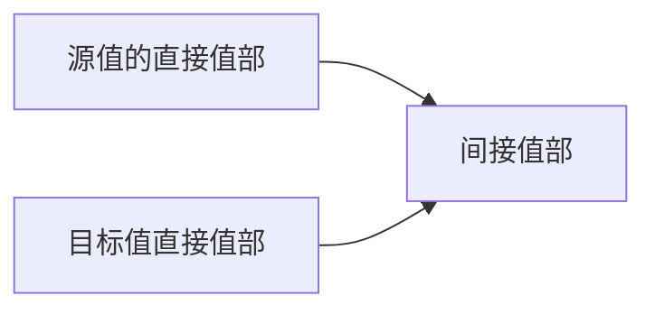

# Go 类型系统

## 基础概念

### 基本类型

Go支持下列基本类型（basic type）：

- 内置字符串类型：`string`.
- 内置布尔类型：`bool`.
- 内置数值类型：
  - `int8`、`uint8`（`byte`）、`int16`、`uint16`、`int32`（`rune`）、`uint32`、`int64`、`uint64`、`int`、`uint`、`uintptr`。
  - `float32`、`float64`。
  - `complex64`、`complex128`。

注意，`byte`是`uint8`的一个内置别名，`rune`是`int32`的一个内置别名。这17个内置基本类型属于预声明类型（predeclared type）。内置类型都没有方法，但是内置类型`error`有一个`Error() string`方法。


#### byte和rune

在Go语言里，`byte`是`uint8`类型的一个别名。换言之，`byte`和`uint8`是相同的类型，`rune`和`int32`属于同样类似的关系。一个`rune`值通常被用来存储一个Unicode码点。`[]byte`和`[]rune`类型的值可以被显式地直接转换成字符串，反之亦然。

```go
func TestConvertToStringFromByteAndRune(t *testing.T) {
	var s0 = "Go"

	var bs = []byte(s0)
	var s1 = string(bs)

	var rs = []rune(s0)
	var s2 = string(rs)

	fmt.Println(s0 == s1) // true
	fmt.Println(s0 == s2) // true
}
```


### 组合类型

Go支持下列组合类型（composite type）：

- 指针类型 - 类C指针
- 结构体类型 - 类C结构体
- 函数类型 - 函数类型在Go中是一种一等公民类别
- 容器类型，包括:
  - 数组类型 - 定长容器类型
  - 切片类型 - 动态长度和容量容器类型
  - 映射类型（map）- 也常称为字典类型。在标准编译器中映射是使用哈希表实现的。
- 通道类型 - 通道用来同步并发的协程
- 接口类型 - 接口在反射和多态中发挥着重要角色
- 无名组合类型可以用它们各自的字面表示形式来表示。下面是一些各种不同种类的无名组合类型字面表示形式的例子（具名和无名类型将在下面解释）：

```go
// 假设T为任意一个类型，Tkey为一个支持比较的类型。

*T         // 一个指针类型
[5]T       // 一个元素类型为T、元素个数为5的数组类型
[]T        // 一个元素类型为T的切片类型
map[Tkey]T // 一个键值类型为Tkey、元素类型为T的映射类型

// 一个结构体类型
struct {
	name string
	age  int
}

// 一个函数类型
func(int) (bool, string)

// 一个接口类型
interface {
	Method0(string) int
	Method1() (int, bool)
}

// 几个通道类型
chan T
chan<- T
<-chan T
```


部分类型的基类型可以为该类型自身：

- 一个指针类型的基类型可以为此指针类型自身。
- 一个切片类型的元素类型可以是此切片类型自身，

- 一个映射类型的元素类型可以是此映射类型自身，
- 一个通道类型的元素类型可以是此通道类型自身，
- 一个函数类型的输入参数和返回结果值类型可以是此函数类型自身。

```go
func TestBaseKindIsSelf(t *testing.T) {
	type P *P
	var p P
	p = &p
	p = **************p

	type S []S
	s := S{0: nil}
	s[0] = s
	_ = s[0][0][0][0][0][0][0][0]
	
	type M map[string]M
	m := M{"Go": nil}
	m["Go"] = m
	_ = m["Go"]["Go"]["Go"]["Go"]
	
	type C chan C
	c := make(C, 3)
	c <- c
	c <- c
	c <- c
	<-<-<-c
	
	type F func(F) F
	var f F
	f = func(F) F { return f }
	f(f(f(f(f))))
}
```


### 类型的种类

每种上面提到的基本类型和组合类型都对应着一个类型种类（kind），除了这些种类，非类型安全指针类型属于另外一个新的类型种类。所以，目前（Go 1.22），Go有26个类型种类。


### 类型的零值

下面这些类型的零值可以用预声明的`nil`标识符表示。

| 类型（`T`） | `T(nil)`的尺寸 |
| :---------: | :------------: |
|    指针     |     1 word     |
|    切片     |    3 words     |
|    映射     |     1 word     |
|    通道     |     1 word     |
|    函数     |     1 word     |
|    接口     |    2 words     |


上表列出的尺寸为标准编译器的结果，一个word（原生字）在32位的架构中为4个字节，在64位的架构中为8个字节，一个类型的零值的尺寸和其它非零值的尺寸是一致的。一个Go值的间接底层部分未统计在尺寸中。


### 类型定义

**类型定义（type definition declaration）**又称类型定义声明。在Go 1.9之前，类型定义被称为类型声明并且是唯一的一种类型声明形式。但是自从Go 1.9，类型定义变成了两种类型声明形式之一，另一种新的类型声明形式为类型别名声明。

在Go中可以用如下形式来定义新的类型，在此语法中，`type`为一个关键字。

```go
// 定义单个类型。
type NewTypeName SourceType

// 定义多个类型（将多个类型描述合并在一个声明中）。
type (
	NewTypeName1 SourceType1
	NewTypeName2 SourceType2
)
```


新的类型名必须为标识符。但是请注意：包级类型（以及下一节将要介绍的类型别名）的名称不能为[`init`](https://gfw.go101.org/article/packages-and-imports.html#init)。

上例中的第二个类型声明中包含两个类型描述（type specification）。 如果一个类型声明包含多于一个的类型描述，这些类型描述必须用一对小括号`()`括起来。每个类型描述创建了一个全新的定义类型（defined type）。

注意：

- 一个新定义的类型和它的源类型为两个不同的类型。
- 在两个不同的类型定义中所定义的两个类型肯定是两个不同的类型。
- 一个新定义的类型和它的源类型的底层类型一致并且它们的值可以相互显式转换。
- 类型定义可以出现在函数体内。


一些类型定义的例子：

```go
// 下面这些新定义的类型和它们的源类型都是基本类型，它们的源类型均为预声明类型
type (
	MyInt int
	Age   int
	Text  string
)

// 下面这些新定义的类型和它们的源类型都是组合类型，它们的源类型均为无名类型
type IntPtr *int
type Book struct{author, title string; pages int}
type Convert func(in0 int, in1 bool)(out0 int, out1 string)
type StringArray [5]string
type StringSlice []string

func f() {
	// 这三个新定义的类型名称只能在此函数内使用。
	type PersonAge map[string]int
	type MessageQueue chan string
	type Reader interface{Read([]byte) int}
}
```

请注意：从Go 1.9到Go 1.17，Go白皮书曾经把预声明类型视为定义类型。 但是从Go 1.18开始，Go白皮书明确说明预声明类型不再属于定义类型。


### 具名类型和无名类型

> 在Go 1.9之前，**具名类型**这个术语在Go白皮书中是精确定义的。在那时，一个具名类型被定义为一个可以用标识符表示的类型。随着在Go 1.9中引入了自定义类型别名，**具名类型**这个术语被从白皮书中删除了；取而代之的是**定义类型**。随着Go 1.18中引入了自定义泛型，**具名类型**这个术语又被重新加回到白皮书。


一个具名类型（named type）可能为：

- 一个预声明类型（不包括类型别名）；
- 一个定义（非自定义泛型）类型；
- 一个（泛型类型的）实例化类型；
- 一个类型参数类型（使用在自定义泛型中）。


其它类型称为无名类型（unnamed type），一个无名类型肯定是一个组合类型（反之则未必）。


### 类型别名

从Go 1.9开始，我们可以使用下面的语法来声明自定义类型别名（type alias declaration）。此语法和类型定义类似，但是请注意每个类型描述中多了一个等号`=`。

```go
type (
	Name = string
	Age  = int
)

type table = map[string]int
type Table = map[Name]Age
```


类型别名也必须为标识符。同样地，类型别名可以被声明在函数体内。在上面的类型别名声明的例子中，`Name`是内置类型`string`的一个别名，它们表示同一个类型。 同样的关系对下面的几对类型表示也成立：

- 别名`Age`和内置类型`int`。
- 别名`table`和映射类型`map[string]int`。
- 别名`Table`和映射类型`map[Name]Age`。

事实上，文字表示形式`map[string]int`和`map[Name]Age`也表示同一类型。 所以，`table`和`Table`一样表示同一个类型。

注意：尽管一个类型别名有一个名字，但是它可能表示一个无名类型。 比如，`table`和`Table`这两个别名都表示同一个无名类型`map[string]int`。


### 底层类型

在Go中，每个类型都有一个底层类型（underlying type）。规则：

- 一个内置类型的底层类型为它自己。
- `unsafe`标准库包中定义的`Pointer`类型的底层类型是它自己。事实上，关于`unsafe.Pointer`类型的底层类型，官方文档中并没有清晰的说明。也可以认为`unsafe.Pointer`类型的底层类型为`*T`，其中`T`表示一个任意类型。`unsafe.Pointer`也被视为一个内置类型。
- 一个无名类型（必为一个组合类型）的底层类型为它自己。
- 在一个类型声明中，新声明的类型和源类型共享底层类型。


一个例子：

```go
// 这四个类型的底层类型均为内置类型int。
type (
	MyInt int
	Age   MyInt
)

// 下面这三个新声明的类型的底层类型各不相同。
type (
	IntSlice   []int   // 底层类型为[]int
	MyIntSlice []MyInt // 底层类型为[]MyInt
	AgeSlice   []Age   // 底层类型为[]Age
)

// 类型[]Age、Ages和AgeSlice的底层类型均为[]Age。
type Ages AgeSlice
```


如何溯源一个声明的类型的底层类型？规则很简单，在溯源过程中，当遇到一个内置类型或者无名类型时，溯源结束。 以上面这几个声明的类型为例，下面是它们的底层类型的溯源过程：

```
MyInt → int
Age → MyInt → int
IntSlice → []int
MyIntSlice → []MyInt → []int
AgeSlice → []Age → []MyInt → []int
Ages → AgeSlice → []Age → []MyInt → []int
```


在Go中，

- 底层类型为内置类型`bool`的类型称为**布尔类型**；
- 底层类型为任一内置整数类型的类型称为**整数类型**；
- 底层类型为内置类型`float32`或者`float64`的类型称为**浮点数类型**；
- 底层类型为内置类型`complex64`或`complex128`的类型称为**复数类型**；
- 整数类型、浮点数类型和复数类型统称为**数字值类型**；
- 底层类型为内置类型`string`的类型称为**字符串类型**。

底层类型这个概念在类型转换、赋值和比较规则中扮演着重要角色。


**类型别名和类型定义的区别：**

| 特性           | 类型定义                     | 类型别名                      |
| -------------- | ---------------------------- | ----------------------------- |
| 创建的新类型   | 是                           | 否                            |
| 与原类型的关系 | 不同的类型，需要显式类型转换 | 完全相同，可以直接互换使用    |
| 能否定义新方法 | 可以                         | 不可以                        |
| 语法           | `type NewType ExistingType`  | `type NewName = ExistingType` |


**类型定义**：用于创建一个与现有类型有相同底层表示但行为不同的新类型。可以为新类型定义方法、接口实现，或防止无意中混用相似类型的数据。

**类型别名**：用于重命名一个现有的类型，它与原类型完全相同，不创建新类型。，通常是在需要迁移代码或兼容老代码时使用。允许用新的名字替代旧的类型而不改变代码逻辑。


### 值

一个类型的一个实例称为此类型的一个值（value）。一个类型可以有很多不同的值，其中一个为它的零值。同一类型的不同值共享很多相同的属性。

每个类型有一个零值，一个类型的零值可以看作是此类型的默认值。预声明的标识符`nil`可以看作是切片、映射、函数、通道、指针（包括非类型安全指针）和接口类型的零值的字面量表示。

在源代码中，值可以呈现为若干种形式，包括字面量、具名常量、变量和表达式，前三种形式可以看作是最后一种形式的特例。值分为类型确定的和类型不确定的。

另外，Go中还有另外两种的字面量表示形式：函数字面量表示形式和组合字面量表示形式（composite literal）。

- 函数字面量表示形式用来表示函数值。事实上，一个函数声明是由一个标识符（函数名）和一个函数字面量表示形式组成。

- 组合字面量表示形式用来表示结构体类型值和容器类型（数组、切片和映射）值。 指针类型、通道类型和接口类型的值没有字面量表示形式。


每个值要么有一个确定的类型要么有一个默认类型，但是类型不确定的`nil`值既没有确定的类型也没有默认类型。


### 值尺寸

一个值存储在内存中是要占据一定的空间的。此空间的大小称为此值的尺寸（value size）。值尺寸是用字节数来衡量的。 在Go中，当我们谈及一个值的尺寸，如果没有特殊说明，我们一般是指此值的直接部分的尺寸。 某个特定类别的所有类型的值的尺寸都是一样的。因为这个原因，我们也常将一个值的尺寸说成是它的类型的尺寸（或值尺寸）。

我们可以用`unsafe`标准库包中的`Sizeof`函数来取得任何一个值的尺寸。


### 结构体类型的字段

一个结构体类型由若干成员变量组成。每个这样的成员变量称为此结构体的一个字段（field）。 比如，下面这个结构体类型含有三个字段：`author`、`title`和`pages`。

```go
struct {
	author string
	title  string
	pages  int
}
```


### 函数类型的签名

一个函数和其类型的签名（signature）由此函数的输入参数和返回结果的类型列表组成。 函数名称和函数体不属于函数签名的构成部分。


### 类型的方法和方法集

在Go中，我们可以给满足某些条件的类型声明方法（method）。方法也常被称为成员函数。 一个类型的所有方法组成了此类型的方法集（method set）。


### 接口类型的动态类型和动态值

接口类型的值称为接口值。一个接口值可以包裹装载一个非接口值。包裹在一个接口值中的非接口值称为此接口值的动态值。此动态值的类型称为此接口值的动态类型。 一个什么也没包裹的接口值为一个零值接口值。零值接口值的动态值和动态类型均为不存在。

一个接口类型可以指定若干个（可以是零个）方法，这些方法形成了此接口类型的方法集。

如果一个类型（可以是接口或者非接口类型）的方法集是一个接口类型的方法集的超集，则此类型实现了此接口类型。


### 一个值的具体类型和具体值

对于一个（类型确定的）非接口值，它的具体类型（concrete type）就是它的类型，它的具体值（concrete value）就是它自己。一个零值接口值没有具体类型和具体值。 对于一个非零值接口值，它的具体类型和具体值就是它的动态类型和动态值。


### 容器类型

数组、切片和映射是Go中的三种正式意义上的内置容器类型。有时候，字符串和通道类型也可以被非正式地看作是容器类型。（正式和非正式的）容器类型的每个值都有一个长度属性。


### 映射类型的键值类型

如果一个映射类型的底层类型表示为`map[Tkey]T`，则此映射类型的键值（key）类型为`Tkey`。`Tkey`必须为一个可比较类型。


### 容器类型的元素类型

存储在一个容器值中的所有元素（element）的类型必须为同一个类型，此同一类型称为此容器值的（容器）类型的元素类型。

- 如果一个数组类型的底层类型表示为`[N]T`，则此数组类型的元素类型为`T`所表示的类型。
- 如果一个切片类型的底层类型表示为`[]T`，则此切片类型的元素类型为`T`所表示的类型。
- 如果一个映射类型的底层类型表示为`map[Tkey]T`，则此映射类型的元素类型为`T`所表示的类型。
- 如果一个通道类型的底层类型表示为`chan T`、`chan<- T`或者`<-chan T`，则此通道类型的元素类型为`T`所表示的类型。
- 一个字符串类型的元素类型总是内置类型`byte`（亦即`uint8`）。


### 通道类型的方向

一个通道值可以被看作是先入先出（first-in-first-out，FIFO）队列。一个通道值可能是可读可写的、只读的（receive-only）或者只写的（send-only）。

- 一个可读可写的通道值也称为一个双向通道。一个双向通道类型的底层类型可以被表示为`chan T`。
- 只能向一个只写的通道值发送数据，而不能从其中接收数据。只写通道类型的底层类型可以被表示为`chan<- T`。
- 只能从一个只读的通道值接收数据，而不能向其发送数据。只读通道类型的底层类型可以被表示为`<-chan T`。


### 可比较类型和不可比较类型

目前（Go 1.22），下面这些类型的值不支持（使用`==`和`!=`运算标识符）比较，这些类型称为不可比较类型，其它类型称为可比较类型。

- 映射（map）
- 切片
- 函数
- 包含不可比较字段的结构体类型
- 元素类型为不可比较类型的数组类型


请注意：

- 尽管映射，切片和函数值不支持比较，但是它们的值可以与类型不确定的`nil`标识符比较；

- 如果两个接口值的动态类型相同且不可比较，那么在运行时比较这两个接口的值会产生一个恐慌；

- 不支持比较的类型不能用做映射类型的键值类型。

  

## 类型转换规则大全

在Go中，如果一个值`v`可以被显式地转换为类型`T`，则此转换可以使用语法形式`(T)(v)`来表示。 在大多数情况下，特别是`T`为一个类型名（即一个标识符）时，此形式可简化为`T(v)`。

当我们说一个值`x`可以被隐式转换为一个类型`T`，这同时也意味着`x`可以被显式转换为类型`T`。


### 显然的类型转换规则

如果两个类型表示着同一个类型，则它们的值可以相互**隐式**转换为这两个类型中的任意一个，比如，

- 类型`byte`和`uint8`的任何值可以转换为这两个类型中的任意一个；
- 类型`rune`和`int32`的任何值可以转换为这两个类型中的任意一个；
- 类型`[]byte`和`[]uint8`的任何值可以转换为这两个类型中的任意一个。

```go
func TestConvertApparentSameKind(t *testing.T) {
	var byteValue byte = 1
	var uint8Value uint8 = 1
	byteValue = uint8Value
	uint8Value = byteValue
	
	var runeValue rune = 1
	var int32Value int32 = 1
	runeValue = int32Value
	int32Value = runeValue
	
	var byteArrayValue []byte = []byte{1}
	var uint8ArrayValue []uint8 = []uint8{1}
	byteArrayValue = uint8ArrayValue
	uint8ArrayValue = byteArrayValue
}
```


### 底层类型相关的类型转换规则

给定一个非接口值`x`和一个非接口类型`T`，并假设`x`的类型为`Tx`：

- 如果类型`Tx`和`T`的底层类型相同（忽略掉结构体字段标签），则`x`可以被显式转换为类型`T`；
- 如果类型`Tx`和`T`中至少有一个是无名类型并且它们的底层类型相同（考虑结构体字段标签），则`x`可以被隐式转换为类型`T`；
- 如果类型`Tx`和`T`的底层类型不同，但是两者都是无名的指针类型并且它们的基类型的底层类型相同（忽略掉结构体字段标签），则`x`可以而且只能被显式转换为类型`T`；


```go
func TestConvertSameUnderlyingKind(t *testing.T) {
	// 类型[]int、IntSlice和MySlice共享底层类型：[]int。
	type IntSlice []int
	type MySlice []int
	var is = IntSlice{}
	var ms = MySlice{}

	// 这两行隐式转换编译不通过，底层类型相同只能显示转换
	//is = ms
	//ms = is

	// 必须使用显式转换
	is = IntSlice(ms)
	ms = MySlice(is)

	// 这些隐式转换是没问题的，因为两边至少有一个是无名类型
	var s []int
	s = is
	is = s
	s = ms
	ms = s

	type Foo = struct {
		n int `foo`
	}
	type Bar = struct {
		n int `bar`
	}
	var x map[Bar]Foo
	var y map[Foo]Bar
	// 必须使用显式转换
	x = map[Bar]Foo(y)
	y = map[Foo]Bar(x)
}
```


指针相关的转换例子：

```go
func TestConvertDifferentUnderlyingKind(t *testing.T) {
	type MyInt int
	type IntPtr *int
	type MyIntPtr *MyInt

	var pi = new(int)  // pi的类型为*int
	var ip IntPtr = pi // 没问题，因为底层类型相同并且pi的类型为无名类型。

	// var _ *MyInt = pi // 不能隐式转换
	var _ = (*MyInt)(pi) // 显式转换是没问题的

	// 类型*int的值不能被直接转换为类型MyIntPtr，但是可以间接地转换过去。
	/*
		var _ MyIntPtr = pi  // 不能隐式转换
		var _ = MyIntPtr(pi) // 也不能显式转换
	*/
	var _ MyIntPtr = (*MyInt)(pi)  // 间接隐式转换没问题
	var _ = MyIntPtr((*MyInt)(pi)) // 间接显式转换没问题

	// 类型IntPtr的值不能被直接转换为类型MyIntPtr，但是可以间接地转换过去。
	/*
		var _ MyIntPtr = ip  // 不能隐式转换
		var _ = MyIntPtr(ip) // 也不能显式转换
	*/
	// 间接隐式或者显式转换都是没问题的。
	var _ MyIntPtr = (*MyInt)((*int)(ip))  // ok
	var _ = MyIntPtr((*MyInt)((*int)(ip))) // ok
}
```


如果两个指针的类型具有不同的底层类型但是它们的基类型却共享相同的底层类型，则这两个指针值可以间接相互转换为对方的类型。

```go
type MyInt int64
type Ta    *int64
type Tb    *MyInt

func main() {
	var a Ta
	var b Tb

	//a = Ta(b) // error: 直接转换是不允许的。

	// 但是间接转换是允许的。
	y := (*MyInt)(b)
	x := (*int64)(y)
	a = x           // 等价于下一行
	a = (*int64)(y) // 等价于下一行
	a = (*int64)((*MyInt)(b))
	_ = a
}
```


### 通道相关的类型转换规则

通道值`x`的类型`Tx`是一个双向通道类型，`T`也是一个通道类型（无论是双向的还是单向的），如果`Tx`和`T`的元素类型相同并且它们中至少有一个为无名类型，则`x`可以被隐式转换为类型`T`。一个例子：

```go
func TestConvertChannelKind(t *testing.T) {
	type C chan string
	type C1 chan<- string
	type C2 <-chan string

	var ca C
	var cb chan string

	cb = ca // ok，因为底层类型相同
	ca = cb // ok，因为底层类型相同

	// 这4行都满足此第3条转换规则的条件。
	var _, _ chan<- string = ca, cb // ok
	var _, _ <-chan string = ca, cb // ok
	var _ C1 = cb                   // ok
	var _ C2 = cb                   // ok

	// 类型C的值不能直接转换为类型C1或C2。
	/*
		var _ = C1(ca) // compile error
		var _ = C2(ca) // compile error
	*/

	// 但是类型C的值可以间接转换为类型C1或C2。
	var _ = C1((chan<- string)(ca)) // ok
	var _ = C2((<-chan string)(ca)) // ok
	var _ C1 = (chan<- string)(ca)  // ok
	var _ C2 = (<-chan string)(ca)  // ok
}
```


### 和接口实现相关的类型转换规则

给定值`x`和接口类型`I`，如果`x`的类型（或者默认类型）为`Tx`并且类型`Tx`实现了接口类型`I`，则`x`可以被隐式转换为类型`I`。此转换的结果为类型为`I`的接口值，此接口值包裹了

- `x`的一个副本（如果`Tx`是一个非接口值）；
- `x`的动态值的一个副本（如果`Tx`是一个接口值）。

```go
type I interface {
	Call()
}
type Tx struct {
}

func (i Tx) Call() {}

func TestConvertInterfaceKind(t *testing.T) {
	x := Tx{}
	var i I = x
	i.Call()
}
```


### 类型不确定值相关的类型转换规则

如果一个类型不确定值可以表示为类型`T`的值，则它可以被**隐式**转换为类型`T`。一个例子：

```go
func TestConvertUntypedValue(t *testing.T) {
	var _ []int = nil
	var _ map[string]int = nil
	var _ chan string = nil
	var _ func() = nil
	var _ *bool = nil
	var _ interface{} = nil

	var _ int = 123.0
	var _ float64 = 123
	var _ int32 = 1.23e2
	var _ int8 = 1 + 0i
}
```


### 常量相关的类型转换规则

常量的类型转换结果一般仍然是一个常量，除非目标类型不是基本类型。给定一个常量值`x`和一个基本类型`T`，如果`x`可以表示成类型`T`的一个值，则`x`可以被显式地转换为类型`T`；特别地，如果`x`是一个类型不确定值，则它可以被**隐式**转换为类型`T`。一个例子：

```go
func TestConvertConstant(t *testing.T) {
	// 这些隐式转换都是合法的。
	const I = 123
	const I1, I2 int8 = 0x7F, -0x80
	const I3, I4 int8 = I, 0.0
	const F = 0.123456789
	const F32 float32 = F
	const F32b float32 = I
	const F64 float64 = F
	const C1, C2 complex64 = F, I

	// const F64b float64 = I3 // 这个赋值编译将失败
	const F64b = float64(I3)   // 这个编译没问题

	// const I5 int = C2 // 这个赋值编译将失败
	const I5 = int(C2)   // 这个编译没问题
}
```


### 非常量数值转换规则

非常量浮点数和整数值可以被显式转换为任何浮点数和整数类型；非常量复数值可以被显式转换为任何复数类型，非常量复数值不能被转换为浮点数或整数类型；非常量浮点数和整数值不能被转换为复数类型；在非常量数值的转换过程中，溢出和舍入是允许的。当一个浮点数被转换为整数时，小数部分将被舍弃（向零靠拢）。一个例子：

```go
func TestConvertNonConstant(t *testing.T) {
	var a, b = 1.6, -1.6        // 类型均为float64
	fmt.Println(int(a), int(b)) // 1 -1

	var i, j int16 = 0x7FFF, -0x8000
	fmt.Println(int8(i), uint16(j)) // -1 32768

	var c1 complex64 = 1 + 2i
	var _ = complex128(c1)
}
```


### 字符串相关的转换规则

如果一个值的类型（或者默认类型）为一个整数类型，则此值可以被当作一个码点值（rune值）显式转换为任何字符串类型。一个字符串可以被显式转换为一个字节切片类型，反之亦然。 字节切片类型是指底层类型为`[]byte`的类型。一个字符串可以被显式转换为一个码点切片类型，反之亦然。码点切片类型是指底层类型为`[]rune`的类型。

```go
func TestConvertStringKind(t *testing.T) {

}
```


结果切片的长度和容量并不总是相等的，在下面的例子中，如果最后一个`fmt.Println`行被删除，在其前面的两行会打印相同的值`5`；否则，一个打印`5`，一个打印`8`（对于标准编译器1.23版本来说）。

```go
func TestConvertStringKind(t *testing.T) {
    s := "abcde"
    x := []byte(s)              // len(s) == 1
    fmt.Println(cap([]byte(s))) // 32
    fmt.Println(cap(x))         // 8
    fmt.Println(x)
}
```


### 切片相关的类型转换规则

从Go 1.17开始，一个切片可以被转化为一个相同元素类型的数组的指针类型。 但是如果数组的长度大于被转化切片的长度，则将导致恐慌产生。从Go 1.20开始，一个切片可以被转化为一个相同元素类型的数组。 但是如果数组的长度大于被转化切片的长度，则将导致恐慌产生。

```go
func TestConvertSliceKind(t *testing.T) {

}
```


仅当两个切片类型共享相同的底层类型时，其中一个切片类型才可以转换成另一个切片的类型而不需要使用`unsafe`机制。一个无名组合类型的底层类型是此组合类型本身，所以即便两个不同的类型`T1`和`T2`共享相同的底层类型，类型`[]T1`和`[]T2`也依然是不同的类型，因此它们的底层类型也是不同的。这意味着其中一个的值不能转换为另一个。

底层类型`[]T1`和`[]T2`不同的原因是：

- 把`[]T1`和`[]T2`的值相互转换的需求在实践中并不常见；
- 使得底层类型的溯源规则更加简单。


同样的原因也适用于其它组合类型，例如类型`map[T]T1` 和 `map[T]T2`同样不共享相同的底层类型，即便`T1` 和 `T2`共享相同的底层类型。类型`[]T1`的值时候有可能通过使用`unsafe`机制转换成`[]T2`的，但是一般不建议这么做。

```go
func TestConvertSliceKind(t *testing.T) {
	type MyInt int

	var a = []int{7, 8, 9}
	var b = *(*[]MyInt)(unsafe.Pointer(&a))
	b[0] = 123
	fmt.Println(a)         // [123 8 9]
	fmt.Println(b)         // [123 8 9]
	fmt.Printf("%T \n", a) // []int
	fmt.Printf("%T \n", b) // []main.MyInt
}
```


### 非类型安全指针相关的类型转换规则

非类型安全指针类型是指底层类型为`unsafe.Pointer`的类型。任何类型安全指针类型的值可以被显式转化为一个非类型安全指针类型，反之亦然。任何uintptr值可以被显式转化为一个非类型安全指针类型，反之亦然。

```go
func TestConvertUnsafePointerKind(t *testing.T) {
	
}
```


## 赋值规则

赋值可以看作是隐式类型转换，赋值语句中的目标值必须为可寻址的值、映射元素表达式或者空标识符。在赋值中，源值被复制给了目标值，精确地说，源值的直接部分被复制给了目标值。注意：函数传参和结果返回其实都是赋值。


## 值比较规则

在任何比较中，第一个比较值必须能被赋值给第二个比较值的类型，或者反之。所以，值比较规则和赋值规则非常相似，两个值是否可以比较取决于其中一个值是否可以隐式转换为另一个值的类型。

如果一个比较表达式中的两个比较值均为类型确定值，则它们的类型必须都属于可比较类型。如果一个不可比较类型（肯定是一个非接口类型）实现了一个接口类型，则比较这两个类型的值是非法的，即使前者的值可以隐式转化为后者。注意，尽管切片/映射/函数类型为不可比较类型，但是它们的值可以和类型不确定的预声明`nil`标识符比较。

上述规则并未覆盖所有的情况，如果两个值均为类型不确定值，这种情况的规则比较简单：

- 两个类型不确定的布尔值可以相互比较。
- 两个类型不确定的数字值可以相互比较。
- 两个类型不确定的字符串值可以相互比较。


两个类型不确定的数字值的比较结果服从直觉，两个类型不确定的nil值不能相互比较，任何比较的结果均为一个类型不确定的布尔值。一些值比较的例子：

```go
package main

// 一些类型为不可比较类型的变量。
var s []int
var m map[int]int
var f func()()
var t struct {x []int}
var a [5]map[int]int

func TestKindCompare(t *testing.T) {
	// 这些比较编译都没问题
	_ = t == t
	_ = s == nil
	_ = m == nil
	_ = f == nil
	_ = 123 == interface{}(nil)
	_ = true == interface{}(nil)
	_ = "abc" == interface{}(nil)

	// 编译正常，运行失败
	_ = nil == nil
	
	// 这些比较编译不通过
	//_ = s == s
	//_ = m == m
	//_ = f == f
	//_ = a == a
	//_ = s == interface{}(nil)
	//_ = m == interface{}(nil)
	//_ = f == interface{}(nil)
}
```


假设两个值可以相互比较，并且它们的类型同为`T`，如果它们的类型不同，则其中一个可以转换为另一个的类型。这里不考虑两者均为类型不确定值的情形。

1. 如果`T`是一个布尔类型，则这两个值只有在它们同为`true`或者`false`的时候比较结果才为`true`。
2. 如果`T`是一个整数类型，则这两个值只有在它们在内存中的表示完全一致的情况下比较结果才为`true`。
3. 如果`T`是一个浮点数类型， 则这两个值只要满足下面任何一种情况，它们的比较结果就为`true`：
   1. 它们都为`+Inf`；
   2. 它们都为`-Inf`；
   3. 它们都为`-0.0`或者都为`+0.0`；
   4. 它们都不是`NaN`并且它们在内存中的表示完全一致；
4. 如果`T`是一个复数类型，则这两个值只有在它们的实部和虚部均做为浮点数进行进行比较的结果都为`true`的情况下比较结果才为`true`。
5. 如果`T`是一个指针类型（类型安全或者非类型安全），则这两个值只有在它们所表示的地址值相等或者它们都为nil的情况下比较结果才为`true`。
6. 如果`T`是一个通道类型，则这两个值只有在它们引用着相同的底层内部通道或者它们都为nil时比较结果才为`true`。
7. 如果`T`是一个结构体类型，则它们的相应字段将逐对进行比较。只要有一对字段不相等，这两个结构体值就不相等。
8. 如果`T`是一个数组类型，则它们的相应元素将逐对进行比较。只要有一对元素不相等，这两个结构体值就不相等。
9. 如果`T`是一个接口类型，请参阅两个接口值是如何进行比较的。
10. 如果`T`是一个字符串类型，请参阅两个字符串值是如何进行比较的。


动态类型均为同一个不可比较类型的两个接口值的比较将产生一个恐慌，比如下面的例子：

```go
package main

func main() {
	type T struct {
		a interface{}
		b int
	}
	var x interface{} = []int{}
	var y = T{a: x}
	var z = [3]T{{a: y}}

	// 这三个比较均会产生一个恐慌。
	_ = x == x
	_ = y == y
	_ = z == z
}
```


### nil值比较

接口值可以看作是包裹非接口值的盒子，被包裹在接口值中的非接口值的类型必须实现了此接口值的类型。在Go中，很多种类型的类型的零值都是用`nil`来表示的。一个什么都没包裹的接口值为一个零值接口值，即nil接口值，一个包裹着其它非接口类型的nil值的接口值并非什么都没包裹，所以它不是（或者说它不等于）一个nil接口值。

当对一个nil接口值和一个nil非接口值进行比较时（假设它们可以比较），此nil非接口值将先被转换为nil接口值的类型，然后再进行比较；此转换的结果为一个包裹了此nil非接口值的一个副本的接口值，此接口值不是（或者说它不等于）一个nil接口值，所以此比较不相等。

```go
func TestCompareUnequalNilValue(t *testing.T) {
	var pi *int = nil
	var pb *bool = nil
	var x interface{} = pi
	var y interface{} = pb
	var z interface{} = nil

	fmt.Println(x == y)   // false
	fmt.Println(x == nil) // false
	fmt.Println(y == nil) // false
	fmt.Println(x == z)   // false
	fmt.Println(y == z)   // false
}
```


### 零尺寸值比较

两个零尺寸值的地址是否相等时依赖于具体编译器实现以及具体编译器版本。

```go
func TestZeroSizeValueComparison(t *testing.T) {
	a := struct{}{}
	b := struct{}{}
	x := struct{}{}
	y := struct{}{}
	m := [10]struct{}{}
	n := [10]struct{}{}
	o := [10]struct{}{}
	p := [10]struct{}{}

	fmt.Println(&x, &y, &o, &p)

	// 对于标准编译器1.23版本，x、y、o和p将逃逸到堆上，但是a、b、m和n则开辟在栈上。
	fmt.Println(&a == &b) // false
	fmt.Println(&x == &y) // true
	fmt.Println(&a == &x) // false

	fmt.Println(&m == &n) // false
	fmt.Println(&o == &p) // true
	fmt.Println(&n == &p) // false
}
```


### 结构体比较

在结构体值的比较中，名为空标识符的字段将被忽略。

```go
type T struct {
	_ int
	_ bool
}

func TestCompareStruct(t *testing.T) {
	var t1 = T{123, true}
	var t2 = T{789, false}
	fmt.Println(t1 == t2) // true
}
```


### 接口比较

如果两个接口值具有相同的动态类型并且此动态类型不支持比较，则比较这两个接口值将导致一个恐慌。

```go
func TestCompareInterfaceValue(t *testing.T) {
	var x interface{} = []int{}
	_ = x == x // panic
}
```


# Go 值部

## Go 类型的内存分布

Go类型的值内存分布有两种，一种只分布在一个内存快，另一种占据多个内存块。分布在不同内存块上的部分为此值的各个值部（value part），一个分布在多个内存块上的值含有一个直接值部和若干被此直接值部引用着的间接值部。下表列出这两种内存分布的类型：

|                    值在单内存块分布的类型                    |                    值在多内存块分布的类型                    |
| :----------------------------------------------------------: | :----------------------------------------------------------: |
|                          单直接值部                          |                 单直接值部 --> 底层间接值部                  |
| 布尔类型、各种数值类型、指针类型、非类型安全指针类型、结构体类型、数组类型 | 切片类型、映射类型、通道类型、函数类型、接口类型、字符串类型 |


- 接口类型和字符串类型值是否包含间接部分取决于具体编译器实现，如果不使用非类型安全途径，无法从这两类类型的值的外在表现来判定它们的值是否含有间接部分；
- 函数类型的值是否包含间接部分几乎也是不可能验证的。


## Go 两种指针类型

Go 支持两种指针类型，一种称为类型安全的指针，另一种称为非类型安全的指针类型。非类型安全的指针类型提供在`unsafe`标准库包中，使用`unsafe.Pointer`来表示。

一个指针值存储着另一个值的地址，除非此指针值是一个nil空指针，可以说此指针引用着另外一个值，或者说另外一个值正被此指针所引用。一个值可能被间接引用，比如：

- 如果一个结构体值`a`含有一个指针字段`b`并且这个指针字段`b`引用着另外一个值`c`，那么可以说结构体值`a`也引用着值`c`；
- 如果一个值`x`（直接或者间接地）引用着另一个值`y`，并且值`y`（直接或者间接地）引用着第三个值`z`，则可以说值`x`间接地引用着值`z`。


一个含有（直接或者间接）指针字段的结构体类型称为一个**指针包裹类型**，将一个含有（直接或者间接）指针的类型称为**指针持有者类型**。指针类型和指针包裹类型都属于指针持有者类型，元素类型为指针持有者类型的数组类型也是指针持有者类型。


## 多内存块分布的类型结构定义

### 映射、通道和函数类型的内部定义

映射、通道和函数类型的内部定义很相似：

```go
// 映射类型
type _map *hashtableImpl // 目前，官方标准编译器是使用哈希表来实现映射的。

// 通道类型
type _channel *channelImpl

// 函数类型
type _function *functionImpl
```

这三种类型的内部结构其实是指针类型，或者说这些类型的值的直接部分在内部是一个指针，引用着它的具体实现的底层间接部分。


### 切片类型的内部定义

切片类型的内部定义：

```go
type _slice struct {
	elements unsafe.Pointer // 引用着底层的元素
	len      int            // 当前的元素个数
	cap      int            // 切片的容量
}
```

切片类型在内部可以看作是一个指针包裹类型，非零切片值包含着一个底层间接部分用来存储此切片的元素，一个切片值的底层元素序列（间接部分）被此切片值的`elements`字段所引用。


### 字符串类型的内部结构

```go
type _string struct {
	elements *byte // 引用着底层的byte元素
	len      int   // 字符串的长度
}
```

字符串类型在内部也可以看作是一个指针包裹类型，每个非零字符串值含有一个指针字段`elements`，这个指针字段引用着此字符串值的底层字节元素序列。


### 接口类型的内部定义

可以认为接口类型在内部是如下定义的：

```go
type _interface struct {
	dynamicType  *_type         // 引用着接口值的动态类型
	dynamicValue unsafe.Pointer // 引用着接口值的动态值
}
```


接口类型也可以看作是一个指针包裹类型，一个接口类型含有两个指针字段。每个非零接口值的两个间接部分分别存储着此接口值的动态类型和动态值，这两个间接部分被此接口值的直接字段`dynamicType`和`dynamicValue`所引用。

上面这个内部定义只用于表示空接口类型的值，空接口类型没有指定任何方法，非空接口类型的内部定义如下：

```go
type _interface struct {
	dynamicTypeInfo *struct {
		dynamicType *_type       // 引用着接口值的动态类型
		methods     []*_function // 引用着动态类型的对应方法列表
	}
	dynamicValue unsafe.Pointer // 引用着动态值
}
```


非空接口类型的值的`dynamicTypeInfo`字段的`methods`字段引用着一个方法列表，此列表中的每一项为此接口值的动态类型上定义的一个方法，此方法对应着此接口类型所指定的一个的同描述的方法。


## 赋值时底层间接值部将不会被复制

在Go中，每个赋值操作（包括函数调用传参等）都是一个值的浅复制过程（假设源值和目标值的类型相同）。在一个赋值操作中，只有源值的直接部分被复制给了目标值，如果源值含有间接部分，则在此赋值操作完成之后，目标值和源值的直接部分将引用着相同的间接部分。换句话说，两个值将共享底层的间接值部，如下图所示：



对于字符串值和接口值的赋值，上述描述在理论上并非百分百正确。[官方FAQ](https://golang.google.cn/doc/faq#pass_by_value)明确说明了在一个接口值的赋值中，接口的底层动态值将被复制到目标值。但是因为一个接口值的动态值是只读的，所以在接口值的赋值中，官方标准编译器并没有复制底层的动态值，这可以被视为是一个编译器优化。对于字符串值的赋值，道理是一样的。所以对于官方标准编译器来说，上一段的描述是100%正确的。

因为一个间接值部可能并不专属于任何一个值，所以在使用`unsafe.Sizeof`函数计算一个值的尺寸的时候，此值的间接部分所占内存空间未被计算在内。


## 引用类型和引用值

“引用”这个术语在Go社区中使用得有些混乱，一些文档或网络文章，包括一些官方文档，把“引用”（reference）看作是“值”（value）的一个对立面。这里仅仅列出一些肯定错误地使用了“引用”这个术语的例子：

- 在Go中，只有切片、映射、通道和函数类型属于引用类型（如果需要引用类型这个术语，那么不应把其它指针持有者类型排除在引用类型之外）。
- 一些函数调用的参数是通过引用来传递的（在Go中，所有的函数调用的参数都是通过值复制直接值部的方式来传递的）。

推荐使用指针持有者类型来代替这个术语，最好将引用这个词限定到只表示值之间的关系，把它当作一个动词或者名词来使用，不要把它当作一个形容词来使用。这样将在使用Go的过程中避免很多困惑。


## 值复制成本

在Go编程中，值复制是很常见的操作。赋值、传参和通道发送操作均涉及到值复制。 


### 值尺寸

值的尺寸（value size）表示此值的直接部分在内存中占用多少个字节，它的间接部分（如果存在的话）对它的尺寸没有贡献。在Go中，如果两个值的类型为同一种类的类型，并且它们的类型的种类不为字符串、接口、数组和结构体，则这两个值的尺寸总是相等的。

事实上，对于官方标准编译器来说，任意两个字符串值的尺寸总是相等的，即使它们的字符串类型并不是同一个类型。同样地，任意两个接口值的尺寸也都是相等的。目前（Go 1.23），至少对于官方标准编译器来说，任何一个特定类型的所有值的尺寸都是相同的。所以也常说一个值的尺寸为此值的类型的尺寸。

数组类型的尺寸取决于它的元素类型的尺寸和它的长度，它的尺寸为它的元素类型的尺寸和它的长度的乘积。

结构体类型的尺寸取决于它的各个字段的类型尺寸和这些字段的排列顺序。为了程序执行性能，编译器需要保证某些类型的值在内存中存放时必须满足特定的内存地址对齐要求。 地址对齐可能会造成相邻的两个字段之间在内存中被插入填充一些多余的字节。所以结构体类型的尺寸必定不小于（常常会大于）此结构体类型的各个字段的类型尺寸之和。

下表列出了各种种类的类型的尺寸（对标准编译器1.23版本来说）。在此表中，一个word表示一个原生字。在32位系统架构中，一个word为4个字节；而在64位系统架构中，一个word为8个字节。

|             类型种类              |               值尺寸                |                       Go白皮书中的要求                       |
| :-------------------------------: | :---------------------------------: | :----------------------------------------------------------: |
|               布尔                |               1 byte                |                         未做特别要求                         |
|        int8, uint8 (byte)         |               1 byte                |                            1 byte                            |
|           int16, uint16           |               2 bytes               |                           2 bytes                            |
|   int32 (rune), uint32, float32   |               4 bytes               |                           4 bytes                            |
| int64, uint64, float64, complex64 |               8 bytes               |                           8 bytes                            |
|            complex128             |              16 bytes               |                           16 bytes                           |
|             int, uint             |               1 word                | 架构相关，在32位系统架构中为4个字节，而在64位系统架构中为8个字节 |
|              uintptr              |               1 word                |                  必须足够存下任一个内存地址                  |
|              字符串               |               2 words               |                         未做特别要求                         |
|       指针和非类型安全指针        |               1 word                |                         未做特别要求                         |
|               切片                |               3 words               |                         未做特别要求                         |
|               映射                |               1 word                |                         未做特别要求                         |
|               通道                |               1 word                |                         未做特别要求                         |
|               函数                |               1 word                |                         未做特别要求                         |
|               接口                |               2 words               |                         未做特别要求                         |
|              结构体               | 所有字段尺寸之和 + 所有填充的字节数 |      一个不含任何尺寸大于零的字段的结构体类型的尺寸为零      |
|               数组                |        元素类型的尺寸 * 长度        |          一个元素类型的尺寸为零的数组类型的尺寸为零          |


### 值复制成本

复制一个值的成本正比于此值的尺寸，但是，值尺寸并非是值复制成本的唯一决定因素，不同的CPU型号和编译器版本可能会对某些特定尺寸的值的复制做了优化。

在实践中，可以将尺寸不大于4个原生字并且字段数不超过4个的结构体值看作是小尺寸值，复制小尺寸值的代价是比较小的。对于标准编译器，除了大尺寸的结构体和数组类型，其它类型均为小尺寸类型。

为了防止在函数传参和通道操作中因为值复制代价太高而造成的性能损失，应该避免使用大尺寸的结构体和数组类型做为参数类型和通道的元素类型，应该在这些场合下使用基类型为这样的大尺寸类型的指针类型，另一方面，也要考虑到太多的指针将会增加垃圾回收的压力。所以到底应该使用大尺寸类型还是以大尺寸类型为基类型的指针类型做为参数类型或通道的元素类型取决于具体的应用场景。

在实践中，很少使用基类型为切片类型、映射类型、通道类型、函数类型、字符串类型和接口类型的指针类型，因为复制这些类型的值的代价很小。

如果一个数组或者切片的元素类型是一个大尺寸类型，应该避免在`for-range`循环中使用双循环变量来遍历这样的数组或者切片类型的值中的元素。因为，在遍历过程中，每个元素将被复制给第二个循环变量一次。下面这个例子展示了三种遍历一个切片的方法的性能差异：

```go
package main

import "testing"

type S [12]int64
var sX = make([]S, 1000)
var sY = make([]S, 1000)
var sZ = make([]S, 1000)
var sumX, sumY, sumZ int64

func Benchmark_Loop(b *testing.B) {
	for i := 0; i < b.N; i++ {
		sumX = 0
		for j := 0; j < len(sX); j++ {
			sumX += sX[j][0]
		}
	}
}

func Benchmark_Range_OneIterVar(b *testing.B) {
	for i := 0; i < b.N; i++ {
		sumY = 0
		for j := range sY {
			sumY += sY[j][0]
		}
	}
}

func Benchmark_Range_TwoIterVar(b *testing.B) {
	for i := 0; i < b.N; i++ {
		sumZ = 0
		for _, v := range sZ {
			sumZ += v[0]
		}
	}
}
```


运行此基准测试将得到下面的结果：

```
Benchmark_Loop-4             424342 2708 ns/op
Benchmark_Range_OneIterVar-4 407905 2808 ns/op
Benchmark_Range_TwoIterVar-4 214860 3915 ns/op
```


可以看出，使用双循环变量的方法的效率比另外两种方法的效率低不少，某些编译器版本可能会做出一些特别的优化从而消除上面几种遍历方法的效率差异。上面的基准测试结果基于Go标准编译器1.23版本。