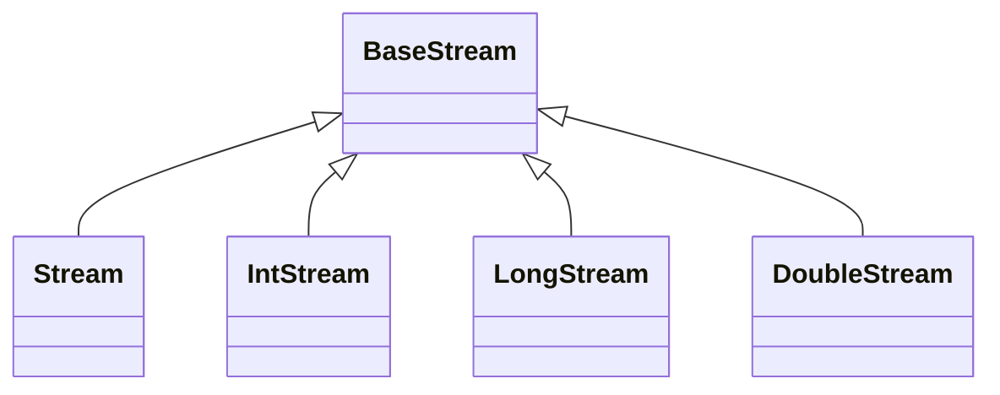

# Stream

## 概述

> @since 8

`Stream`不存储数据，它可以检索(Retrieve)和逻辑处理集合数据、包括筛选、排序、统计、计数等。它的源数据可以是`Collection`、`Array`等。由于它的方法参数都是函数式接口类型，所以一般和Lambda配合使用。

Stream具备如下特点：

- 非集合，无法存储元素；
- 不改变源对象，而是返回一个持有结果的新Stream；
- 操作是延迟执行的，必须知道有哪些数据才会继续往下执行，即会等到需要结果时才执行；
- 只执行一次，如果要继续操作则需要重新获取Stream对象；
- 类似高级的iterator，单向不可重复，数据只能遍历一次，但是可以并行化数据。
- stream不是一种数据结构，它并不存储数据。stream是某个数据源之上的数据视图。数据源可以是一个数组，或者是一个Collection类，甚至还可以是I/O channel。它通过一个计算管道（a pipeline of computational operations），对数据源的数据进行filter-map-reduce的操作。
- stream天生支持函数式编程。函数式编程的一个重要特点就是不会修改变量的值（没有“副作用”）。而对stream的任何操作，都不会修改数据源中的数据。例如，对一个数据源为Collection的stream进行filter操作，只会生成一个新的stream对象，而不会真的删除底层数据源中的元素。
- stream的许多操作都是惰性求值的（laziness-seeking）。惰性求值是指该操作只是对stream的一个描述，并不会马上执行。这类惰性的操作在stream中被称为中间操作（intermediate operations）。
- stream呈现的数据可以是无限的。例如Stream.generate可以生成一个无限的流。我们可以通过 limit(n) 方法来将一个无限流转换为有限流，或者通过 findFirst() 方法终止一个无限流。
- stream中的元素只能被消费1次。和迭代器 Iterator 相似，当需要重复访问某个元素时，需要重新生成一个新的stream。


### Stream继承关系




### Stream操作类型

stream的操作可以分成两类，**中间操作**（intermediate operations）和**终止操作**（terminal operations）。一个stream管道（stream pipeline）是由一个数据源 + 0个或多个中间操作 + 1个终止操作组成的。

**中间操作：**中间操作（intermediate operations）指的是将一个stream转换为另一个stream的操作，譬如filter和map操作。中间操作都是惰性的，它们的作用仅仅是描述了一个新的stream，不会马上被执行。

**终止操作：**终止操作（terminal operations）则指的是那些会产生一个新值或副作用（side-effect）的操作，譬如count 和 forEach 操作。只有遇到终止操作时，之前定义的中间操作才会真正被执行。需要注意，当一个stream执行了一个终止操作后，它的状态会变成“已消费”，不能再被使用。


### 并行流

Stream有串行流（Sequential）和并行流（Parallel Stream）两种，串行Stream上的操作是在一个线程中依次完成，而并行Stream则是在多个线程上同时执行。调用方法parallelStream()即可获取到并行流。

一般来说，在web应用中不推荐使用Stream的并行编程接口，因为Stream并行编程的底层是基于ForkJoinPool，而ForkJoinPool的工作线程数是在虚拟机启动时指定的，如果Stream并行执行的任务数量过多或耗时过多，甚至会影响应用程序中其它使用ForkJoinPool的功能。但如果是在某些任务单一、能确保不影响其它任务的场景中，使用Stream并行编程能带来编码上的便利性，即使数据源不是线程安全的，通过Stream并行编程，也能轻松写出多线程并行处理任务的代码，不需要考虑加锁。


## 源码解析

### 方法定义

```java
public interface Stream<T> extends BaseStream<T, Stream<T>> {
    // 以identity为初始值，然后按照指定accumulator合并操作聚合流中所有元素
    T reduce(T identity, BinaryOperator<T> accumulator);
    // 按照指定accumulator合并操作聚合流中所有元素
    Optional<T> reduce(BinaryOperator<T> accumulator);
    // 以identity为初始值，并将流中所有元素按照accumulator规则转换，最后将转换后的值按照指定combiner合并操作聚合
    <U> U reduce(U identity, BiFunction<U, ? super T, U> accumulator, BinaryOperator<U> combiner);
    // 根据指定方式收集元素
    <R> R collect(Supplier<R> supplier, BiConsumer<R, ? super T> accumulator, BiConsumer<R, R> combiner);
    // 根据指定方式收集元素
    <R, A> R collect(Collector<? super T, A, R> collector);
    // @since 9 从满足条件位置开始获取剩余的元素
    default Stream<T> takeWhile(Predicate<? super T> predicate) {}
    // @since 9 依次获取满足条件的元素，直到不满足条件为止
    default Stream<T> dropWhile(Predicate<? super T> predicate) {}
    // @since 9 创建一个单元素的Stream，参数允许为null
	public static<T> Stream<T> ofNullable(T t) {}
    // @since 9 提供断言函数式接口来决定什么时候结束迭代
    public static<T> Stream<T> iterate(T seed, Predicate<? super T> hasNext, UnaryOperator<T> next) {}
}
```


### 方法说明

## 实践应用

### 创建操作

常用的创建流的工具方法包括：

1. Collection方法：Collection.stream() 或 Collection.parallelStream()
2. 数组方法：Arrays.stream(Object[])
3. 工厂方法：Stream.of(Object[]), IntStream.range(int, int) 或 Stream.iterate(Object, UnaryOperator) 等等
4. 读取文件方法：BufferedReader.lines()
5. 类 java.nio.file.Files 中，也提供了Stream相关的API，例如 Files.list, Files.walk 等等


```java
default Stream<E> stream() {
    return StreamSupport.stream(spliterator(), false);
}
```


java.util.stream类中的of(T...)方法的实现就是调用的Arrays类的stream(T[])方法。

```java
public static <T> Stream<T> stream(T[] array) {
    return stream(array, 0, array.length);
}
```

```java
public static<T> Stream<T> of(T t) {
    return StreamSupport.stream(new Streams.StreamBuilderImpl<>(t), false);
}
```


所有上述创建流的方法都是最终调用了java.util.stream.StreamSupport#stream(java.util.Spliterator<T>, boolean)来创建流

```java
/*
 * @param spliterator 表示流中元素的描述
 * @param parallel 为true表示创建并行流，否则创建串行流
 */
public static <T> Stream<T> stream(Spliterator<T> spliterator, boolean parallel) {
    Objects.requireNonNull(spliterator);
    return new ReferencePipeline.Head<>(spliterator,
                                        StreamOpFlag.fromCharacteristics(spliterator),
                                        parallel);
}
```


```java
public void build() {
    Stream<Integer> listStream = Lists.newArrayList(1, 2, 3).stream();

    Integer[] arr = {1, 2, 3};
    Stream<Integer> arrayStream = Arrays.stream(arr);

    Stream<Integer> singleStream = Stream.of(1);
}
```


### peek

用于 debug 调试流中间结果，不能形成新的流，但能修改引用类型字段的值。

```java
Stream<T> peek(Consumer<? super T> action);
```


```java
@Test
public void peekTest(){
    List<StreamBean> beans = beans().stream()
        // peek方法用于调试流中的元素状态或修改该元素，并返回新的流
        .peek(bean -> bean.setTitle("state : " + bean.getTitle()))
        .collect(Collectors.toList());
    beans.forEach(System.err::println);
}
```


### map

用于对流中的每个元素进行映射处理，然后再形成新的流。

```java
<R> Stream<R> map(Function<? super T, ? extends R> mapper);
```


### foreach

用于遍历，会中断流操作。


> java.util.stream.Stream

```java
void forEach(Consumer<? super T> action);
```


#### Demo

```java
@Test
public void foreachTest(){
    // map方法用于操作流中的元素，并结束流
    beans().forEach(System.err::println);
}
```


### 递归构建树形结构

```java
    public void buildTree() {
        List<StreamNode> nodes = getTreeElementList();
        // 创建根节点
        StreamNode rootNode = new StreamNode(1L, 0L);
        println(JSON.toJSONString(covert(rootNode, nodes), true));
    }

    private StreamNode covert(StreamNode rootNode, List<StreamNode> nodes) {
        // 递归获取子节点
        List<StreamNode> children = nodes.stream()
            .filter(node -> node.getParentId().equals(rootNode.getId()))
            .map(node -> covert(node, nodes)).collect(Collectors.toList());
        rootNode.setChildren(children);
        return rootNode;
    }
```


### 并行流示例

```java
@Test
public void testParallelStream() {
    int max = 1000000;
    List<String> values = new ArrayList<>(max);
    for (int i = 0; i < max; i++) {;
        values.add(UUID.randomUUID().toString());
    }
    sortBySequentialStream(values);
    sortByParallelStream(values);
}

private void sortBySequentialStream(List<String> values) {
    long t0 = System.nanoTime();
    System.out.println(values.stream().sorted().toList().size());
    long t1 = System.nanoTime();
    long millis = TimeUnit.NANOSECONDS.toMillis(t1 - t0);
    System.out.println(String.format("sequential sort took: %d ms", millis));
}

private void sortByParallelStream(List<String> values) {
    long t0 = System.nanoTime();
    System.out.println(values.parallelStream().sorted().toList().size());
    long t1 = System.nanoTime();
    long millis = TimeUnit.NANOSECONDS.toMillis(t1 - t0);
    System.out.println(String.format("parallel sort took: %d ms", millis));
}
```


## 参考资料

- [Java8 Stream groupingBy对List进行分组](https://blog.csdn.net/weixin_41835612/article/details/83687088)
- [Java中的函数式编程（八）流Stream并行编程](https://www.cnblogs.com/anyuanwai/p/15449206.html)


# Collectors

## 概述

## 源码解析

### 方法定义

### 方法说明

#### toUnmodifiableList

> @since Java 10


用于将流中的元素收集为不可变的集合。


#### toUnmodifiableSet

> @since Java 10


用于将流中的元素收集为不可变的集合。


## 实践应用