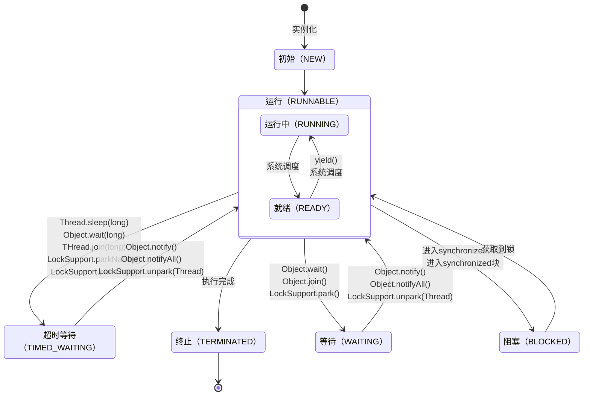

# Java 线程

使用多线程就是因为： **在正确的场景下，设置恰当数目的线程，可以用来程提高序的运行速率。更专业点讲，就是充分地利用CPU和I/O的利用率，提升程序运行速率。**


## 线程、进程和程序

### 线程

**线程**与进程相似，但线程是一个比进程更小的执行单位。一个进程在其执行的过程中可以产生多个线程。与进程不同的是同类的多个线程共享同一块内存空间和一组系统资源，每个线程有自己的**程序计数器**、**虚拟机栈**和**本地方法栈**。所以系统在产生一个线程，或是在各个线程之间作切换工作时，负担要比进程小得多，也正因为如此，线程也被称为轻量级进程。

线程是操作系统能够进行运算调度的最小单位，它被包含在进程之中，是进程中的实际运作单位。

程序员可以通过它进行多处理器编程，你可以使用多线程对运算密集型任务提速。比如，如果一个线程完成一个任务要100毫秒，那么用十个线程完成该任务只需10毫秒。

线程是比进程更轻量级的调度执行单位。线程可以把一个进程的资源分配和执行调度分开，各个线程既可以共享进程资源（内存地址、文件I/O），又可以独立调度（线程是CPU调度的最基本单位）。


```java
    @Test
    public void multiThread(){
        // 获取 Java 线程管理 MXBean
        ThreadMXBean threadMXBean = ManagementFactory.getThreadMXBean();
        // 不需要获取同步的 monitor 和 synchronizer 信息，仅获取线程和线程堆栈信息
        ThreadInfo[] threadInfos = threadMXBean.dumpAllThreads(false, false);
        // 遍历线程信息，仅打印线程 ID 和线程名称信息
        for (ThreadInfo threadInfo : threadInfos) {
            System.out.println("[" + threadInfo.getThreadId() + "] " + threadInfo.getThreadName());
        }
    }
```


输出结果：

```
[6] Monitor Ctrl-Break 
[5] Attach Listener    //添加事件
[4] Signal Dispatcher  // 分发处理给 JVM 信号的线程
[3] Finalizer          //调用对象 finalize 方法的线程
[2] Reference Handler  //清除 reference 线程
[1] main               //main 线程,程序入口
```


**一个 Java 程序的运行是 main 线程和多个其他线程同时运行**。在Java里面没有办法强制启动一个线程，它被线程调度器控制且Java没有公布相关的API。


#### 线程实现方式

- 使用内核线程实现
- 使用用户线程实现
- 使用用户线程+轻量级进程混合实现

操作系统支持怎样的线程模型，在很大程度上就决定了Java虚拟机的线程是怎样映射的。


#### 线程调度

线程调度是系统为线程分配处理器使用权的过程。


##### 线程调度方法

- 协同式线程调度：实现简单，没有线程同步的问题。但是线程执行时间不可控，容易系统崩溃。
- 抢占式线程调度：每个线程由系统来分配执行时间，不会有线程导致整个进程阻塞的问题。


虽然Java线程调度是系统自动完成的，但是我们可以建议系统给某些线程多分配点时间——设置线程优先级。Java语言有10个级别的线程优先级，优先级越高的线程，越容易被系统选择执行。

但是并不能完全依靠线程优先级。因为Java的线程是被映射到系统的原生线程上，所以线程调度最终还是由操作系统说了算。如Windows中只有7种优先级，所以Java不得不出现几个优先级相同的情况。

同时优先级可能会被系统自行改变。Windows系统中存在一个“优先级推进器”，当系统发现一个线程执行特别勤奋，可能会越过线程优先级为它分配执行时间。


### 进程

**进程**是程序的一次执行过程，是系统运行程序的基本单位，因此进程是动态的。系统运行一个程序即是一个进程从创建，运行到消亡的过程。简单来说，一个进程就是一个执行中的程序，它在计算机中一个指令接着一个指令地执行着，同时，每个进程还占有某些系统资源如 CPU 时间，内存空间，文件，输入输出设备的使用权等等。换句话说，当程序在执行时，将会被操作系统载入内存中。 线程是进程划分成的更小的运行单位。线程和进程最大的不同在于基本上各进程是独立的，而各线程则不一定，因为同一进程中的线程极有可能会相互影响。从另一角度来说，进程属于操作系统的范畴，主要是同一段时间内，可以同时执行一个以上的程序，而线程则是在同一程序内几乎同时执行一个以上的程序段。

一个进程是一个独立(self contained)的运行环境，它可以被看作一个程序或者一个应用。而线程是在进程中执行的一个任务。

线程是进程的子集，一个进程可以有很多线程，每条线程并行执行不同的任务。不同的进程使用不同的内存空间，而所有的线程共享一片相同的内存空间（堆）。每个线程都拥有单独的栈内存（虚拟机栈）用来存储本地数据。


- 进程是运行中的应用程序，线程是进程的内部的一个执行序列
- 进程是资源分配的最小单位，线程是CPU调度的最小单位。
- 一个进程可以有多个线程。线程又叫做轻量级进程，多个线程共享进程的资源
- 进程间切换代价大，线程间切换代价小
- 进程拥有资源多，线程拥有资源少地址
- 进程是存在地址空间的，而线程本身无地址空间，线程的地址空间是包含在进程中的


### 程序

**程序**是含有指令和数据的文件，被存储在磁盘或其他的数据存储设备中，也就是说程序是静态的代码。


## 虚拟线程

> @since 21

虚拟线程（Virtual Thread）是JDK而不是OS实现的轻量级线程(Lightweight Process，LWP），许多虚拟线程共享同一个操作系统线程，虚拟线程的数量可以远大于操作系统线程的数量。虚拟线程在其他多线程语言中已经被证实是十分有用的，比如Go中的Goroutine、Erlang中的进程。

虚拟线程避免了上下文切换的额外耗费，兼顾了多线程的优点，简化了高并发程序的复杂，可以有效减少编写、维护和观察高吞吐量并发应用程序的工作量。


在引入虚拟线程之前，`java.lang.Thread`包已经支持所谓的平台线程，也就是没有虚拟线程之前一直使用的线程。JVM调度程序通过平台线程（载体线程）来管理虚拟线程，一个平台线程可以在不同的时间执行不同的虚拟线程（多个虚拟线程挂载在一个平台线程上），当虚拟线程被阻塞或等待时，平台线程可以切换到执行另一个虚拟线程。

虚拟线程、平台线程和系统内核线程的关系图如下所示：

​		


关于平台线程和系统内核线程的对应关系多提一点：在Windows和Linux等主流操作系统中，Java线程采用的是一对一的线程模型，也就是一个平台线程对应一个系统内核线程。Solaris系统是一个特例，HotSpot VM在Solaris上支持多对多和一对一，具体可以参考: [JVM 中的线程模型是用户级的么？](https://www.zhihu.com/question/23096638/answer/29617153)。

相比较于平台线程来说，虚拟线程是廉价且轻量级的，使用完后立即被销毁，因此它们不需要被重用或池化，每个任务可以有自己专属的虚拟线程来运行。虚拟线程暂停和恢复来实现线程之间的切换，避免了上下文切换的额外耗费，兼顾了多线程的优点，简化了高并发程序的复杂，可以有效减少编写、维护和观察高吞吐量并发应用程序的工作量。


### 创建虚拟线程

官方为了降低虚拟线程的门槛，尽力复用原有的`Thread`线程类，这样可以平滑的过渡到虚拟线程的使用。


#### Thread.ofVirtual()创建

```java
@Test
public void testCreateByOfVirtual() {
    Runnable fn = () -> System.out.println("virtual thread running");
    Thread thread = Thread.ofVirtual().start(fn);
}
```


#### Thread.startVirtualThread()创建

```java
@Test
public void testCreateByStartVirtualThread() {
    Thread thread = Thread.startVirtualThread(() -> {
        System.out.println("virtual thread running");
    });
}
```


#### Executors.newVirtualThreadPerTaskExecutor()创建

```java
@Test
public void testCreateByNewVirtualThreadPerTaskExecutor() {
    try (var executorService = Executors.newVirtualThreadPerTaskExecutor()) {
        executorService.submit(() -> {
            System.out.println("virtual thread running");
        });
    }
}
```


#### ThreadFactory.newThread()创建

```java
@Test
public void testCreateByThreadFactory() {
    class CustomThread implements Runnable {
        @Override
        public void run() {
            System.out.println("virtual thread running");
        }
    }
    CustomThread customThread = new CustomThread();
    ThreadFactory factory = Thread.ofVirtual().factory(); // 获取线程工厂类
    Thread thread = factory.newThread(customThread); // 创建虚拟线程
    thread.start(); // 启动线程
}
```


### 参考资料

- [虚拟线程极简入门](https://javaguide.cn/java/concurrent/virtual-thread.html)
- [虚拟线程原理及性能分析｜得物技术](https://mp.weixin.qq.com/s/vdLXhZdWyxc6K-D3Aj03LA)
- [Java19 正式 GA！看虚拟线程如何大幅提高系统吞吐量](https://mp.weixin.qq.com/s/yyApBXxpXxVwttr01Hld6Q)
- [虚拟线程 - VirtualThread 源码透视](https://www.cnblogs.com/throwable/p/16758997.html)
- [How to Use Java 19 Virtual Threads](https://medium.com/javarevisited/how-to-use-java-19-virtual-threads-c16a32bad5f7)


## 线程状态

- 新建(New)

创建后尚未启动。

- 可运行(Runnable)

可能正在运行，也可能正在等待 CPU 时间片。

包含了操作系统线程状态中的 Running 和 Ready。

- 阻塞(Blocking)

等待获取一个排它锁，如果其线程释放了锁就会结束此状态。

- 无限期等待(Waiting)

等待其它线程显式地唤醒，否则不会被分配 CPU 时间片。

| 进入方法                                   | 退出方法                             |
| ------------------------------------------ | ------------------------------------ |
| 没有设置 Timeout 参数的 Object.wait() 方法 | Object.notify() / Object.notifyAll() |
| 没有设置 Timeout 参数的 Thread.join() 方法 | 被调用的线程执行完毕                 |
| LockSupport.park() 方法                    | -                                    |

- 限期等待(Timed Waiting)

无需等待其它线程显式地唤醒，在一定时间之后会被系统自动唤醒。

调用 Thread.sleep() 方法使线程进入限期等待状态时，常常用“使一个线程睡眠”进行描述。

调用 Object.wait() 方法使线程进入限期等待或者无限期等待时，常常用“挂起一个线程”进行描述。

睡眠和挂起是用来描述行为，而阻塞和等待用来描述状态。

阻塞和等待的区别在于，阻塞是被动的，它是在等待获取一个排它锁。而等待是主动的，通过调用 Thread.sleep() 和 Object.wait() 等方法进入。

| 进入方法                                 | 退出方法                                        |
| ---------------------------------------- | ----------------------------------------------- |
| Thread.sleep() 方法                      | 时间结束                                        |
| 设置了 Timeout 参数的 Object.wait() 方法 | 时间结束 / Object.notify() / Object.notifyAll() |
| 设置了 Timeout 参数的 Thread.join() 方法 | 时间结束 / 被调用的线程执行完毕                 |
| LockSupport.parkNanos() 方法             | -                                               |
| LockSupport.parkUntil() 方法             | -                                               |

- 死亡(Terminated)

可以是线程结束任务之后自己结束，或者产生了异常而结束。


Java 线程在运行的生命周期中的指定时刻只可能处于下面 6 种不同状态的其中一个状态：

| 状态名称                    | 说明                                                         |
| --------------------------- | ------------------------------------------------------------ |
| **初始(NEW)**               | 新创建了一个线程对象，但还没有调用start()方法。              |
| **运行(RUNNABLE)**          | Java线程中将就绪（ready）和运行中（running）两种状态笼统的称为“运行”。<br/>线程对象创建后，其他线程(比如main线程）调用了该对象的start()方法。该状态的线程位于可运行线程池中，等待被线程调度选中，获取CPU的使用权，此时处于就绪状态（ready）。就绪状态的线程在获得CPU时间片后变为运行中状态（running）。 |
| **阻塞(BLOCKED)**           | 表示线程阻塞于锁。                                           |
| **等待(WAITING)**           | 进入该状态的线程需要等待其他线程做出一些特定动作（通知或中断）。 |
| **超时等待(TIMED_WAITING)** | 该状态不同于WAITING，它可以在指定的时间后自行返回。          |
| **终止(TERMINATED)**        | 表示该线程已经执行完毕。                                     |


线程在生命周期中并不是固定处于某一个状态而是随着代码的执行在不同状态之间切换。Java 线程状态变迁如下图所示




线程创建之后它将处于 **NEW（新建）** 状态，调用 `start()` 方法后开始运行，线程这时候处于 **READY（可运行）** 状态。可运行状态的线程获得了 cpu 时间片（timeslice）后就处于 **RUNNING（运行）** 状态。


> 操作系统隐藏 Java 虚拟机（JVM）中的 READY 和 RUNNING 状态，它只能看到 RUNNABLE 状态（图源：[HowToDoInJava](https://howtodoinjava.com/)：[Java Thread Life Cycle and Thread States](https://howtodoinjava.com/java/multi-threading/java-thread-life-cycle-and-thread-states/)），所以 Java 系统一般将这两个状态统称为 **RUNNABLE（运行中）** 状态 。


当线程执行 `wait()`方法之后，线程进入 **WAITING（等待）**状态。进入等待状态的线程需要依靠其他线程的通知才能够返回到运行状态，而 **TIME_WAITING(超时等待)** 状态相当于在等待状态的基础上增加了超时限制，比如通过 `sleep（long millis）`方法或 `wait（long millis）`方法可以将 Java 线程置于 TIMED WAITING 状态。当超时时间到达后 Java 线程将会返回到 RUNNABLE 状态。当线程调用同步方法时，在没有获取到锁的情况下，线程将会进入到 **BLOCKED（阻塞）** 状态。线程在执行 Runnable 的`run()`方法之后将会进入到 **TERMINATED（终止）** 状态。


### 初始

实现Runnable接口和继承Thread可以得到一个线程类，new一个实例出来，线程就进入了初始状态。线程对象创建之后、但还没有调用`start()`方法，就是这个状态。

在Java中使用new关键字创建一个线程，新创建的线程将处于新建状态。在创建线程时主要是为线程分配内存并初始化其成员变量的值。


### 可运行

**执行Thread的start方法之后，线程进行RUNNABLE可运行状态。**

它包括就绪（`ready`）和运行中（`running`）两种状态。如果调用`start`方法，线程就会进入`Runnable`状态。它表示我这个线程可以被执行啦（此时相当于`ready`状态），如果这个线程被调度器分配了CPU时间，那么就可以被执行（此时处于`running`状态）。

新建的线程对象在调用start方法之后将转为可运行状态。运行状态中又分：就绪（Ready）和运行中（Running）两种状态。就绪状态指的是JVM完成了方法调用栈和程序计数器的创建，等待该线程的调度和运行。

就绪状态的线程在竞争到CPU的使用权并开始执行run方法的线程执行体时，会转为运行中状态，处于运行中状态的线程的主要任务就是执行run方法中的逻辑代码。


#### 就绪

1. 就绪状态只是说你资格运行，调度程序没有挑选到你，你就永远是就绪状态。
2. 调用线程的start()方法，此线程进入就绪状态。
3. 当前线程sleep()方法结束，其他线程join()结束，等待用户输入完毕，某个线程拿到对象锁，这些线程也将进入就绪状态。
4. 当前线程时间片用完了，调用当前线程的yield()方法，当前线程进入就绪状态。
5. 锁池里的线程拿到对象锁后，进入就绪状态。


#### 运行中

线程调度程序从可运行池中选择一个线程作为当前线程时线程所处的状态。这也是线程进入运行状态的唯一的一种方式。


### 阻塞

阻塞状态是线程阻塞在进入synchronized关键字修饰的方法或代码块(获取锁)时的状态。

阻塞的（被同步锁或者IO锁阻塞）。表示线程阻塞于锁，线程阻塞在进入`synchronized`关键字修饰的方法或代码块(**等待获取锁**)时的状态。比如前面有一个临界区的代码需要执行，那么线程就需要等待，它就会进入这个状态。它一般是从`RUNNABLE`状态转化过来的。如果线程获取到锁，它将变成`RUNNABLE`状态


运行中的线程会主动或被动地放弃 CPU 的使用权并暂停运行，此时该线程将转为阻塞状态，直到再次进入可运行状态，才有机会再次竞争到CPU使用权并转为运行状态。阻塞状态分为如下三种。

**（1）等待阻塞：**在运行状态的线程调用o.wait方法时，JVM会把该线程放入等待队列（Waitting Queue）中，线程转为阻塞状态。

**（2）同步阻塞：**在运行状态的线程尝试获取正在被其他线程占用的对象同步锁时，JVM会把该线程放入锁池（Lock Pool）中，此时线程转为阻塞状态。

**（3）其他阻塞：**运行状态的线程在执行Thread.sleep(long ms)、Thread.join()或者发出I/O请求时，JVM会把该线程转为阻塞状态。直到sleep()状态超时、Thread.join()等待线程终止或超时，或者I/O处理完毕，线程才重新转为可运行状态。


### 等待

处于这种状态的线程不会被分配CPU执行时间，它们要等待被显式地唤醒，否则会处于无限期等待的状态。

永久等待状态，进入该状态的线程需要等待其他线程做出一些特定动作（比如通知）。处于该状态的线程不会被分配CPU执行时间，它们要等待被显式地唤醒，否则会处于无限期等待的状态。一般`Object.wait`。

当线程调用了Object.wait()、Thread.join()、LockSupport.park()会进入等待状态。处于等待状态的线程正在等待另一个线程执行指定的操作。例如，调用Object.wait()的一个线程对象正在等待另一个线程调用该对象的Object.notify()或Object.notifyAll()。调用thread .join()的线程正在等待指定的线程退出。


### 超时等待

处于这种状态的线程不会被分配CPU执行时间，不过无须无限期等待被其他线程显示地唤醒，在达到一定时间后它们会自动唤醒。

等待指定的时间重新被唤醒的状态。有一个计时器在里面计算的，最常见就是使用`Thread.sleep`方法触发，触发后，线程就进入了`Timed_waiting`状态，随后会由计时器触发，再进入`Runnable`状态。


超时等待和等待状态的不同是，超时等待状态的线程经过超时时间后会自动唤醒。当线程调用了Thread.sleep (long)、Object.wait(long)、Thread.join(long)、LockSupport.parkNanos()、LockSupport.parkUntil()后线程会进入超时等待状态。


### 终止

当线程的run()方法完成时，或者主线程的main()方法完成时，我们就认为它终止了。这个线程对象也许是活的，但是它已经不是一个单独执行的线程。线程一旦终止了，就不能复生。

在一个终止的线程上调用start()方法，会抛出java.lang.IllegalThreadStateException异常。


线程在以如下三种方式结束后转为终止状态。

◎ **线程正常结束：**run方法或call方法执行完成。

◎ **线程异常退出：**运行中的线程抛出一个Error或未捕获的Exception，线程异常退出。

◎ **手动结束：**调用线程对象的stop方法手动结束运行中的线程（该方式会瞬间释放线程占用的同步对象锁，导致锁混乱和死锁，不推荐使用）。


```java
public class ThreadTest {
    private static Object object = new Object();
    public static void main(String[] args) throws Exception {
        Thread thread = new Thread(new Runnable() {
            @Override
            public void run() {
                try {
                    for(int i = 0; i< 1000; i++){
                        System.out.print("");
                    }
                    Thread.sleep(500);
                    synchronized (object){
                        object.wait();
                    }
                } catch (InterruptedException e) {
                    e.printStackTrace();
                }
            }
        });

        Thread thread1 = new Thread(new Runnable() {
            @Override
            public void run() {
                try {
                    synchronized (object){
                        Thread.sleep(1000);
                    }
                    Thread.sleep(1000);
                    synchronized (object){
                        object.notify();
                    }
                } catch (InterruptedException e) {
                    e.printStackTrace();
                }
            }
        });
        
        System.out.println("1"+thread.getState());
        thread.start();
        thread1.start();
        System.out.println("2"+thread.getState());
        while (thread.isAlive()){
            System.out.println("---"+thread.getState());
            Thread.sleep(100);
        }
        System.out.println("3"+thread.getState());
    }
}
```


## 线程状态转换

**（1）**调用new方法新建一个线程，这时线程处于新建状态。

**（2）**调用start方法启动一个线程，这时线程处于可运行状态。可运行状态中又分：就绪（Ready）和运行中（Running）两种状态。处于就绪状态的线程等待线程获取CPU资源，在等待其获取CPU资源后线程会执行run方法进入运行中状态；正在运行的线程在调用了yield方法或失去处理器资源时，会再次进入就绪状态。

**（3）**正在运行中的线程在执行了sleep方法、I/O阻塞、等待同步锁、等待通知、调用suspend方法等操作后，会挂起并进入阻塞状态。阻塞状态的线程由于出现sleep时间已到、I/O方法返回、获得同步锁、收到通知、调用resume方法等情况，会再次进入可运行状态中的就绪状态，等待CPU时间片的轮询。该线程在获取CPU资源后，会再次进入运行状态。

**（4）**当线程调用了Object.wait ()、Object.join()、LockSupport.park()后线程进入等待状态。等待状态的线程调用Object.notify ()、Object. notifyAll()、LockSupport.unpark(Thread)方法后会再次进入可运行状态。

**（5）**当可运行状态的线程调用Thread.sleep(long)、Object.wait(long)、Thread.join(long)、LockSupport.parkNanos()、LockSupport.parkUntil()时线程会进入超时等待状态。当超时等待的线程出现超时时间到、等待进入synchronized方法、等待进入synchronized块或者调用Object.notify ()、Object. notifyAll()、LockSupport.unpark(Thread)时会再次进入可运行状态。

**（6）**处于可运行状态的线程，在调用run方法或call方法正常执行完成、调用stop方法停止线程或者程序执行错误导致异常退出时，会进入终止状态。


## 线程优先级

每一个线程都是有优先级的，一般来说，高优先级的线程在运行时会具有优先权，但这依赖于线程调度的实现，这个实现是和操作系统相关的(OS dependent)。我们可以定义线程的优先级，但是这并不能保证高优先级的线程会在低优先级的线程前执行。线程优先级是一个int变量(从1-10)，1代表最低优先级，10代表最高优先级。


## Java内存模型


## 多线程

先从总体上来说：

- **从计算机底层来说：** 线程可以比作是轻量级的进程，是程序执行的最小单位,线程间的切换和调度的成本远远小于进程。另外，多核 CPU 时代意味着多个线程可以同时运行，这**减少了线程上下文切换的开销**。
- **从当代互联网发展趋势来说：** 现在的系统动不动就要求百万级甚至千万级的并发量，而多线程并发编程正是开发高并发系统的基础，利用好多线程机制可以大大**提高系统整体的并发能力以及性能**。

再深入到计算机底层来探讨：

- **单核时代：** 在单核时代多线程主要是为了提高 CPU 和 IO 设备的综合利用率。举个例子：当只有一个线程的时候会导致 CPU 计算时，IO 设备空闲；进行 IO 操作时，CPU 空闲。我们可以简单地说这两者的利用率目前都是 50%左右。但是当有两个线程的时候就不一样了，当一个线程执行 CPU 计算时，另外一个线程可以进行 IO 操作，这样两个的利用率就可以在理想情况下达到 100%了。
- **多核时代:** 多核时代多线程主要是为了提高 CPU 利用率。举个例子：假如我们要计算一个复杂的任务，我们只用一个线程的话，CPU 只会一个 CPU 核心被利用到，而创建多个线程就可以让多个 CPU 核心被利用到，这样就**提高了 CPU 的利用率**。


并发编程的目的就是为了能提高程序的执行效率提高程序运行速度，但是并发编程并不总是能提高程序运行速度的，而且并发编程可能会遇到很多问题，比如：**内存泄漏**、**上下文切换**、**死锁** 。


### 线程过多

使用多线程可以提升程序性能。但是如果使用过多的线程，则适得其反。

过多的线程会影响程序的系统。一方面，线程的启动和销毁，都是需要开销的。其次，过多的并发线程也会导致共享有限资源的开销增大。过多的线程，还会导致内存泄漏。

因此尽量使用线程池来管理线程，同时还需要设置恰当的线程数。


### 线程共享数据

1. 可以通过类变量直接将数据放到主存中
2. 通过并发的数据结构来存储数据
3. 使用volatile变量或者锁
4. 调用atomic类（如AtomicInteger）


## 死锁

线程死锁描述的是这样一种情况：多个线程同时被阻塞，它们中的一个或者全部都在等待某个资源被释放。由于线程被无限期地阻塞，因此程序不可能正常终止。


### 死锁达成条件

死锁必须具备以下四个条件：

1. 互斥条件：该资源任意一个时刻只由一个线程占用。
2. 请求与保持条件：一个进程因请求资源而阻塞时，对已获得的资源保持不放。
3. 不剥夺条件:线程已获得的资源在末使用完之前不能被其他线程强行剥夺，只有自己使用完毕后才释放资源。
4. 循环等待条件:若干进程之间形成一种头尾相接的循环等待资源关系。


### 避免死锁

1. **破坏互斥条件** ：这个条件我们没有办法破坏，因为我们用锁本来就是想让他们互斥的（临界资源需要互斥访问）。
2. **破坏请求与保持条件** ：一次性申请所有的资源。
3. **破坏不剥夺条件** ：占用部分资源的线程进一步申请其他资源时，如果申请不到，可以主动释放它占有的资源。
4. **破坏循环等待条件** ：靠按序申请资源来预防。按某一顺序申请资源，释放资源则反序释放。破坏循环等待条件。


### 活锁和死锁的区别

活锁和死锁类似，不同之处在于处于活锁的线程或进程的状态是不断改变的，活锁可以认为是一种特殊的饥饿。简单的说就是，活锁和死锁的主要区别是前者进程的状态可以改变但是却不能继续执行。


## 线程安全

如果你的代码所在的进程中有多个线程在同时运行，而这些线程可能会同时运行这段代码。如果每次运行结果和单线程运行的结果是一样的，而且其他的变量的值也和预期的是一样的，就是线程安全的。一个线程安全的计数器类的同一个实例对象在被多个线程使用的情况下也不会出现计算失误。很显然你可以将集合类分成两组，线程安全和非线程安全的。Vector 是用同步方法来实现线程安全的, 而和它相似的ArrayList不是线程安全的。

当多个线程访问一个对象时，如果不用考虑这些线程在运行时环境下的调度和交替执行，也不需要进行额外的同步，或者在调用方法进行任何其他的协调操作，调用这个对象的行为都可以获得正确的结果，那这个对象就是线程安全的。


VM规范定义了几种原子操作：

- 基本类型（`long`和`double`除外）赋值，例如：`int n = m`；
- 引用类型赋值，例如：`List<String> list = anotherList`。


实现线程安全主要有如下三种方式：

- 互斥同步
- 非阻塞同步
- 无同步方案


### 互斥同步

- 使用synchronzied同步；
- 使用原子类(atomic concurrent classes)；
- 使用显示锁；
- 使用volatile关键字；
- 使用不变类；


互斥是实现同步的一种手段，临界区、互斥量和信号量都是主要的互斥实现方式。Java中最基本的同步手段就是synchronized关键字，其编译后会在同步块的前后分别形成monitorenter和monitorexit两个字节码指令。

这两个字节码都需要一个Reference类型的参数指明要锁定和解锁的对象。如果Java程序中的synchronized明确指定了对象参数，那么这个对象就是Reference；如果没有明确指定，那就根据synchronized修饰的是实例方法还是类方法，去获取对应的对象实例或Class对象作为锁对象。 在执行monitorenter指令时，首先要尝试获取对象的锁。

- 如果这个对象没有锁定，或者当前线程已经拥有了这个对象的锁，把锁的计数器+1；当执行monitorexit指令时将锁计数器-1。当计数器为0时，锁就被释放了。
- 如果获取对象失败了，那当前线程就要阻塞等待，知道对象锁被另外一个线程释放为止。

除了synchronized之外，还可以使用java.util.concurrent包中的重入锁（ReentrantLock）来实现同步。ReentrantLock比synchronized增加了高级功能：等待可中断、可实现公平锁、锁可以绑定多个条件。

等待可中断：当持有锁的线程长期不释放锁的时候，正在等待的线程可以选择放弃等待，对处理执行时间非常长的同步块很有用。

公平锁：多个线程在等待同一个锁时，必须按照申请锁的时间顺序来依次获得锁。synchronized中的锁是非公平的。


#### 同步方法

用synchronized关键字修饰方法。 由于java的每个对象都有一个内置锁，当用此关键字修饰方法时，内置锁会保护整个方法。在调用该方法前，需要获得内置锁，否则就处于阻塞状态。


#### 同步代码块

用synchronized关键字修饰语句块。被该关键字修饰的语句块会自动被加上内置锁，从而实现同步。

同步是一种高开销的操作，因此应该尽量减少同步的内容。通常没有必要同步整个方法，使用synchronized代码块同步关键代码即可。


#### ReentrantLock

ReentrantLock类是可重入、互斥、实现了Lock接口的锁， 它与使用synchronized方法和快具有相同的基本行为和语义，并且扩展了其能力。

ReentrantLock()还有一个可以创建公平锁的构造方法，但由于能大幅度降低程序运行效率，不推荐使用。


### 非阻塞同步

互斥同步最主要的问题就是线程阻塞和唤醒所带来的性能问题，因此这种同步也称为阻塞同步。

互斥同步属于一种悲观的并发策略，总是认为只要不去做正确的同步措施，那就肯定会出现问题。无论共享数据是否真的会出现竞争，它都要进行加锁(这里讨论的是概念模型，实际上虚拟机会优化掉很大一部分不必要的加锁)、用户态核心态转换、维护锁计数器和检查是否有被阻塞的线程需要唤醒等操作。


互斥同步最大的问题，就是进行线程阻塞和唤醒所带来的性能问题，是一种悲观的并发策略。总是认为只要不去做正确的同步措施（加锁），那就肯定会出问题，无论共享数据是否真的会出现竞争，它都要进行加锁、用户态核心态转换、维护锁计数器和检查是否有被阻塞的线程需要被唤醒等操作。

随着硬件指令集的发展，可以使用基于冲突检测的乐观并发策略。先进行操作，如果没有其他线程征用数据，那操作就成功了；如果共享数据有征用，产生了冲突，那就再进行其他的补偿措施。这种乐观的并发策略的许多实现不需要线程挂起，所以被称为非阻塞同步。


#### Volatile

a.volatile关键字为域变量的访问提供了一种免锁机制

b.使用volatile修饰域相当于告诉虚拟机该域可能会被其他线程更新

c.因此每次使用该域就要重新计算，而不是使用寄存器中的值

d.volatile不会提供任何原子操作，它也不能用来修饰final类型的变量


因为volatile不能保证原子操作导致的，因此volatile不能代替 synchronized。此外volatile会组织编译器对代码优化。它的原理是每次要线程要访问volatile修饰 的变量时都是从内存中读取，而不是存缓存当中读取，因此每个线程访问到的变量值都是一样的。这样就保证了同步。


#### CAS

随着硬件指令集的发展，我们可以使用基于冲突检测的乐观并发策略: 先进行操作，如果没有其它线程争用共享数据，那操作就成功了，否则采取补偿措施(不断地重试，直到成功为止)。这种乐观的并发策略的许多实现都不需要将线程阻塞，因此这种同步操作称为非阻塞同步。

乐观锁需要操作和冲突检测这两个步骤具备原子性，这里就不能再使用互斥同步来保证了，只能靠硬件来完成。硬件支持的原子性操作最典型的是: 比较并交换(Compare-and-Swap，CAS)。CAS 指令需要有 3 个操作数，分别是内存地址 V、旧的预期值 A 和新值 B。当执行操作时，只有当 V 的值等于 A，才将 V 的值更新为 B。


#### 原子变量

需要使用线程同步的根本原因在于对普通变量的操作不是原子的。原子操作就是指将读取变量值、修改变量值、保存变量值看成一个整体来操作，即-这几种行为要么同时完成，要么都不完成。

其中**AtomicInteger** 可以用原子方式更新int的值，可用在应用程序中(如以原子方式增加的计数器)，但不能用于替换Integer；可扩展Number，允许那些处理机遇数字类的工具和实用工具进行统一访问。


### 无同步方案

要保证线程安全，并不是一定就要进行同步。如果一个方法本来就不涉及共享数据，那它自然就无须任何同步措施去保证正确性。


#### 栈封闭

多个线程访问同一个方法的局部变量时，不会出现线程安全问题，因为局部变量存储在虚拟机栈中，属于线程私有的。


#### ThreadLocal

使用ThreadLocal管理变量，则每一个使用该变量的线程都获得该变量的副本， 副本之间相互独立，这样每一个线程都可以随意修改自己的变量副本，而不会对其他线程产生影响。

如果一段代码中所需要的数据必须与其他代码共享，那就看看这些共享数据的代码是否能保证在同一个线程中执行。如果能保证，我们就可以把共享数据的可见范围限制在同一个线程之内，这样，无须同步也能保证线程之间不出现数据争用的问题。


## 扩展概念

### 竞态条件

在大多数实际的多线程应用中，两个或两个以上的线程需要共享对同一数据的存取。如果i线程存取相同的对象，并且每一个线程都调用了一个修改该对象状态的方法，将会发生什么呢？可以想象，线程彼此踩了对方的脚。根据线程访问数据的次序，可能会产生讹误的对象。这样的情况通常称为竞争条件。


### 阻塞式方法

阻塞式方法是指程序会一直等待该方法完成期间不做其他事情，ServerSocket的accept()方法就是一直等待客户端连接。这里的阻塞是指调用结果返回之前，当前线程会被挂起，直到得到结果之后才会返回。此外，还有异步和非阻塞式方法在任务完成前就返回。


### 线程调度器和时间分片

线程调度器（Thread Scheduler）是一个操作系统服务，它负责为Runnable状态的线程分配CPU时间。一旦我们创建一个线程并启动它，它的执行便依赖于线程调度器的实现。时间分片（Time Slicing）是指将可用的CPU时间分配给可用的Runnable线程的过程。分配CPU时间可以基于线程优先级或者线程等待的时间。线程调度并不受到Java虚拟机控制，所以由应用程序来控制它是更好的选择（也就是说不要让你的程序依赖于线程的优先级）。


### 上下文切换

#### CPU上下文

CPU 寄存器，是CPU内置的容量小、但速度极快的内存。而程序计数器，则是用来存储 CPU 正在执行的指令位置、或者即将执行的下一条指令位置。它们都是 CPU 在运行任何任务前，必须的依赖环境，因此叫做CPU上下文。


#### CPU上下文切换

它是指，先把前一个任务的CPU上下文（也就是CPU寄存器和程序计数器）保存起来，然后加载新任务的上下文到这些寄存器和程序计数器，最后再跳转到程序计数器所指的新位置，运行新任务。

一般我们说的**上下文切换**，就是指内核（操作系统的核心）**在CPU上对进程或者线程进行切换**。进程从用户态到内核态的转变，需要通过系统调用来完成。系统调用的过程，会发生CPU上下文的切换。

所以大家有时候会听到这种说法，**线程的上下文切换**。 它指，CPU资源的分配采用了**时间片轮转**，即给每个线程分配一个时间片，线程在时间片内占用 CPU 执行任务。当线程使用完时间片后，就会处于就绪状态并让出 CPU 让其他线程占用，这就是线程的上下文切换。看个图，可能会更容易理解一点


上下文切换是存储和恢复CPU状态的过程，它使得线程执行能够从中断点恢复执行。上下文切换是多任务操作系统和多线程环境的基本特征。

多线程编程中一般线程的个数都大于 CPU 核心的个数，而一个 CPU 核心在任意时刻只能被一个线程使用，为了让这些线程都能得到有效执行，CPU 采取的策略是为每个线程分配时间片并轮转的形式。当一个线程的时间片用完的时候就会重新处于就绪状态让给其他线程使用，这个过程就属于一次上下文切换。

概括来说就是：当前任务在执行完 CPU 时间片切换到另一个任务之前会先保存自己的状态，以便下次再切换回这个任务时，可以再加载这个任务的状态。**任务从保存到再加载的过程就是一次上下文切换**。

上下文切换通常是计算密集型的。也就是说，它需要相当可观的处理器时间，在每秒几十上百次的切换中，每次切换都需要纳秒量级的时间。所以，上下文切换对系统来说意味着消耗大量的 CPU 时间，事实上，可能是操作系统中时间消耗最大的操作。

Linux 相比与其他操作系统（包括其他类 Unix 系统）有很多的优点，其中有一项就是，其上下文切换和模式切换的时间消耗非常少。


### 不可变对象

Immutable对象可以在没有同步的情况下共享，降低了对该对象进行并发访问时的同步化开销。要创建不可变类，要实现下面几个步骤：通过构造方法初始化所有成员、对变量不要提供setter方法、将所有的成员声明为私有的，这样就不允许直接访问这些成员、在getter方法中，不要直接返回对象本身，而是克隆对象，并返回对象的拷贝。


### 忙循环

忙循环就是程序员用循环让一个线程等待，不像传统方法wait(), sleep() 或 yield() 它们都放弃了CPU控制，而忙循环不会放弃CPU，它就是在运行一个空循环。这么做的目的是为了保留CPU缓存，在多核系统中，一个等待线程醒来的时候可能会在另一个内核运行，这样会重建缓存。为了避免重建缓存和减少等待重建的时间就可以使用它了。


### 线程转储

线程转储是一个JVM活动线程的列表，它对于分析系统瓶颈和死锁非常有用。有很多方法可以获取线程转储——使用Profiler，Kill -3命令，jstack工具等等。我们更喜欢jstack工具，因为它容易使用并且是JDK自带的。由于它是一个基于终端的工具，所以我们可以编写一些脚本去定时的产生线程转储以待分析。


### 守护线程

当我们在Java程序中创建一个线程，它就被称为用户线程。一个守护线程是在后台执行并且不会阻止JVM终止的线程。当没有用户线程在运行的时候，JVM关闭程序并且退出。一个守护线程创建的子线程依然是守护线程。

守护线程是程序运行时在后台提供服务的线程，不属于程序中不可或缺的部分。

当所有非守护线程结束时，程序也就终止，同时会杀死所有守护线程。

main() 属于非守护线程。使用 setDaemon() 方法将一个线程设置为守护线程。


### 伪共享

CPU的缓存是以缓存行(cache line)为单位进行缓存的，当多个线程修改相互独立的变量，而这些变量又处于同一个缓存行时就会影响彼此的性能，这就是伪共享。


CPU执行速度比内存速度快好几个数量级，为了提高执行效率，现代计算机模型演变出CPU、缓存（L1，L2，L3），内存的模型。

CPU执行运算时，如先从L1缓存查询数据，找不到再去L2缓存找，依次类推，直到在内存获取到数据。

为了避免频繁从内存获取数据，聪明的科学家设计出缓存行，缓存行大小为64字节。也正是因为**缓存行的存在**，就导致了伪共享问题，如图所示：


假设数据`a、b`被加载到同一个缓存行。

- 当线程1修改了a的值，这时候CPU1就会通知其他CPU核，当前缓存行（Cache line）已经失效。
- 这时候，如果线程2发起修改b，因为缓存行已经失效了，所以「core2 这时会重新从主内存中读取该 Cache line 数据」。读完后，因为它要修改b的值，那么CPU2就通知其他CPU核，当前缓存行（Cache line）又已经失效。
- 酱紫，如果同一个Cache line的内容被多个线程读写，就很容易产生相互竞争，频繁回写主内存，会大大降低性能。


#### 解决方式

既然伪共享是因为相互独立的变量存储到相同的Cache line导致的，一个缓存行大小是64字节。那么，我们就可以使用**空间换时间**的方法，即**数据填充的方式**，把独立的变量分散到不同的Cache line~


### **happens-before原则**

在Java语言中，有一个先行发生原则（`happens-before`）。它包括八大规则,如下：

- **程序次序规则**：在一个线程内，按照控制流顺序，书写在前面的操作先行发生于书写在后面的操作。
- **管程锁定规则**：一个unLock操作先行发生于后面对同一个锁额lock操作
- **volatile变量规则**：对一个变量的写操作先行发生于后面对这个变量的读操作
- **线程启动规则**：Thread对象的start()方法先行发生于此线程的每个一个动作
- **线程终止规则**：线程中所有的操作都先行发生于线程的终止检测，我们可以通过Thread.join()方法结束、Thread.isAlive()的返回值手段检测到线程已经终止执行
- **线程中断规则**：对线程interrupt()方法的调用先行发生于被中断线程的代码检测到中断事件的发生
- **对象终结规则**：一个对象的初始化完成先行发生于他的finalize()方法的开始
- **传递性**：如果操作A先行发生于操作B，而操作B又先行发生于操作C，则可以得出操作A先行发生于操作C


**happens-before其实本质是一种能确保线程及时刷新数据到内存，另一线程能实时从内存读取最新数据以保证数据在线程之间保持一致性的一种机制**。


### 线程调度策略

Java默认的线程调度算法是抢占式。即线程用完CPU之后，操作系统会根据线程优先级、线程饥饿情况等数据算出一个总的优先级并分配下一个时间片给某个线程执行。


#### 抢占式调度策略

Java运行时系统的线程调度算法是抢占式的 (preemptive)。Java运行时系统支持一种简单的固定优先级的调度算法。如果一个优先级比其他任何处于可运行状态的线程都高的线程进入就绪状态，那么运行时系统就会选择该线程运行。新的优先级较高的线程抢占(preempt)了其他线程。但是Java运行时系统并不抢占同优先级的线程。换句话说，Java运行时系统不是分时的(time-slice)。然而，基于Java Thread类的实现系统可能是支持分时的，因此编写代码时不要依赖分时。当系统中的处于就绪状态的线程都具有相同优先级时，线程调度程序采用一种简单的、非抢占式的轮转的调度顺序。

抢占式调度：优先让可运行池中优先级高的线程占用CPU，如果可运行池中的线程优先级相同，那么就随机选择一个线程，使其占用CPU。处于运行状态的线程会一直运行，直至它不得不放弃 CPU。


#### 时间片轮转调度策略

有些系统的线程调度采用时间片轮转(round-robin)调度策略。这种调度策略是从所有处于就绪状态的线程中选择优先级最高的线程分配一定的CPU时间运行。该时间过后再选择其他线程运行。只有当线程运行结束、放弃(yield)CPU或由于某种原因进入阻塞状态，低优先级的线程才有机会执行。如果有两个优先级相同的线程都在等待CPU，则调度程序以轮转的方式选择运行的线程。

分时调度模型：让所有的线程轮流获得cpu的使用权，并且平均分配每个线程占用的 CPU 的时间片。


