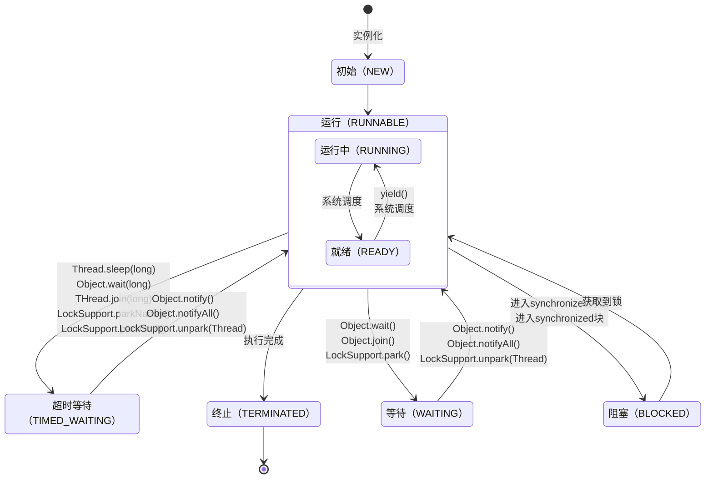

# 面试技术点

## Java

### Java Base

**三大特性：**封装，继承，多态。


**深拷贝 vs 浅拷贝：**

1. **浅拷贝**：对基本数据类型进行值传递，对引用数据类型进行引用传递般的拷贝，此为浅拷贝。
2. **深拷贝**：对基本数据类型进行值传递，对引用数据类型，创建一个新的对象，并复制其内容，此为深拷贝。


### Java Exception

**异常：**Error，受检异常（编译期异常），非受检异常（RuntimeException异常及其子类）。


### Java Collection

#### List

- ArrayList：基于动态数组实现，支持随机访问。
- LinkedList：基于双向链表实现，只能顺序访问，但可以快速地在链表中间插入和删除元素。
- Vector：和 ArrayList 类似，但它是线程安全的。


#### Set

- HashSet：基于哈希表实现，支持快速查找，但不支持有序性操作。
- LinkedHashSet：具有 HashSet 的查找效率，且内部使用双向链表维护元素的插入顺序。
- TreeSet：基于红黑树实现，支持有序性操作，例如根据一个范围查找元素的操作。


### Java Map

Map

- HashMap：1.7基于哈希表实现，1.8基于数组+链表+红黑树。
- LinkedHashMap：使用双向链表来维护元素的顺序，顺序为插入顺序或者最近最少使用(LRU)顺序。
- HashTable：和 HashMap 类似，但它是线程安全的。
- TreeMap：基于红黑树实现。


Map Principle

- 每次扩容都是2倍的方式，(n -1) & hash；
- 发生元素碰撞时，会将新元素添加到链表末尾，当HashMap总容量大于等于64，并且某个链表的大小大于等于8，会将链表转化为红黑树。


### Java Thread

**线程创建：**继承Thread，实现Runnable，实现Callable，通过线程池。

**线程状态：**

- 初始(NEW)：创建后尚未启动。
- 运行(RUNNABLE)：可能正在运行，也可能正在等待 CPU 时间片。包含了操作系统线程状态中的 Running 和 Ready。
- 阻塞(BLOCKED)：等待获取一个排它锁，如果其线程释放了锁就会结束此状态。
- 等待(WAITING)：等待其它线程显式地唤醒，否则不会被分配 CPU 时间片。
- 超时等待(TIMED_WAITING)：无需等待其它线程显式地唤醒，在一定时间之后会被系统自动唤醒。
- 终止(TERMINATED)：可以是线程结束任务之后自己结束，或者产生了异常而结束。


**线程状态流转：**



**线程中断：**

- interrupt方法：设置线程的中断标记，如果该线程处于阻塞、限期等待或者无限期等待状态，那么就会抛出 InterruptedException，从而提前结束该线程。
- interrupted方法：判断线程是否处于中断状态（有中断标记），从而提前结束线程。
- Executor.shutdownNow方法：调用每个线程的interrupt方法


**sleep和wait的区别：**

- wait是 Object 的方法，而 sleep是 Thread 的静态方法；
- wait会释放锁，sleep不会；
- wait没有设置时间时需要等待notify唤醒，sleep必须传入时间，并到时间自动唤醒。


### Java Class

#### Object

**wait、notify、notifyAll：**

因为每个对象都可以成为锁，去调用这些方法，而Object是所有类的父类；这些方法和对象锁是绑定关系，如果写在Thread类中，则虚拟机不知道要操作的对象锁是哪一个。所以在Object类中。


### Java 8

**Lambda表达式：**参数列表，函数主体，返回类型。

**Stream流：**创建、聚合，终结。


## JUC

### JUC Base

**并发问题：**可见性，原子性，有序性。

**CAS：**比较交换。内存值V，旧的预期值A，要更新的值B，当且仅当内存值V的值等于旧的预期值A时才会将内存值V的值修改为B。

**AQS：**如果被请求的共享资源空闲，则将当前请求资源的线程设置为有效的工作线程，并且将共享资源设置为锁定状态。如果被请求的共享资源被占用，那么就需要一套线程阻塞等待以及被唤醒时锁分配的机制，这个机制 AQS 是用 CLH 队列锁实现的，即将暂时获取不到锁的线程加入到队列中。

CLH 同步队列,全英文`Craig, Landin, and Hagersten locks`。是一个FIFO双向队列，其内部通过节点head和tail记录队首和队尾元素，队列元素的类型为Node。AQS依赖它来完成同步状态state的管理，当前线程如果获取同步状态失败时，AQS则会将当前线程已经等待状态等信息构造成一个节点（Node）并将其加入到CLH同步队列，同时会阻塞当前线程，当同步状态释放时，会把首节点唤醒（公平锁），使其再次尝试获取同步状态。


#### 并发安全及同步

互斥同步：

- synchronized
- ReentrantLock

非阻塞同步：

- CAS
- 原子变量

无同步：

- 栈封闭
- ThreadLocal


### JUC Keyword

#### synchronized

synchronized锁优化：

- 偏向锁：偏向锁主要用来在非多线程竞争的情况下减少不必要的轻量级锁执行路径，避免不必要的CAS操作。如果竞争失败则会升级为轻量级锁。
- 轻量级锁：因为绝大部分的锁在生命周期内都是不会存在竞争的，因此引入了轻量级锁，通过CAS来获取锁和释放锁。
- 重量级锁：多线程竞争的情况下升级为重量级锁，效率最低。
- 自旋锁：自旋锁表示线程通过**循环方式**等待一段时间，不会立即挂起，看持有锁的线程是否会很快释放锁。

- 锁消除：锁消除是指虚拟机即时编译器在运行时，对一些代码上要求同步，但被检测到不可能存在共享数据竞争的锁进行消除。主要根据逃逸分析。
- 锁粗化：锁粗化表示将多个连续的加锁和解锁操作连接在一起，扩展成一个范围更大的锁。例如for循环内部获取锁。


#### valitale

**valitale功能**：

- 防重排序：多线程环境下就可能将一个未初始化的对象引用暴露出来；
    - 分配内存空间；
    - 初始化对象；
    - 将内存空间的地址赋值给对应的引用。
- 实现可见性，每次使用变量都到主存中进行读取；
- volatile不能保证完全的原子性，只能保证单次的读/写操作具有原子性。


### JUC Executor

线程池优点：降低资源消耗；提高响应速度；提高线程的可管理性；降低使用复杂度。

线程池核心参数：

- 核心线程数corePoolSize
    - IO密集型配置2*CPU核心数
    - 计算密集型配置CPU核心数 + 1，**即使当计算（CPU）密集型的线程偶尔由于页缺失故障或者其他原因而暂停时，这个“额外”的线程也能确保 CPU 的时钟周期不会被浪费。**
- 最大线程数maximumPoolSize，
- 任务队列workQueue，
- 非核心线程存活时间keepAliveTime，
- 非核心线程存活时间单位unit，
- 线程工厂threadFactory，
- 拒绝策略handler。


线程池状态：

- 运行（RUNNING）：线程池创建时就是这个状态，能够接收新任务，以及对已添加的任务进行处理。
- 关闭（SHUTDOWN）：调用shutdown方法线程池就会转换成SHUTDOWN状态，此时线程池不再接收新任务，但能继续处理已添加的任务到队列中任务。
- 停止（STOP）：调用shutdownNow方法线程池就会转换成STOP状态，不接收新任务，也不能继续处理已添加的任务到队列中任务，并且会尝试中断正在处理的任务的线程。
- 整理（TIDYING）：线程池在 SHUTDOWN 状态，任务队列为空且执行中任务为空，线程池会变为 TIDYING 状态；线程池在 STOP 状态，线程池中执行中任务为空时，线程池会变为 TIDYING 状态。
- 销毁（TERMINATED）：线程池彻底终止。线程池在 TIDYING 状态执行完 terminated() 方法就会转变为 TERMINATED 状态。


线程池调用方法：

- execute（无返回值，抛出异常）
- submit（有返回值，不抛出异常）


线程池拒绝策略：

- 调用者运行策略（CallerRunsPolicy）；
- 抛出异常中止策略（AbortPolicy）；
- 丢弃策略（DiscardPolicy）；
- 丢弃最老策略（DiscardOldestPolicy）。

线程池优化：线程池隔离，线程命名，ThreadLocal数据错乱。


#### Executors

- **FixedThreadPool 和 SingleThreadExecutor** ： 允许请求的队列长度为 Integer.MAX_VALUE ，可能堆积大量的请求，从而导致 OOM。
- **CachedThreadPool 和 ScheduledThreadPool** ： 允许创建的线程数量为 Integer.MAX_VALUE ，可能会创建大量线程，从而导致 OOM。


### JUC Collections

#### ConcurrentHashMap

- JDK1.7之前采用的时分段锁，默认分成了16个Segment，即并发度为16，每次加锁锁住的是一个Segment；
- JDK1.8之后采用数组 + 链表/红黑二叉树结构，通过CAS + synchronized实现并发操作。


#### CopyOnWriteArrayList

- 写操作需要拷贝数组，比较消耗内存；
- 不能用于实时读的场景，拷贝数组、新增元素都需要时间，只能保证最终一致性。


#### ConcurrentLinkedQueue

ConcurrentLinkedQueue是基于链接节点的无边界的线程安全队列，采用FIFO原则对元素进行排序，内部采用CAS算法实现。该队列允许不一致性和弱一致性。


### JUC Locks

#### ReentrantLock

和synchronized的区别：

|            | synchronized                             | ReentrantLock               |
| ---------- | ---------------------------------------- | --------------------------- |
| 实现       | JVM，monitorenter和monitorexit指令码方式 | Java API，底层是CAS乐观锁   |
| 加锁和释放 | 编译器加锁和释放                         | 手动加锁和释放              |
| 公平锁     | 只能是非公平锁                           | 可以是公平锁或非公平锁      |
| 是否可中断 | 不可以响应中断                           | 可响应中断、可轮回          |
| 多条件     | 不可以                                   | 可以绑定多个 Condition 对象 |
| 异常释放   | 异常时自动释放                           | 异常时必须手动释放          |


### JUC Tools

#### CountDownLatch

内置一个计数器，构造函数初始化计数值。每当线程执行 countDown 方法，计数器的值就会减一，当计数器的值为 0 时，表示所有的任务都执行完成，然后在 CountDownLatch 上等待的线程就可以恢复执行接下来的任务。


#### CyclicBarrier

CyclicBarrier底层实现采用ReentrantLock + Condition。

CountDownLatch是允许一个或多个线程等待其他线程完成，CyclicBarrier是允许多个线程互相等待。


| 区别             | CountDownLatch         | CyclicBarrier   |
| ---------------- | ---------------------- | --------------- |
| 计数方式         | 递减计数               | 加法计数        |
| 可重复利用性     | 不可重复利用           | 可重复利用      |
| 初始值           | 初始值为N，N>0         | N为0            |
| 计数方式         | 调用countDown，N-1     | 调用await，N+1  |
| 阻塞条件         | N>0，调用await一直阻塞 | N小于指定值     |
| 何时释放等待线程 | 计数为0时              | 计数达到指定值N |


#### Semaphore

Semaphore表示信号量，用来控制访问多个共享资源的计数器。底层实现采用**共享锁**。


## JVM

### Classloader

类加载器：

- 启动类加载器：加载Java的核心库JAVA_HOME/jre/lib/rt.jar等，是用原生代码（C/C++）来实现。
- 扩展类加载器：加载Java的扩展库JAVA_HOME/jre/ext/*.jar等。
- 应用程序类加载器：加载Java应用程序类路径下的内容，是最常用的类加载器。


类加载过程：

- 加载：查找并加载类的二进制数据，在Java堆中也创建一个java.lang.Class类的对象
- 连接：
    - 验证：文件格式、元数据、字节码、符号引用验证
    - 准备：为类的静态变量分配内存，并将其初始化为默认值
    - 解析：把类中的符号引用转换为直接引用
- 初始化：为类的静态变量赋予正确的初始值
- 使用：new出对象程序中使用
- 销毁：执行垃圾回收


双亲委派机制：

- 避免类的重复加载：当父亲已经加载了该类时，就没有必要子ClassLoader再加载一次, 这样保证了每个类只被加载一次。
- 保护程序安全：防止核心API被随意篡改，比如 java核心api中定义类型不会被随意替换。


### Runtime Area

运行时内存：
- 元空间相对于方法区内存更大，能加载更多的类，减少内存溢出的可能性。
- 堆：线程共享，存储对象实例、数组，生命周期和虚拟机一致，有垃圾回收，存在OutOfMemoryError异常；
- 方法区：线程共享，存储类信息、常量、静态变量、即时编译器编译后的代码，有垃圾回收，存在OutOfMemoryError异常；
- 元空间：线程共享，有垃圾回收，存在OutOfMemoryError异常；
- 栈：线程私有，存储栈帧（局部变量表、操作数栈、动态链接、方法出口信息），生命周期和和线程一致，存在StackOverflowError，OutOfMemoryError异常；
- 本地方法栈：线程私有，存在StackOverflowError，OutOfMemoryError异常；
- 程序计数器：线程私有，存储指令地址，生命周期和和线程一致，唯一不存在异常情况的区域。


内存异常：
- 内存溢出：没有空闲内存，并且垃圾收集器也无法提供更多内存。
- 内存泄漏：对象不会再被程序用到了，但是GC又不能回收的情况叫内存泄漏。


### Garbage Collect

对象引用：

| 引用类型                    | 描述                       |
| --------------------------- | -------------------------- |
| 强引用（Strong Reference）  | 宁可抛出OOM也不回收        |
| 软引用（Soft Reference）    | 内存足够就不回收           |
| 弱引用（Weak Reference）    | 不管内存是否足够，都会回收 |
| 虚引用（Phantom Reference） | 任何时候都会回收           |


垃圾标记算法：

- 引用计数法：对每个对象保存一个整型的引用计数器属性，用于记录对象被引用的情况。对于一个对象A，只要有任何一个对象引用了A，则A的引用计数器就加1；当引用失效时，引用计数器就减1。只要对象A的引用计数器的值为0，即表示对象A不再被使用，可进行回收。
- 可达性分析法：使用有向图来记录和管理堆内存中的所有对象，通过这个有向图就可以识别哪些对象是“可达的”（有引用变量引用它就是可达的），哪些对象是“不可达的”（没有引用变量引用它就是不可达的），所有“不可达”对象都是可被垃圾回收的。两个互相调用而没有其他对象进行调用的对象也是不可达的，会被当成垃圾处理。


垃圾回收算法：

- 标记-清除算法：首先标记出所有不需要回收的对象，在标记完成后统一回收掉所有没有被标记的对象。
- 复制算法：将内存分为大小相同的两块，每次使用其中的一块。当这一块的内存使用完后，就将还存活的对象复制到另一块去，然后再把使用的空间一次清理掉。
- 标记-压缩算法：根据老年代的特点提出的一种标记算法，标记过程仍然与“标记-清除”算法一样，但后续步骤不是直接对可回收对象回收，而是让所有存活的对象向一端移动，然后直接清理掉端边界以外的内存。


分代回收

- 新生代（Eden，Survivor1，Survivor2）：Minor GC，发生在新生代的垃圾收集动作，因为 Java 对象大多死亡频繁，所以 Minor GC 非常频繁，一般回收速度较快。
- 老年代：Major GC，速度一般比 Minor GC 慢 10 倍以上。
- 新生代+老年代：Full GC，老年代是存储长期存活的对象的，占满时就会触发我们最常听说的Full GC，期间会停止所有线程等待GC的完成。


内存分配策略：

1. 对象优先在 Eden 区分配；
2. 大对象直接进入老年代；
3. 长期存活的对象将进入老年代；
4. 动态对象年龄判定（虚拟机并不会永远地要求对象的年龄都必须达到 `MaxTenuringThreshold` 才能晋升老年代，如果 Survivor 空间中相同年龄的所有对象的大小总和大于 Survivor 的一半，年龄大于或等于该年龄的对象就可以直接进入老年代）；
5. 只要老年代的连续空间大于（新生代所有对象的总大小或者历次晋升的平均大小）就会进行 minor GC，否则会进行 full GC。


垃圾回收器：

- Serial：串行，新生代采用复制算法，响应速度有限；
- Serial Old：串行，老年代采用标记-压缩算法，响应速度优先；
- ParNew：并行，新生代采用复制算法，响应速度优先；

- Parallel Scavenge（JDK 8默认）：并行，新生代采用复制算法，吞吐量优先，并发GC，注重降低停顿实践和提高吞吐量；
- Parallel Old：并行，老年代采用标记-压缩算法，吞吐量优先；
- CMS：并行，老年代采用标记-清除算法，响应速度优先；
    - 初始标记：**仅仅只是标记出GCRoots能直接关联到的对象**，会出现短暂的STW。
    - 并发标记：从GC Roots的直接关联对象开始遍历整个对象图的过程，这个过程耗时较长但是**不需要停顿用户线程**，可以与垃圾收集线程一起并发运行。
    - 重新标记：**修正并发标记期间，因用户程序继续运作而导致标记产生变动的那一部分对象的标记记录**，这个阶段的停顿时间通常会比初始标记阶段稍长一些，但也远比并发标记阶段的时间短。
    - 并发清除：此阶段**清理删除掉标记阶段判断的已经死亡的对象**，释放内存空间。由于不需要移动存活对象，所以这个阶段也是可以与用户线程同时并发的。
- G1：并发、并行，新生代采用局部复制算法，老年代采用整体标记-压缩算法。
    - 分多个Region，使用不同的Region来表示Eden、幸存者0区，幸存者1区，老年代等。
    - 避免在整个Java堆中进行全区域的垃圾收集，维护一个优先列表，优化回收价值最大的Region


### Optimization

调整内存大小：
- 如果内存太小，就会导致频繁的需要进行垃圾收集才能释放出足够的空间来创建新的对象，所以增加堆内存大小的效果是非常显而易见的。


调整内存区域大小比率：
- 如果对应区域空间不足，导致需要频繁GC来释放空间，在JVM堆内存无法增加的情况下，可以调整对应区域的大小比率。


调整对象升老年代的年龄：
- 如果升代年龄小，新生代的对象很快就进入老年代了，导致老年代对象变多，而这些对象其实在随后的很短时间内就可以回收，这时候可以调整对象的升级代年龄，让对象不那么容易进入老年代解决老年代空间不足频繁GC问题。


## Spring

### Spring Core

- IOC和DI：控制反转和依赖注入。


### Spring Context

容器初始化原理：

1. Spring启动。
2. 加载配置文件，xml、JavaConfig、注解、其他形式等等，将描述我们自己定义的和Spring内置的定义的Bean加载进来。
3. 加载完配置文件后将配置文件转化成统一的Resource来处理。
4. 使用Resource解析将我们定义的一些配置都转化成Spring内部的标识形式：BeanDefinition。
5. 在低级的容器BeanFactory中，到这里就可以宣告Spring容器初始化完成了，Bean的初始化是在我们使用Bean的时候触发的；在高级的容器ApplicationContext中，会自动触发那些lazy-init=false的单例Bean，让Bean以及依赖的Bean进行初始化的流程，初始化完成Bean之后高级容器也初始化完成了。
6. 在我们的应用中使用Bean。
7. Spring容器关闭，销毁各个Bean。


BeanFactory和ApplicationContext的区别：

- BeanFactory是最底层的接口，延迟加载注入Bean，调用时才抛出异常，编程方式创建，手动注册BeanPostProcessor、BeanFactoryPostProcessor。
- ApplicationContext是BeanFactory派生接口，一次性创建了所有的Bean，启动时就可以发现配置错误，编程方式创建和声明方式创建，如ContextLoader，自动注册BeanPostProcessor、BeanFactoryPostProcessor。


BeanFactory 和 FactoryBean 的区别：

- BeanFactory 是 Bean 的工厂， ApplicationContext 的父类，IOC 容器的核心，负责生产和管理 Bean 对象。
- FactoryBean 是 Bean，可以通过实现 FactoryBean 接口定制实例化 Bean 的逻辑，通过代理一个Bean对象，对方法前后做一些操作。


### Spring Bean

对象注入：

- 属性注入
- setter方法注入
- 构造器注入（推荐）


Bean作用域：

- singleton（默认）：单例，所有场景；
- prototype：多例，所有场景；
- request：在一次http请求内有效，Web场景；
- session：在一个用户会话内有效，Web场景；
- globalSession：在全局会话内有效，Web场景。


Bean生命周期：

- 实例化：
- 属性赋值：
- 初始化：Aware、BeanPostProcesser前置处理、InitailizinBean、init-method、BeanPostProcesser后置处理；
- 销毁：DisposableBean接口、destory-method方法。


#### Circular References

循环依赖解决：

| 名称                  | 描述                                                         |
| --------------------- | ------------------------------------------------------------ |
| singletonObjects      | 一级缓存，存放完整（实例化、初始化都完成）的 Bean。          |
| earlySingletonObjects | 二级缓存，存放提前暴露的不完整（实例化完成，未初始化完成）Bean，未完成属性注入和执行 init 方法。 |
| singletonFactories    | 三级缓存，存放的是 Bean 工厂，主要是生产 Bean，存放到二级缓存中。 |


A对象的创建过程：

1. 创建对象A，实例化的时候把A对象工厂放入三级缓存
2. A注入属性时，发现依赖B，转而去实例化B
3. 同样创建对象B，注入属性时发现依赖A，一次从一级到三级缓存查询A，从三级缓存通过对象工厂拿到A，把A放入二级缓存，同时删除三级缓存中的A，此时，B已经实例化并且初始化完成，把B放入一级缓存。
4. 接着继续创建A，顺利从一级缓存拿到实例化且初始化完成的B对象，A对象创建也完成，删除二级缓存中的A，同时把A放入一级缓存
5. 最后，一级缓存中保存着实例化、初始化都完成的A、B对象


Spring 选择二级缓存来解决循环依赖的话，那么就意味着所有 Bean 都需要在实例化完成之后就立马为其创建代理，而 Spring 的设计原则是在 Bean 初始化完成之后才为其创建代理。

如果不在实例化完成后就创建代理，仍然使用对象工厂缓存的情况下，这样每次从对象工厂中获取到的代理对象就是非单例的，这种情况是不正确的。


### Spring AOP

- Spring AOP和AspectJ：Spring AOP 属于运行时增强，而 AspectJ 是编译时增强。
- JDK动态代理和CGLIB动态代理：JDK实现接口，CGLIB继承父类。


### Spring MVC

Spring MVC流程：

- DispatcherServlet接收用户请求和响应；
- 在HandlerMapping中查找对应的Handler；
- 通过HanlerAdapter执行具体的Handler，即业务逻辑，然后返回ModelAndView；
- View Resolver进行视图解析并返回view；
- 试图渲染，将模型数据填充到request域中。


返回JSON流程：

- DispatcherServlet接收用户请求和响应；
- 在HandlerMapping中查找对应的Handler；
- 通过HanlerAdapter执行具体的Handler，即业务逻辑；
- 选择处理器RequestResponseBodyMethodProcessor将返回数据写入响应中；
- 设置请求已处理标志为true，通过这个标志返回ModelAndView为null。


### Spring Transaction

事务创建方式：编程式事务和声明式事务

事务隔离级别：默认，读未提交，读已提交，可重复读，可序列化。

事务传播行为：

| 类型                          | 描述                                           |
| ----------------------------- | ---------------------------------------------- |
| **PROPAGATION_REQUIRED**      | 当前存在事务则加入，否则新建事务执行（默认）   |
| **PROPAGATION_SUPPORTS**      | 当前存在事务则加入，否则非事务执行             |
| **PROPAGATION_MANDATORY**     | 当前存在事务则加入，否则抛出异常               |
| **PROPAGATION_NESTED**        | 当前存在事务则加入为嵌套事务，否则新建事务执行 |
| **PROPAGATION_REQUIRES_NEW**  | 新建事务执行，当前存在事务则挂起当前事务       |
| **PROPAGATION_NOT_SUPPORTED** | 非事务执行行，当前存在事务则挂起当前事务       |
| **PROPAGATION_NEVER**         | 非事务执行行，当前存在事务则抛出异常。         |


事务失效场景：

- 类内部调用
- 非public方法：获取事务属性时过滤掉非public方法
- 异常被捕获
- 检查异常：默认只回滚运行时异常 RuntimeException 和 Error
- 数据库不支持


事务原理：初始化时获取所有事务属性，然后创建代理对象。调用事务方法时，从缓存中取出事务属性，然后创建事务并启动，执行业务逻辑，最后提交或回滚事务。


## Spring Boot

### Auto Configuration

Spring Boot自动配置原理

- 1、`@EnableAutoConfiguration`注解导入`AutoConfigurationImportSelector`类。
- 2、执行`selectImports`方法调用`SpringFactoriesLoader.loadFactoryNames()`扫描所有`jar`下面的对应的`META-INF/spring.factories`文件.
- 3、限定为`@EnableAutoConfiguration`对应的`value`，将这些装配条件的装配到`IOC`容器中。


## MyBatis

### Principle

工作原理：

1. 读取 MyBatis 配置文件——mybatis-config.xml 、加载映射文件——映射文件即 SQL 映射文件，文件中配置了操作数据库的 SQL 语句。最后生成一个配置对象。
2. 构造会话工厂：通过 MyBatis 的环境等配置信息构建会话工厂 SqlSessionFactory。
3. 创建会话对象：由会话工厂创建 SqlSession 对象，该对象中包含了执行 SQL 语句的所有方法。
4. Executor 执行器：MyBatis 底层定义了一个 Executor 接口来操作数据库，它将根据 SqlSession 传递的参数动态地生成需要执行的 SQL 语句，同时负责查询缓存的维护。
5. StatementHandler：数据库会话器，串联起参数映射的处理和运行结果映射的处理。
6. 参数处理：对输入参数的类型进行处理，并预编译。
7. 结果处理：对返回结果的类型进行处理，根据对象映射规则，返回相应的对象。


### Cache

一级缓存：基于HashMap的和SQLSession生命周期一致的本地缓存。
二级缓存：基于HashMap的多个SQLSession共享，作用域为Mapper级别的本地缓存。
`#{}`和`${}`：\#{}是占位符，预编译处理；${}是拼接符，字符串替换，没有预编译处理。


## MySQL

### MySQL Base

数据库三范式：

- 对属性的原子性，要求属性具有原子性，不可再分解；
- 对记录的唯一性，要求记录有唯一标识，即实体的唯一性，即不存在部分依赖；
- 对字段的冗余性，要求任何字段不能由其他字段派生出来，它要求字段没有冗余，即不存在传递依赖。


### MySQL Grammar

count：count(*) = count(1) > count(主键字段) > count(字段)


### MySQL Storage Engine

存储引擎：

- MyISAM不支持外键，支持B+Tree和Hash索引，不支持事务，支持表锁，支持BinLog日志；
- InnoDB支持外键，支持B+Tree和Hash索引，支持事务，支持表锁和行锁，支持BingLog、RedoLog、UndoLog日志。


### MySQL Index

索引失效：违法最左前缀原则，（!=，<>，NOT LIKE）反向查询，Like左通配符模糊查询，OR查询，索引列操作。

执行计划type列：eq_ref，ref，range，index，ALL。


### MySQL Transaction

事务特性ACID：

- 原子性（undo log）：一个事务必须是一系列操作的最小单元，这系列操作的过程中，要么整个执行，要么整个回滚，不存在只执行了其中某一个或者某几个步骤。
- 一致性（持久性+原子性+隔离性）：事务要保证数据库整体数据的完整性和业务数据的一致性，事务成功提交整体数据修改，事务错误则回滚到数据回到原来的状态。
- 隔离性（MVCC或锁）：隔离性是说两个事务的执行都是独立隔离开来的，事务之前不会相互影响，多个事务操作一个对象时会以串行等待的方式保证事务相互之间是隔离的。
- 持久性（redo log）：持久性是指一旦事务成功提交后，只要修改的数据都会进行持久化（通常是指数据成功保存到磁盘），不会因为异常、宕机而造成数据错误或丢失。


事务隔离级别

- 读未提交：所有事务都可以看到其他未提交事务的执行结果。能够读取到其他事务中未提交的内容，存在脏读问题。
- 读已提交：一个事务只能看见已经提交事务所做的改变。可避免脏读的发生。只能读取其他事务已经提交的内容，存在不可重复读问题。
- 可重复读：MySQL的默认事务隔离级别，它确保同一事务的多个实例在并发读取数据时，会看到同样的数据行，解决了不可重复读的问题。在读取某行后不允许其他事务操作此行，直到事务结束，但是依然存在幻读问题。
- 可序列化：通过强制事务排序，使之不可能相互冲突，从而解决幻读问题。一个事务的开始必须等待另一个事务的完成。


事务异常

- 脏读：是指在一个事务处理过程里读取了另一个未提交的事务中的数据。
- 不可重复读：是指在对于数据库中的某行记录，一个事务范围内多次查询却返回了不同的数据值，这是由于在查询间隔，另一个事务修改了数据并提交了。
- 幻读：是当某个事务在读取某个范围内的记录时，另外一个事务又在该范围内插入了新的记录或删除了记录，当之前的事务再次读取该范围的记录时，会产生幻行，就像产生幻觉一样，这就是发生了幻读。


| 隔离级别 | 脏读 | 不可重复读 | 幻读 |
| -------- | ---- | ---------- | ---- |
| 读未提交 | ✓    | ✓          | ✓    |
| 读已提交 | ×    | ✓          | ✓    |
| 可重复读 | ×    | ×          | ✓    |
| 串行读   | ×    | ×          | ×    |


### MySQL Log

#### Bin Log

Bin Log（数据备份和主从复制）：MySQL 在完成一条更新操作后，Server 层还会生成一条 binlog，等之后事务提交的时候，会将该事物执行过程中产生的所有 binlog 统一写 入 binlog 文件。binlog主要用于恢复数据库和同步数据库。
- 追加写


写入模式：

- STATEMENT：binlog 只会记录可能引起数据变更的 sql 语句
- ROW：在该模式下，binlog 会**记录每次操作的源数据与修改后的目标数据**
- MIXED：是对上述STATEMENT 跟 ROW  两种模式的混合使用。


sync_binlog刷盘：
- sync_binlog = 0 的时候，表示每次提交事务都只 write，不 fsync，后续交由操作系统决定何时将数据持久化到磁盘；
- sync_binlog = 1 的时候，表示每次提交事务都会 write，然后马上执行 fsync；
- sync_binlog =N(N>1) 的时候，表示每次提交事务都 write，但累积 N 个事务后才 fsync。


#### Redo Log

Redo Log（故障恢复和顺序写）：redo log 是物理日志，记录了某个数据页做了什么修改，对 XXX 表空间中的 YYY 数据页 ZZZ 偏移量的地方做了AAA 更新，每当执行一个事务就会产生这样的一条物理日志。
- 循环写
- 实现事务的持久性
- 将写操作从随机写变成了顺序写


**innodb_flush_log_at_trx_commit**

- 当设置该**参数为 0 时**，表示每次事务提交时 ，还是**将 redo log 留在 redo log buffer 中** ，该模式下在事务提交时不会主动触发写入磁盘的操作。
- 当设置该**参数为 1 时（默认）**，表示每次事务提交时，都**将缓存在 redo log buffer 里的 redo log 直接持久化到磁盘**，这样可以保证 MySQL 异常重启之后数据不会丢失。
- 当设置该**参数为 2 时**，表示每次事务提交时，都只是缓存在 redo log buffer 里的 redo log **写到 redo log 文件，注意写入到「 redo log 文件」并不意味着写入到了磁盘**。


##### 两阶段提交

1. 写入更新数据，innodb 引擎将数据保存在内存中，同时记录`redo log`，此时`redo log`进入 `prepare`状态。
2. 执行器收到通知后记录`binlog`，然后调用引擎接口，提交`redo log`为`commit`状态。


故障情况

- 判断 redo log 是否完整（commit状态），如果判断是完整的，就立即提交。
- 如果 redo log 只是预提交但不是 commit 状态，这个时候就会去判断 binlog 是否完整，如果完整就提交 redo log, 不完整就回滚事务。


#### Undo Log

Undo Log（事务回滚和MVCC）：在操作任何数据之前，首先将数据备份到一个地方（这个存储数据备份的地方称为 Undo Log），然后进行数据的修改。通俗易懂地说，它只关心过去的数据。


##### MVCC

Read View 有四个重要的字段：

- m_ids ：指的是在创建 Read View 时，当前数据库中「活跃事务」的**事务 id 列表**，注意是一个列表，**“活跃事务”指的就是，启动了但还没提交的事务**。
- min_trx_id ：指的是在创建 Read View 时，当前数据库中「活跃事务」中事务 **id 最小的事务**，也就是 m_ids 的最小值。
- max_trx_id ：这个并不是 m_ids 的最大值，而是**创建 Read View 时当前数据库中应该给下一个事务的 id 值**，也就是全局事务中最大的事务 id 值 + 1；
- creator_trx_id ：指的是**创建该 Read View 的事务的事务 id**。


比较方式：

```java
if (trx_id <= min_trx_id) {
    // 说明修改这行数据的事务已经提交，或者说就是本事务修改的，那么该版本可读。
} else if ( min_trx_id < trx_id && trx_id < max_trx_id) {
    // 这时需要判断修改这行数据的事务 ID trx_id 是否在 m_ids 列表中
    if (m_ids.contains(trx_id)) {
        // 说明生成 ReadView 时，该事务还未提交，那么该版本不可读
        // 根据 undo log 版本链读取最近的历史版本
        // 如果没有合适的历史版本，那么这行数据就是不可读的
    } else {
        // 说明生成 ReadView 时，该事务已提交，那么该版本可读。
    }
} else {
    // 说明修改这行数据的事务，在生成 ReadView 后才开启的，那么该版本不可读
    // 根据 undo log 版本链读取最近的合适的历史版本，
    // 如果没有合适的历史版本，那么这行数据就是不可读的
}
```

这个机制就是事务在读取时，会判断这行数据的 trx_id 和事务本身 ReadView 中的 min_trx_id 的大小关系，以及 trx_id 是否在 m_ids 列表中，来决定这行数据是否可读，以及用什么方式来读。


### MySQL Lock

锁：
- 读锁（共享锁）：允许一个事务去读一行，阻止其他事务获得相同数据集的排他锁。
- 写锁（排它锁）：当一个事务添加了写锁后，其他事务不能读不能写也不能添加任何锁，只能等待当前事务释放锁。
- 表锁：Mysql中锁定 **粒度最大** 的一种锁，对当前操作的整张表加锁
- 行锁：Mysql中锁定 **粒度最小** 的一种锁，只针对当前操作的行进行加锁。
- 乐观锁：假设不会发生并发冲突，只在提交操作时检查是否数据是否被修改过。
- 悲观锁：假定会发生并发冲突，在查询完数据的时候就把事务锁起来，直到提交事务。
- 记录锁：在单条索引记录上加锁。
- 间隙锁：符合范围条件的已有数据记录的索引项加锁。
- 临键锁： Record Lock + Gap Lock 的组合，锁定一个范围，并且锁定记录本身。

|      | X      | S      |
| ---- | ------ | ------ |
| X    | 不兼容 | 不兼容 |
| S    | 不兼容 | 兼容   |

|                | 意向共享锁 | 意向排他锁 | 表共享锁 | 表排他锁 | 行共享锁 | 行排他锁 |
| -------------- | ---------- | ---------- | -------- | -------- | -------- | -------- |
| **意向共享锁** | 兼容       | 兼容       | 兼容     | 互斥     | 兼容     | 兼容     |
| **意向排他锁** | 兼容       | 兼容       | 互斥     | 互斥     | 兼容     | 兼容     |


#### Deadlock

死锁条件：

- 互斥条件：在一段时间内，计算机中的某个资源只能被一个进程占用。此时，如果其他进程请求该资源，则只能等待。
- 不可剥夺条件：某个进程获得的资源在使用完毕之前，不能被其他进程强行夺走，只能由获得资源的进程主动释放。
- 请求与保持条件：进程已经获得了至少一个资源，又要请求其他资源，但请求的资源已经被其他进程占有，此时请求的进程就会被阻塞，并且不会释放自己已获得的资源。
- 循环等待条件：系统中的进程之间相互等待，同时各自占用的资源又会被下一个进程所请求。


MySQL死锁避免：以固定的顺序访问，避免大事务，为表添加合理的索引，开启innodb_deadlock_detect死锁检查配置；


### MySQL Advanced

#### Sharding Databases And Tables

分库原因：服务器存储内存容量小；请求连接数多。

分表原因：表数据量较多或字段较多时

存在问题：事务问题；跨库关联问题；分页排序问题；全局唯一主键问题；数据库治理问题；数据迁移问题。

分片方法：取余算法；范围限定算法。

分片模式：客户端模式；代理模式。


## Redis

### Redis Data

数据类型：String，List，Hash，Set，ZSet，BitMap，HyperLogLog，GEO，Stream。


### Redis Expire

数据过期删除策略：

- 定时删除：在设置 key 的过期时间时，同时创建一个定时事件，当时间到达时，由事件处理器自动执行 key 的删除操作。
- 惰性删除：不主动删除过期键，每次从数据库访问 key 时，都检测 key 是否过期，如果过期则删除该 key。将删除过期数据的主动权交给了每次访问请求。
- 定期删除：每隔一段时间「随机」从数据库中取出一定数量的 key 进行检查，并删除其中的过期key。


内存淘汰策略：

- volatile-lru（V3.0 前默认）：（Least Recently Used）淘汰所有设置了过期时间的键值中，最久未使用的键值；
- volatile-lfu（V4.0后）：（Least Frequently Used）淘汰所有设置了过期时间的键值中，最少使用的键值；
- volatile-random：随机淘汰设置了过期时间的任意键值；
- volatile-ttl：（Time To Live）优先淘汰更早过期的键值；
- allkeys-lru：淘汰整个键值中最久未使用的键值；
- allkeys-lfu（V4.0后）：淘汰整个键值中最少使用的键值。
- allkeys-random：随机淘汰任意键值；
- no-eviction（V3.0 后默认）：当运行内存超过最大设置内存时，不淘汰任何数据，新增直接返回错误。


### Redis Persistence

持久化：RDB，AOF，混合持久化。


#### RDB

RDB：存储某个时间点上的所有数据，是全量快照。

持久化方式：

- save：主线程生成RDB文件，阻塞主线程；
- bgsave：创建子线程生成RDB文件，避免阻塞主线程。


写时复制：

在bgsave时为了避免阻塞主线程，在主线程修改共享数据中的数据时，复制该物理内存的副本，在副本中进行修改操作，bgsave子进程继续将原来的数据写入RDB。


风险：

- 数据丢失：在RDB创建完成后崩溃，会丢失写时复制修改的数据；
- 内存占用：极端情况，所有数据发生写时复制，数据及其副本内存会占用两倍；

RDB配置：900/1，300/10，60/10000。


#### AOF

AOF：记录每一条修改命令来持久化数据

AOF优点：数据丢失少；性能高；效率高；

AOF配置：always，everysec，no（执行fsync函数来刷盘时机不同）。

AOF重写：写入新的AOF文件避免重写失败造成现有AOF文件污染。

- 子进程执行AOF重写命令；
- 发生写时复制时，会将追加命令写入AOF重写缓冲区；
- 完成AOF重写后将AOF重写缓冲区中的内从追加到新AOF文件，保证新旧AOF文件数据库状态一致；
- 对新的AOF文件改名，覆盖现有的AOF文件。


#### Mixing Persistence

> v4.0

使用了混合持久化，AOF 文件的**前半部分是 RDB 格式的全量数据，后半部分是 AOF 格式的增量数据**。

好处在于，重启 Redis 加载数据的时候，由于前半部分是 RDB 内容，这样**加载的时候速度会很快**。

加载完 RDB 的内容后，才会加载后半部分的 AOF 内容，这里的内容是 Redis 后台子进程重写 AOF 期间，主线程处理的操作命令，可以使得**数据更少的丢失**。


### Redis Slave And Master

优缺点：

- 优点：解决单点故障；缓解服务器压力；
- 缺点：主宕机后数据不一致，无法自动选主；存储相同信息，浪费内存。


主从复制：

- 全量复制

    - 执行了 replicaof 命令后，建立链接、协商同步
    - 主服务器会执行 bgsave 命令来生成 RDB 文件，然后同步数据给从服务器
    - 主服务器从replication buffer中发送新写操作命令给从服务器
- 命令传播

    - 主从服务器在完成第一次同步后，双方之间就会维护一个 TCP 连接。
    - 后续主服务器可以通过这个连接继续将写操作命令传播给从服务器，然后从服务器执行该命令，使得与主服务器的数据库状态相同。

- 增量复制

    - 如果判断出从服务器要读取的数据还在 repl_backlog_buffer 缓冲区里，那么主服务器将采用**增量同步**的方式；
    - 相反，如果判断出从服务器要读取的数据已经不存在 repl_backlog_buffer 缓冲区里，那么主服务器将采用**全量同步**的方式。


过期数据处理：

- 过期的key主节点会模拟del命令发送给从节点，从而删除从节点过期数据。


哨兵数量推荐设置为3、5个，便于投票选主操作。

哨兵模式：

- 监控主从节点
    - 主观下线：哨兵每隔1秒向所有主从节点发送ping命令判断是否主观下线；
    - 客观下线：一个哨兵发现主节点主观下线后通知其它哨兵投票，票数达到配置就判断为客观下线，触发重新选主操作。

- 投票选主节点

    - 投票从哨兵后选择中选出哨兵leader执行主从切换，候选哨兵就是首先发现主节点客观下线的那个哨兵；
    - 故障转移分为4步：选出主节点；将从节点指向主节点；通知客户端主节点更换，将旧主节点变为从节点。


### Redis Cluster

> v3.0

集群分为16384个哈希槽，所有哈希槽都有节点处理即为上线状态，否则为下线状态。对键的`CRC16`取模`16384`计算出哈希槽，以此决定放置的哈希嘈的位置。

16384个既能让Redis实例分配到的数据相对均匀，又不会影响Redis实例之间交互槽信息产生严重的网络性能开销问题。


### Redis Exception Scenes

缓存失效：

- 穿透：缓存穿透是指查询一个一定不存在的数据，每次请求都要到数据库去查询，失去了缓存的意义。
- 击穿：缓存在某个时间点过期的时候，恰好在这个时间点对这个Key有大量的并发请求过来，这些请求发现缓存过期一般都会从数据库加载数据并回设到缓存，这个时候大并发的请求可能会瞬间把数据库压垮，**更强调瞬时性。**
- 雪崩：缓存雪崩是指设置缓存时采用了相同的过期时间，导致缓存在某一时刻同时失效，请求全部转发到数据库，数据库瞬时压力过重雪崩。

缓存一致性：延时双删、读取binlog异步删除。


## RocketMQ

### RocketMQ Component

工作组件：

- NameServer：类似一个注册中心，底层由netty实现，提供了路由管理、服务注册、服务发现的功能，是一个无状态节点。
- Producer：消息的生产者，Producer随机选择其中一个NameServer节点建立长连接，获得Topic路由信息（包括topic下的queue，这些queue分布在哪些broker上等等）。接下来向提供topic服务的master建立长连接（因为rocketmq只有master才能写消息），且定时向master发送心跳。
- Broker：broker主要用于producer和consumer接收和发送消息，是消息中间件的消息存储、转发服务器。每个Broker节点，在启动时，都会遍历NameServer列表，与每个NameServer建立长连接，注册自己的信息，之后定时上报提交自己的信息。
- Consumer：消息的消费者，通过NameServer集群获得Topic的路由信息，连接到对应的Broker上消费消息。由于Master和Slave都可以读取消息，因此Consumer会与Master和Slave都建立连接进行消费消息。


nameserver是服务发现者，集群中各个角色（producer、broker、consumer等）都需要定时向nameserver上报自己的状态，以便互相发现彼此，超时不上报的话，nameserver会把它从列表中剔除。

NameServer 是一个几乎无状态节点，可集群部署，节点之间无任何信息同步。Broker 启动之后会向所有 NameServer 定期（每 30s）发送**心跳包**(**路由信息**)，NameServer 会定期扫描 Broker 存活列表，如果超过 120s 没有心跳则移除此 Broker 相关信息，代表下线。


Producer：

- 单向发送
- 同步发送
- 异步发送


### RocketMQ Scenes

#### Repeat Consume

- consumer消费完发送ack


#### Message Deduplicate

- 使用业务端逻辑保持幂等性，保证每条消息都有唯一编号。


#### Consume By Order

- 将消息全部发送到同一个queue；


#### Message Lost

- producer同步发送消息，自动重试；
- broker同步刷盘，集群部署；


#### Message Accumulate

1、如果可以添加消费者解决，就添加消费者的数据量
2、如果出现了queue，但是消费者多的情况。可以使用准备一个临时的topic，同时创建一些queue，在临时创建一个消费者来把这些消息转移到topic中，让消费者消费。


#### Transaction Message

1. 发送一个事务消息，这个时候，RocketMQ将消息状态标记为Prepared，注意此时这条消息消费者是无法消费到的；
2. 执行业务代码逻辑，可能是一个本地数据库事务操作；
3. 本地事务成功，RocketMQ将消息状态标记为可消费，这个时候消费者，才能真正的保证消费到这条数据。
4. 本地事务失败，删除Half Message。
5. 长时间没有收到commit或rollback，会回查生产者事务执行状态。


#### Delay Message

实现原理：

- Broker收到消息后，修改Topic为SCHEDULE_TOPIC_XXXX，并存储到18个队列中去；

- 之前使用的是Timer，之后改为通过创建18个核心线程的ScheduledThreadPoolExecutor线程池来实现任务的定时执行；
- 每隔一段时间遍历这18个队列，取出符合消费条件的队列恢复成原先的Topic进行消费。


## Distributed

### Distributed Theory

分布式理论：CAP（一致性，可用性，分区容错性），BASE（基本可用，软状态，最终一致性）。


### Distributed Lock

数据库实现，Redisson实现，Zookeeper实现。


#### Distributed Lock Standard

原子性加锁，加锁超时放弃，锁过期放弃，手动释放锁。


#### Redisson Distributed Lock

非公平锁，公平锁，读写锁，批量加锁，红锁。


### Distributed Transaction

#### 2PC

执行流程：

- 准备阶段：协调者询问参与者是否能够提交事务，参与者执行事务操作（但不提交）并返回事务结果YES还是NO。
- 提交阶段：
    - 所有参与者均返回YES时，协调者通知所有参与者提交事务，参与者提交事务后发送ACK确认消息，协调者收到所有ACK后，完成事务；
    - 任何一个参与者反馈NO时，协调者通知参与者回滚，参与者回滚后发送ACK消息，协调者收到所有ACK后，完成事务中断。


存在问题：

- 性能问题
- 节点故障
- 数据不一致


#### 3PC

执行流程：

- CanCommit：协调者询问是否可以提交，参与者认为可以提交则反馈YES进入预备状态，反之反馈NO；
- PreCommit：
    - 所有参与者反馈YES时，协调者发送预提交请求，参与者会执行事务操作，执行成功则返回ACK；
    - 任何一个参与者反馈NO或超时，则事务中断，协调者向所有参与者发送放弃请求。
- DoCommit：
    - 协调者收到所有参与者的ACK，发送提交请求，参与者执行事务提交，事务提交完成后返回ACK，协调者收到所有参与者ACK后，完成事务；
    - 协调者没有收到参与者的ACK活超时，则中断事务，向所有参与者发送放弃请求，参与者进行事务回滚并返回ACK，协调者收到参与者的ACK后，执行事务中断。


对比2PC：

- 引入超时机制。同时在协调者和参与者中都引入超时机制；
- 在第一阶段和第二阶段中插入一个准备阶段。保证了在最后提交阶段之前各参与节点的状态是一致的。


存在问题：

- 数据不一致：参与者在等待超时后，依旧会执行事务提交，这样会导致数据的不一致。


#### TCC

- Try：完成业务检查、预留业务资源；
- Confirm：使用预留的资源执行业务操作（需要保证幂等性），只要 Try 操作成功，Confirm 必须能成功；
- Cancel：取消执行业务操作，释放预留的资源（需要保证幂等性）。


#### Transaction Message


#### Local Message Table

发送消息方：

- 需要有一个消息表，记录着消息状态相关信息。
- 业务数据和消息表在同一个数据库，要保证它俩在同一个本地事务。直接利用本地事务，将业务数据和事务消息直接写入数据库。
- 在本地事务中处理完业务数据和写消息表操作后，通过写消息到 MQ 消息队列。使用专门的投递工作线程进行事务消息投递到MQ，根据投递ACK去删除事务消息表记录
- 消息会发到消息消费方，如果发送失败，即进行重试。

消息消费方：

- 处理消息队列中的消息，完成自己的业务逻辑。
- 如果本地事务处理成功，则表明已经处理成功了。
- 如果本地事务处理失败，那么就会重试执行。
- 如果是业务层面的失败，给消息生产方发送一个业务补偿消息，通知进行回滚等操作。

生产方和消费方定时扫描本地消息表，把还没处理完成的消息或者失败的消息再发送一遍。如果有靠谱的自动对账补账逻辑，这种方案还是非常实用的。


## Feign

工作原理：JDK动态代理，远程调用处理器，方法处理器（请求并处理结果）。


## Nacos

### 注册中心工作原理

服务注册

- 服务启动后会将自己的IP和端口号通知注册中心
- Nacos每5秒发送心跳来获取服务的状态，15秒没有收到心跳的服务会被设置为不健康，30秒没收到心跳的服务会被临时摘除。


服务发现

- 服务注册到注册中心后，服务的消费者就可以向注册中心订阅某个服务，并提交一个监听器，当注册中心中服务发生变更时，监听器会收到通知，这时消费者更新本地的服务实例列表，以保证所有的服务均是可用的。


### 配置中心工作原理

如果客户端拉取发现客户端与服务端配置是一致的（其实是通过MD5判断的）那么服务端会先拿住这个请求不返回，直到这段时间内配置有变化了才把刚才拿住的请求返回。他的步骤是nacos服务端收到请求后检查配置是否发生变化，如果没有则开启定时任务，延迟29.5s执行。同时把当前客户端的连接请求放入队列。那么此时服务端并没有将结果返回给客户端，当有以下2种情况的时候才触发返回。

- 就是等待29.5s后触发自动检查
- 在29.5s内有配置进行了更改

经过这2种情况才完成这次的pull操作。这种的好处就是保证了客户端的配置能及时变化更新，也减少了轮询给服务端带来的压力。所以之前文章我们说过这个长链接回话超时时间默认是30s。


## Gateway

工作原理：动态路由（请求转发），断言（匹配规则），过滤器。

过滤器：Pre过滤器（参数校验、权限校验、流量监控、日志输出），Post过滤器(修改响应内容或响应头、日志输出、流量监控)，局部过滤器，全局过滤器。


## Xxl-Job

工作组件：调度模块（依赖MySQL配置定时任务），执行模块（被触发后执行定时任务）。


## Sentinel

工作组件：控制台（配置限流等设置），客户端。


## Linux

### Command

#### ps

- ps -ef：显示所有进程信息，连同命令行；

#### find

- find -name -type


#### tail

- tail -f ：循环读取；
- tail -n<行号>：显示行数；


#### grep

- grep -i：忽略大小写，大小写视为相同；
- grep -n：输出行号；
- grep -v：反向选择，查找不包含指定内容的；


#### |

管道，连接命令。


#### mkdir

- mkdir -p: 递归新建多级目录


## IT

锁：悲观锁，乐观锁，排它锁，共享锁，读写锁，自旋锁，非公平锁，公平锁，可重入锁，不可重入锁。

Cookie和Session：安全性，值类型，有效期，大小不同。

1. 安全性：Session 比 Cookie 安全，Session 是存储在服务器端的，Cookie 是存储在客户端的。
2. 存取值的类型不同：Cookie 只支持存字符串数据，想要设置其他类型的数据，需要将其转换成字符串，Session 可以存任意数据类型。
3. 有效期不同：Cookie 可设置为长时间保持，比如我们经常使用的默认登录功能，Session 一般失效时间较短，客户端关闭（默认情况下）或者 Session 超时都会失效。
4. 存储大小不同：单个 Cookie 保存的数据不能超过 4K，Session 可存储数据远高于 Cookie，但是当访问量过多，会占用过多的服务器资源。


JWT组成部分：Header，Payload，Signature。

1. Header :描述 JWT 的元数据。定义了生成签名的算法以及 Token 的类型。
2. Payload（负载）:用来存放实际需要传递的数据
3. Signature（签名）：服务器通过`Payload`、`Header`和一个密钥(`secret`)使用 Header 里面指定的签名算法（默认是 HMAC SHA256）生成。


cron表达式：秒 分 时 日 月 星期 年


## Network

网络层次：应用层，运输层，网络层，数据链路层，物理层。


### TCP

TCP连接：三次握手（syn，syn+ack，ack），四次挥手（A端请求断开，B端ack，B段请求断开，A端ack）。


### HTTP

#### 长连接

HTTP 的 Keep-Alive 也叫 HTTP 长连接，该功能是由「应用程序」实现的，可以使得用同一个 TCP 连接来发送和接收多个 HTTP 请求/应答，减少了 HTTP 短连接带来的多次 TCP 连接建立和释放的开销。

TCP 的 Keepalive 也叫 TCP 保活机制，该功能是由「内核」实现的，当客户端和服务端长达一定时间没有进行数据交互时，内核为了确保该连接是否还有效，就会发送探测报文，来检测对方是否还在线，然后来决定是否要关闭该连接。


## Design Pattern

单例模式：私有化构造器和对外提供获取实例方法。懒汉式，饿汉式，双检锁式，静态内部类，枚举单例。

策略模式：结合Spring容器，创建不同策略，不同场景调用不同策略。

模板模式：定义执行步骤框架，某些步骤的具体实现交由子类实现。


## MongoDB

基础概念：

- SQL：database，table，row，column，index，primary key；
- MongoDB：database，collection，document，field，index，primary key。


索引：单一索引；复合索引；多键索引。


## Git


## Docker

Docker是一个可以快速的创建和模拟各类环境的一个工具。


## Maven

### Pom

```xml
<PO>
    <parent></parent>
    <groupId></groupId>
    <artifactId></artifactId>
    <version></version>
    <classifier><classifier>
    <type></type>
    <dependencies>
        <PO></PO>
        <PO></PO>
        ...
    </dependencies>
    <modules>
        ...
    </modules>
</PO>
```


### Life_Cycle

生命周期：

- Clean Lifecycle在进行真正的构建之前进行一些清理工作。
- Default Lifecycle构建的核心部分，编译，测试，打包，安装，部署等等。
- Site Lifecycle生成项目报告，站点，发布站点。


默认阶段（Phase）：

- 验证工程是否正确
- 初始化操作
- 生成、处理源码、资源文件
- 编译源码
- 处理编译后文件
- 生成、处理测试源码、测试资源文件
- 编译测试源码
- 处理编译后测试文件
- 测试
- 打包前置处理
- 打包
- 集成测试前置处理、集成测试、集成测试后置处理
- 运行所有检查
- 安装至本地仓库
- 部署至远程仓库


目标（Goal）：

- dependency:tree


### Dependency

- 依赖路径最短优先原则；
- 声明顺序优先原则；
- 子 POM 内声明的依赖优先于父 POM 中声明的依赖。


## 生产解决方案

### 防重 Token 令牌


## 数据结构

### 红黑树

红黑树也是一种自平衡二叉查找树，它与AVL树类似，都在添加和删除的时候通过旋转操作保持二叉树的平衡，以求更高效的查询性能。与AVL树相比，红黑树牺牲了部分平衡性以换取插入/删除操作时少量的旋转操作，整体来说性能要优于AVL树。

- 节点非黑即红；
- 整个树的根节点和叶子节点一定是黑色；
- 每个红色节点的两个子节点都为黑色，从每个叶子到根的所有路径上不能有两个连续的红色节点；
- 从任一节点到其每个叶子的所有路径都包含相同数目的黑色节点。


# 开放问题

## 自我介绍

### 深圳市采贝教育科技有限公司

面试官你好，我是许芒芒，17年毕业，有5年从事Java开发经验。

上一家是在深圳市采贝教育科技有限公司做自研项目开发。该项目基于Spring Cloud开发，根据业务分成了十几个微服务，主要有学习项目、考试、直播、刷题练习等模块，使用了Nacos、Redis、RocketMQ、Xxl-job等中间件提供注册、配置、缓存、消息和定时任务功能。

我在这个项目中主要负责刷题练习和学习项目模块的开发。


### 深圳市迅维数字孪生科技技术有限公司

面试官你好，我是许芒芒，17年本科毕业，有6年从事Java开发经验。

上一家是在深圳市迅维数字孪生科技技术有限公司做自研项目开发。


## 项目亮点
### 深圳市采贝教育科技有限公司
在编写刷题练习功能时，因为刷题练习的使用场景比较频繁，使用人数较多，为了提高并发。使用了缓存和消息中间件来加快数据的处理和功能解耦及流量削峰。

首先通过定时任务，将热门刷题包缓存预热；提交刷题结果后，数据统计的功能通过异步消息进行处理，发放积分等非主流程也是通过异步消息处理。


### 深圳市迅维数字孪生科技技术有限公司
业务中有大量的上传、拷贝和删除文件的场景，然后写入对应的项目或素材数据，计算占用空间大小等业务数据。这个过程中要保证不能产生垃圾文件（文件存储在OSS中，却不可访问的文件）和业务数据一致性，通过引入文件操作记录表和两阶段提交的方式来保证文件的操作和业务数据的一致性。

拿文件上传来说，第一阶段进行文件操作及写入文件操作记录表
- 首先获取预上传签名链接，此时写入一条状态为待上传的上传文件记录到文件操作记录表；
- 前端通过预上传签名链接上传文件，上传完成后请求服务器，标识文件上传记录状态为已上传并创建异步任务更新业务数据；
- 异步任务更新业务数据后将上传记录状态改为已完成（通过乐观锁，更新时校验上传时间是否在60s内，不在则默认超时），此时因为都是数据库操作，可以通过事务保证数据一致性；
- 因为空间不足或其他原因，在业务上不支持上传该文件的场景下，会直接将该记录标识为业务失败状态；
- 前段轮询这条上传记录的状态30s，30s内状态变为已完成是刷新页面，告知用户上传项目文件业务完成；
- 服务器会创建一个定时任务，轮询文件操作记录表中状态如下的数据，从OSS中删除这些垃圾文件。
  - 状态为待上传时，表示文件未上传或上传完成但是标记为已上传失败，此时没有业务数据的变更，该文件也是不可访问的，可以删除；
  - 状态为已上传且上传完成时间为60s前的数据，表示创建异步任务失败，此时没有业务数据的变更，该文件也是不可访问的，可以删除；
  - 状态为业务失败时，表示业务逻辑不通过，此时没有业务数据的变更，该文件也是不可访问的，可以删除；


# 面试经验

- 主要表达做成了什么，不要流水线似的说做过。
- 遇到的问题，怎么解决，怎么总结。
- 技术方案想两个，一个好的，一个不好的，做对比。
- 业余兴趣爱好说对技术有益的方向。
- 项目介绍要大概说一下做了多久，规模多大，用到了哪些技术，大概说一下哪些模块。
- 回答的时候适当停顿，避免表现的像背诵的。
- 回答时要考虑代码的扩展性，有参与框架设计的意识。
- 有调优意思，能通过监控发现问题，然后解决。
- 动手能力强，责任心强，有主见。